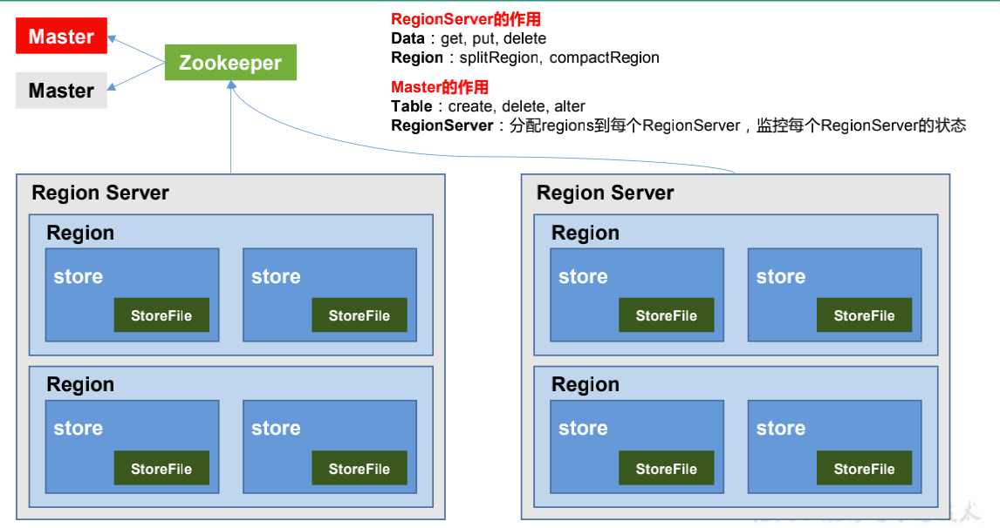

# 1 概念

[HBase官网](https://hbase.apache.org/)

> [Apache](https://www.apache.org/) HBase™ is the [Hadoop](https://hadoop.apache.org/) database, a distributed, scalable, big data store.
>
> Use Apache HBase™ when you need random, realtime read/write access to your Big Data. This project's goal is the hosting of very large tables -- billions of rows X millions of columns -- atop clusters of commodity hardware. Apache HBase is an open-source, distributed, versioned, non-relational database modeled after Google's [Bigtable: A Distributed Storage System for Structured Data](https://research.google.com/archive/bigtable.html) by Chang et al. Just as Bigtable leverages the distributed data storage provided by the Google File System, Apache HBase provides Bigtable-like capabilities on top of Hadoop and HDFS.

从Google的BigTable开始，一系列的可以进行海量数据存储与访问的数据库被设计出来，更进一步说，NoSQL这一概念被提了出来

NoSQL主要指**非关系的、分布式的、支持海量数据存储的数据库设计模式**。也有许多专家将 NoSQL解读为Not Only SQL，表示NoSQL只是关系数据库的补充，而不是替代方案。其中，HBase是这一类NoSQL系统的杰出代表

## 1.1 数据模型

### NameSpace

命名空间，类似于关系型数据库的DataBase概念，每个命名空间下有多个表。HBase有两个自带的命名空间：`hbase`和`defalut`，`hbase`中存放HBase自带的表，`default`是用户默认使用的命名空间

### Cell

表由行和列组成，表格的单元格（Cell）由行和列的坐标交叉决定，是有版本的。默认情况下，版本号是自动分配的，为HBase插入单元格时的时间戳。单元格中的数据是没有类型的，其内容是字节数组

### Column Family

行中的列被分成列族（column family），同一个列族的所有成员具有相同的前缀。如上图`info:format`和`info:geo`都是列族`info`的成员

一个表的列族必须作为表模式定义的一部分预先给出，而列限定符（ column qualifier，可以看作是单列）无需预先给定，但是新的列族成员（列限定符，也就是单列）可以随后按需加入

物理上，所有的列族成员都一起存放在文件系统中。所以，HBase被描述为一个面向列的存储器，实际上更准确的说法是：**它是一个面向列族的存储器**

### Region

HBase自动把表水平划分成区域（Region），每个区域都由表中行的子集构成

一开始一个表只有一个区域，随着区域开始变大（行数增多想象为高表）等到它超出设定的大小阈值，便会在某行的边界上把表分成两个大小基本相同的新分区

第一次划分之前，所有加载的数据都放在原始区域所在的服务器上，随着表的增大，区域个数也会增加。**区域是在HBase集群上分布数据的最小单位**。使用这种方式，一个因为太大而无法放在单台服务器上的表会被放到服务器集群上，其中每个节点都负责管理表所有区域的一个子集

## 1.2 实现

正如HDFS和YARN是有客户端、从属机（slave）和协调主控机（master）组成，HBase也采用相同的模型，它用一个`master`节点协调管理一个或多个`regionserver`从属机

