# 1 概念

[HBase官网](https://hbase.apache.org/)

> [Apache](https://www.apache.org/) HBase™ is the [Hadoop](https://hadoop.apache.org/) database, a distributed, scalable, big data store.
>
> Use Apache HBase™ when you need random, realtime read/write access to your Big Data. This project's goal is the hosting of very large tables -- billions of rows X millions of columns -- atop clusters of commodity hardware. Apache HBase is an open-source, distributed, versioned, non-relational database modeled after Google's [Bigtable: A Distributed Storage System for Structured Data](https://research.google.com/archive/bigtable.html) by Chang et al. Just as Bigtable leverages the distributed data storage provided by the Google File System, Apache HBase provides Bigtable-like capabilities on top of Hadoop and HDFS.

从Google的BigTable开始，一系列的可以进行海量数据存储与访问的数据库被设计出来，更进一步说，NoSQL这一概念被提了出来

NoSQL主要指**非关系的、分布式的、支持海量数据存储的数据库设计模式**。也有许多专家将 NoSQL解读为Not Only SQL，表示NoSQL只是关系数据库的补充，而不是替代方案。其中，HBase是这一类NoSQL系统的杰出代表

## 1.1 数据模型

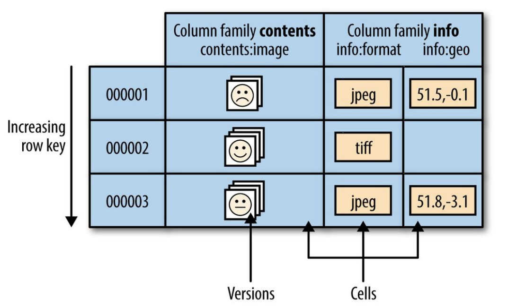

### NameSpace

命名空间，类似于关系型数据库的DataBase概念，每个命名空间下有多个表。HBase有两个自带的命名空间：`hbase`和`defalut`，`hbase`中存放HBase自带的表，`default`是用户默认使用的命名空间

### Cell

表由行和列组成，表格的单元格（Cell）由行和列的坐标交叉决定，是有版本的。默认情况下，版本号是自动分配的，为HBase插入单元格时的时间戳。单元格中的数据是没有类型的，其内容是字节数组

### Column Family

行中的列被分成列族（column family），同一个列族的所有成员具有相同的前缀。如上图`info:format`和`info:geo`都是列族`info`的成员

一个表的列族必须作为表模式定义的一部分预先给出，而列限定符（ column qualifier，可以看作是单列）无需预先给定，但是新的列族成员（列限定符，也就是单列）可以随后按需加入

物理上，所有的列族成员都一起存放在文件系统中。所以，HBase被描述为一个面向列的存储器，实际上更准确的说法是：**它是一个面向列族的存储器**

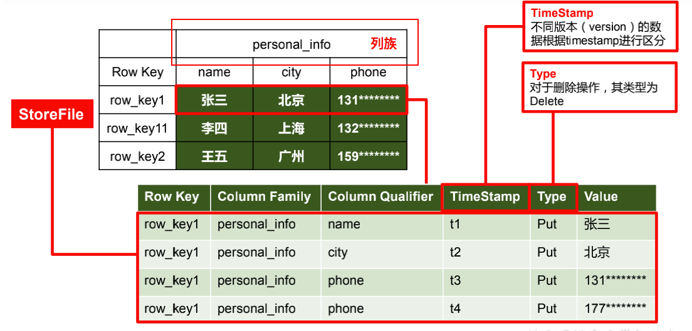

### Region

HBase自动把表水平划分成区域（Region），每个区域都由表中行的子集构成

一开始一个表只有一个区域，随着区域开始变大（行数增多想象为高表）等到它超出设定的大小阈值，便会在某行的边界上把表分成两个大小基本相同的新分区

第一次划分之前，所有加载的数据都放在原始区域所在的服务器上，随着表的增大，区域个数也会增加。**区域是在HBase集群上分布数据的最小单位**。使用这种方式，一个因为太大而无法放在单台服务器上的表会被放到服务器集群上，其中每个节点都负责管理表所有区域的一个子集

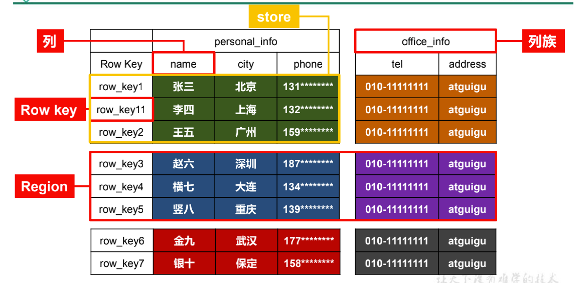

HBase作为Google BigTable的开源实现，完整地继承了BigTable的优良设计。架构上通过数据分片的设计配合HDFS，实现了数据的分布式海量存储；数据结构上通过列族的设计，实现了数据表结构可以在运行期自定义；存储上通过LSM树的方式，使数据可以通过连续写磁盘的方式保存数据，极大地提高了数据写入性能

## 1.2 实现

Reference：

[HBase架构](https://www.huaweicloud.com/articles/31192a16656cfe2280689f3866e7cbb8.html)

[深入理解HBase架构（翻译）](https://segmentfault.com/a/1190000019959411)(该文和上面得参考是一样的，不过有自己的点评)

正如HDFS和YARN是有客户端、从属机（slave）和协调主控机（master）组成，HBase也采用相同的模型，它用一个`master`节点协调管理一个或多个`regionserver`从属机

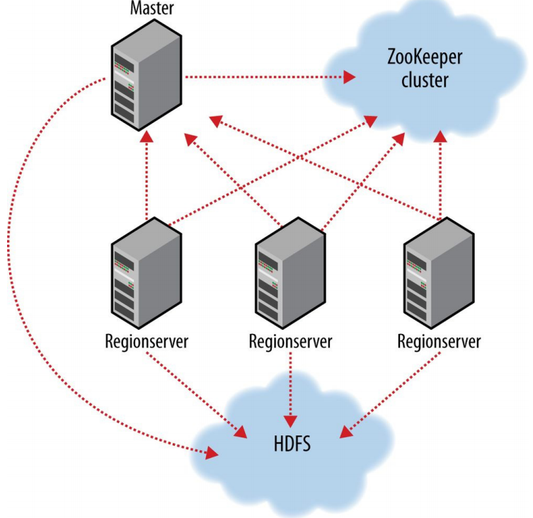

> HBase 的主从结构主要由三部分组成。Region Server 用于服务数据的读写，当访问数据时，客户端直接与 HBase RegionServer 交互
>
> Region 的分配（region assignment），DDL（create，delete tables）的操作由 HBase Master 处理。Zookeepr，作为HDFS的一部分，用于维持一个活跃的集群状态

### Region Server组件

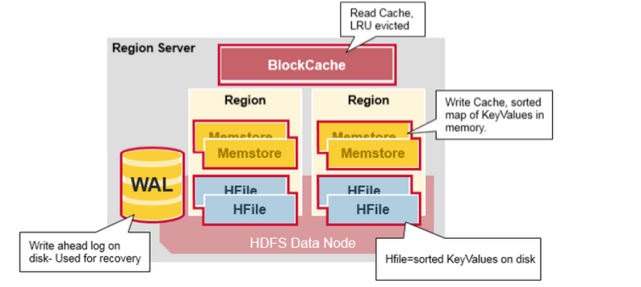

> 一个 Region Server 运行在一个 HDFS data node，并拥有以下组件：
>
> 1. WAL：预写日志（Write Ahead Log）是存在分布式文件系统里的一个文件。WAL 用于存储还没有被持久化到永久性存储的新数据。也被用于在发生failure时做recovery
> 2. BlockCache：**读缓存**（内存），它存储最频繁被读取的数据在内存中。在缓存满后，最长时间未被访问的数据（Least Recently Used）会被替换掉
> 3. MemStore：写缓存（内存），它保存所有尚未写入到disk 的新数据。新数据在被写入到disk 之前会先存储到MemStore。每个region下的每个列族（column family）会有一个 MemStore
> 4. HFile：保存行（rows），以排序好的 KeyValues 形式，保存在disk

## 1.3 HBase第一次读写

> HBase 中有个特殊的目录（Catalog） 表，称为META table，它保存集群里所有regions 的位置信息。Zookeeper保存META table的位置信息。
>
> 当一个客户端对 HBase 进行第一次读或写实，会发生以下过程：
>
> 1. 客户端从Zookeeper 获取存放了META table 的Region server 信息
> 2. 客户端query .META. server，根据需要访问的行键范围，从 .META. server获取存储对应row key范围的region server。客户端将这个信息以及META table的位置信息加入缓存
> 3. 从对应的 Region Server 获取对应行信息
>
> 对于之后的读操作，客户端使用缓存获取 META的位置，以及之前访问过的行键。随着时间的推移，客户端可以不需要query META 表，除非在访问时返回 miss（由于region被移动），然后客户端会 re-query 并更新缓存

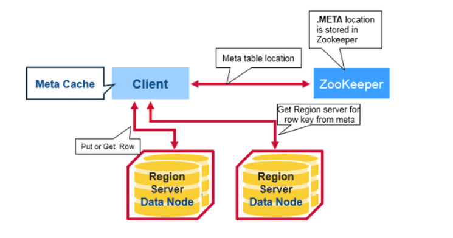

无论读写都会先执行以上步骤，然后在走读写流程

### 1.3.1 HBase写

> 当客户端发起一个Put请求时，第一步是将数据写入到 write-ahead 日志（WAL）：
>
> 1. 编辑（edit）操作会被添加到（存储在磁盘上的）WAL 文件的末尾
> 2. WAL用于：在服务器挂掉时，恢复尚未持久化的数据

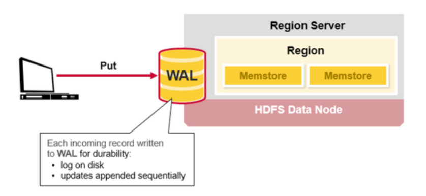

> 当数据被写入 WAL后，它会被放入MemStore（内存）。然后，put 请求会被ack，并返回给客户端

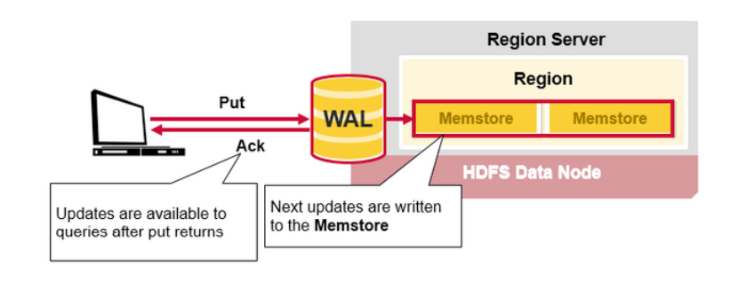

> **HBase Region Flush**
>
> 当 MemStore 聚集了足够的数据时，整个排序好的数据会被写入到HDFS 里的一个新HFile中。HBase对每个列族使用多个HFile，它们包含真正的数据单元（或 KeyValue 实例）。这些文件随着MemStores 里不断增加的 KeyValue 编辑操作后，作为文件被flushed 到磁盘
>
> 值得注意的是，这是为什么HBase 里对列族数量有限制的一个原因。每个列族都会有一个MemStore，当一个已经满时，它们所有的都会被flush。它也会保存最后一次写的序列号，以此让系统得知当前持久化的进度
>
> 最高的序列号（sequence number）被作为一个meta field 保存在每个 HFile 中，以此反应持久化终止在哪，并应从哪里继续。当一个region 启动后，序列号会被读取，然后最高的会被用于最新编辑操作的序列号

### 1.3.2 HBase读

#### HFile索引

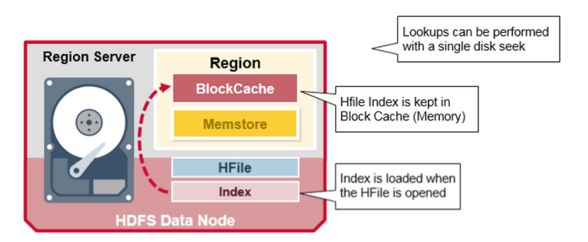

注意上图，在HFile被打开时（被访问），索引（index）会被载入并保存在内存（BlockCache就是另一种内存），它允许查询在一个磁盘搜索内操作内完成

#### HBase读

> 我们已经知道一个行的KeyValue cells 会被存储在多个地方，row cells 已经被持久化到 HFile，最近被更新的 cells在MemSotre，并且最近被读过的 cells 会在 Block Cache。所以当读某一个行时，系统如何得到对应的 cells 返回？
>
> 一个读的操作会从BlockCache、MemStore以及HFile集合Key Values，步骤如下：
>
> 1. 首先，Scanner会在Block Cache 搜索 Row cells。最近被读过的 Key Values 被缓存到这，并且，如内存需要，最常时间未使用的会被替换掉
> 2. 然后 scanner会在 MemStore 里搜索，write cache（MemStore）里保有最近的写操作
> 3. 如果scanner没有在MemStore以及Block Cache里找到所有的row cells，则HBase会使用Block Cache 索引以及bloom filter 加载HFiles 到内存，这些Hfiles可能包含目标的row cells
>
> 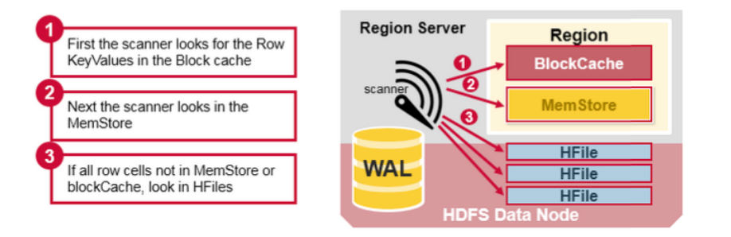
>
> 每个MemStore可能会有多个HFiles，即是说：对于一个读操作，可能需要检查多个文件，并继而影响performance（性能）。这个被称为读放大（read amplification）

## 1.4 Memstore Flush

Reference: 

[HBase – Memstore Flush深度解析](http://hbasefly.com/2016/03/23/hbase-memstore-flush/)

[HBase 入门之数据刷写(Memstore Flush)详细说明](https://www.iteblog.com/archives/2497.html#comments)(注意看评论提到点应该是单个Menstore的flush而不是作者说的所有)

### Memstore 概述

> HBase中，Region是集群节点上最小的数据服务单元，用户数据表由一个或多个Region组成。在Region中每个ColumnFamily的数据组成一个Store。每个Store由一个Memstore和多个HFile组成，如下图所示：
>
> 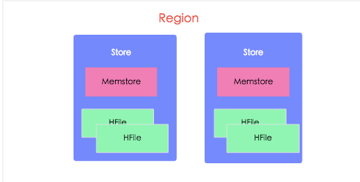

### MenStore Flush触发条件

- MemStore级别限制：当Region中任意一个MenStore的大小达到上限(`hbase.hregion.memstore.flush.size，默认128MB`)，会触发Memstore刷写

- Region级别限制：随着数据的增长，Region中**所有**的MemStore达到了`hbase.hregion.memstore.flush.size * hbase.hregion.memstore.block.multiplier(默认值4)`，也就是`128 * 4 = 512MB`的时候，除了触发刷写之外，HBase还会在刷写的时候阻塞所有写入该Store的写请求
- RegionServer级别限制：如果整个RegionServer的MenStore暂用内存总和大于`hbase.regionserver.global.memstore.size.lower.limit(默认值0.95) * hbase.regionserver.global.memstore.size(默认值0.4，表示40%) * hbase_heapsize(堆内存大小)`是，会触发MenStore的刷写。RegionServer 级别的Flush策略是每次找到 RS 中占用内存最大的 Region 对他进行刷写，这个操作是循环进行的，直到总体内存的占用低于全局 MemStore 刷写下限`（hbase.regionserver.global.memstore.size.lower.limit * hbase.regionserver.global.memstore.size * hbase_heapsize）`才会停止

需要注意的是，如果达到了RegionServer级别的flush，那么当前RegionServer的所有写操作将会被阻塞，而且这个阻塞可能会持续到分钟级别

- HBase定期刷新Memstore：默认周期( `hbase.regionserver.optionalcacheflushinterval`)为1小时，确保MemStore不会长时间没有持久化。为避免所有的MemStore在同一时间都进行flush导致的问题，定期的flush操作有20000左右的随机延时
- 手动执行flush：用户可以通过shell命令 flush \<tablename\>或者flush \<region name\>分别对一个表或者一个Region进行flush

## 1.5 Compaction

由于MemStore每次Flush都会生成一个新的HFile，且同一个字段的不同版本（timestamp）和不同类型（Put/Delete）有可能会分布在不同的HFile中，因此查询时需要遍历所有的HFile。为了减少HFile的个数，以及清理掉过期和删除的数据，会进行Compaction

### HBase Minor Compaction

Minor Compaction会自动和并一些小的HFile，**重写**成少量更大的HFiles，但是不会清楚过期和已删除的数据（默认值为3，>=3时进行合并，且当>=3的Minor Compaction效果和Major Compaction效果一样，会从物理上删除过期数据）

```xml
<!-- hbase-default.xml 注意源码是 >= hbase.hstore.compactionThreshold -->  
<property>
    <name>hbase.hstore.compactionThreshold</name>
    <value>3</value>
    <description> If more than this number of StoreFiles exist in any one Store
      (one StoreFile is written per flush of MemStore), a compaction is run to rewrite all
      StoreFiles into a single StoreFile. Larger values delay compaction, but when compaction does
      occur, it takes longer to complete.</description>
</property>
```

### HBase Major Compaction

Major Compaction将一个region中每个列族（一个列族就是一个MemStore，一个MemStore Flush出一个HFile）的HFile**重写**为一个新HFile

在这个过程中，Major Compaction能扫描所有的键值对，顺序**重写**全部的数据，对于有删除标记的数据会被略过。而被删除和过期的数据会被真正从物理上删除，这样可以提高读的性能，但是因为Major Compaction会重写所有的文件，在这个过程中会产生大量的磁盘I/O以及网络开销，这被称为写放大（Write Amplification）

Major Compaction可以被设定为自动调度，因为存在写放大的问题，它一般都安排在周末的半夜

```xml
<!-- hbase-default.xml 0为禁用 --> 
<property>
    <name>hbase.hregion.majorcompaction</name>
    <value>604800000</value>
    <description>Time between major compactions, expressed in milliseconds. Set to 0 to disable
      time-based automatic major compactions. User-requested and size-based major compactions will
      still run. This value is multiplied by hbase.hregion.majorcompaction.jitter to cause
      compaction to start at a somewhat-random time during a given window of time. The default value
      is 7 days, expressed in milliseconds. If major compactions are causing disruption in your
      environment, you can configure them to run at off-peak times for your deployment, or disable
      time-based major compactions by setting this parameter to 0, and run major compactions in a
      cron job or by another external mechanism.</description>
</property>

<property>
    <name>hbase.hregion.majorcompaction.jitter</name>
    <value>0.50</value>
    <description>A multiplier applied to hbase.hregion.majorcompaction to cause compaction to occur
      a given amount of time either side of hbase.hregion.majorcompaction. The smaller the number,
      the closer the compactions will happen to the hbase.hregion.majorcompaction
      interval.</description>
</property>
```

## 1.6 Region Split

### Region = Contiguous Keys （连续的键）

> 对 regions 做一个快速总结：
>
> 1. 一个表可以被水平的分配到一个或多个region中。一个region包含相邻的、排序的一段rows。范围从start key 到 end key。
> 2. 每个region默认大小是1GB
> 3. region里的数据由Region Server提供服务（读写），和client交互
> 4. 一个region server 可以服务大约 1000 个regions（可能属于同一个表或是不同的表）
>
> 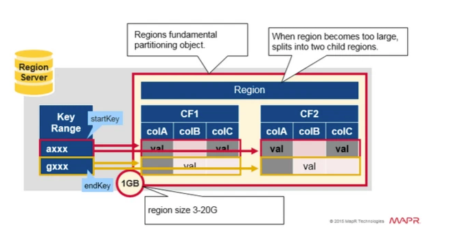

### Region Split

> 一开始每个 table 默认只有一个 region。当一个 region 逐渐变得很大时，它会分裂（**split**）成两个子 region，每个子 region 都包含了原来 region 一半的数据，这两个子 region 并行地在原来这个 region server 上创建，这个分裂动作会被报告给 HMaster。处于负载均衡的目的，HMaster 可能会将新的 region 迁移给其它 region server
>
> 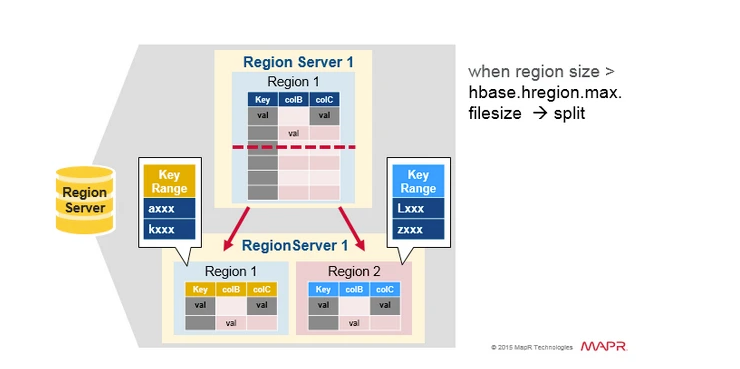

```xml
  <property>
    <name>hbase.hregion.max.filesize</name>
    <value>10737418240</value>
    <description>Maximum file size. If the sum of the sizes of a region's HFiles has
      grown to exceed this value, the region is split in two. There are two choices of
      how this option works, the first is when any store's size exceed the threshold
      then split, and the other is overall region's size exceed the threshold then split,
      it can be configed by hbase.hregion.split.overallfiles.</description>
  
</property>
```

### Split 触发策略

Reference：

[HBase Split 简介](https://www.jianshu.com/p/53459997c814)

[HBase Region 自动拆分策略](https://cloud.tencent.com/developer/article/1374592)

> HBase 中共有3种情况会触发 HBase Split：
>
> 1. 当 Memstore flush 操作后，HRegion 写入新的 HFile，有可能产生较大的 HFile，会判断是否需要执行 Split
> 2. HStore 执行完成 Compact 操作后可能产生较大的 HFile，会判断是否需要执行 Split
> 3. HBaseAdmin 手动执行 split 命令时，会触发 Split
>
> 目前已经的支持触发策略多达6种，每种触发策略都有各自的适用场景，可以根据业务在表级别（Column family 级别）选择不同的切分触发策略。一般情况下使用默认切分策略即可。
>
> - **ConstantSizeRegionSplitPolicy**：0.94版本前默认切分策略。
>    一个 Region 中最大 Store 的大小大于设置阈值之后才会触发切分，Store 大小为压缩后的文件大小（启用压缩的场景）
>    切分策略对于大表和小表没有明显的区分
> - **IncreasingToUpperBoundRegionSplitPolicy**：0.94版本~2.0版本默认切分策略。
>    和 ConstantSizeRegionSplitPolicy 思路相同，一个 Region 中最大 Store 大小大于设置阈值就会触发切分，区别是这个阈值并不像 ConstantSizeRegionSplitPolicy 是一个固定的值，而是会在不断调整。
>    调整规则和 Region 所属表在当前 RegionServer 上的 Region 个数有关系 ：(#regions) * (#regions) * (#regions) * flush_size * 2，最大值为用户设置的 MaxRegionFileSize
>    能够自适应大表和小表，这种策略下很多小表会在大集群中产生大量小 Region，分散在整个集群中
> - **SteppingSplitPolicy**：2.0版本默认切分策略。
>    相比 IncreasingToUpperBoundRegionSplitPolicy 简单了一些，依然和待分裂 Region 所属表在当前 RegionServer 上的 Region 个数有关系：如果 Region 个数等于1，切分阈值为 flush_size * 2，否则为 MaxRegionFileSize
> - **DisableSplitPolicy**：禁止 Region split
> - **KeyPrefixRegionSplitPolicy**：切分策略依然依据默认切分策略，根据 Rowkey 指定长度的前缀来切分 Region，保证相同的前缀的行保存在同一个 Region 中。由 KeyPrefixRegionSplitPolicy.prefix_length 属性指定 Rowkey 前缀长度。按此长度对splitPoint进行截取。
>    此种策略比较适合有固定前缀的 Rowkey。当没有设置前缀长度，切分效果等同与 IncreasingToUpperBoundRegionSplitPolicy。
> - **DelimitedKeyPrefixRegionSplitPolicy**：切分策略依然依据默认切分策略，同样是保证相同 RowKey 前缀的数据在一个Region中，但是是以指定分隔符前面的前缀为来切分 Region。

```xml
<property>
    <name>hbase.regionserver.region.split.policy</name>
    <value>org.apache.hadoop.hbase.regionserver.SteppingSplitPolicy</value>
    <description>
      A split policy determines when a region should be split. The various
      other split policies that are available currently are BusyRegionSplitPolicy,
      ConstantSizeRegionSplitPolicy, DisabledRegionSplitPolicy,
      DelimitedKeyPrefixRegionSplitPolicy, KeyPrefixRegionSplitPolicy, and
      SteppingSplitPolicy. DisabledRegionSplitPolicy blocks manual region splitting.
    </description>
</property>
```

# 2 部署

HBase依赖于ZooKeeper和Hadoop，安装HBase之前先将ZooKeeper和Hadoop部署并启动

将HBase解压至指定目录

```shell
tar -zxvf hbase-1.3.1-bin.tar.gz -C /opt/module
```

修改配置文件(这边使用$hbase表示hbase主目录)

`$hbase/conf/hbase-env.sh`

```shell
# $JAVA_HOME根据自身情况替换为实际路径
export JAVA_HOME=$JAVA_HOME
export HBASE_MANAGES_ZK=false
```

注释掉如下两行（仅JDK7需要用到）

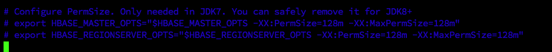

`$hbase/conf/hbase-site.xml`**根据实际情况修改！**

```xml
<configuration>
  <!-- 对应hdfs namenode内部通信端口 -->
<property>
	<name>hbase.rootdir</name>
	<value>hdfs://hadoop102:8020/HBase</value>
</property>
<property>
	<name>hbase.cluster.distributed</name>
	<value>true</value>
</property>
<!-- 0.98 后的新变动，之前版本没有.port,默认端口为 60000 -->
<property>
	<name>hbase.master.port</name>
	<value>16000</value>
</property>
<property> 
	<name>hbase.zookeeper.quorum</name>
	<value>hadoop102,hadoop103,hadoop104</value>
</property>
  <!-- 指定zk的dataDir 要和zk对应 -->
<property> 
	<name>hbase.zookeeper.property.dataDir</name>
	<value>/opt/module/zookeeper-3.6.3/zkData</value>
</property>
</configuration>
```

`$hbase/conf/regionservers`添加所有需要的hbase节点，准确来说应该是`regionserver`的节点（类似于Hadoop的wookers）

```
hadoop102
hadoop103
hadoop104
```

将Hadoop配置[软件接](https://www.cnblogs.com/kex1n/p/5193826.html)到HBase

> 当 我们需要在不同的目录，用到相同的文件时，我们不需要在每一个需要的目录下都放一个必须相同的文件，我们只要在某个固定的目录，放上该文件，然后在其它的 目录下用ln命令链接（link）它就可以，不必重复的占用磁盘空间。例如：ln -s /bin/less /usr/local/bin/less
> -s 是代号（symbolic）的意思。
> 这里有两点要注意：第一，ln命令会保持每一处链接文件的同步性，也就是说，不论你改动了哪一处，其它的文件都会发生相同的变化；第二，ln的链接又软链接 和硬链接两种，软链接就是ln -s ,它只会在你选定的位置上生成一个文件的镜像，不会占用磁盘空间，硬链接ln ,没有参数-s, 它会在你选定的位置上生成一个和源文件大小相同的文件，无论是软链接还是硬链接，文件都保持同步变化

```shell
# core-site 这边我的Hadoop路径为/opt/module/hadoop-3.1.3
# 我的实际操作位 ln -s /opt/module/hadoop-3.1.3/etc/hadoop/core-site.xml /opt/module/hbase-1.3.1/conf/core-site.xm
# 下同
ln -s $HADOOP_HOME/etc/hadoop/core-site.xml $hbase/conf/core-site.xm
# hdfs-site
# ln -s /opt/module/hadoop-3.1.3/etc/hadoop/hdfs-site.xml /opt/module/hbase-1.3.1/conf/hdfs-site.xml
ln -s $HADOOP_HOME/etc/hadoop/hdfs-site.xml $hbase/conf/hdfs-site.xml


[hadoop@hadoop102 conf]$ ln -s /opt/module/hadoop-3.1.3/etc/hadoop/hdfs-site.xml /opt/module/hbase-1.3.1/conf/hdfs-site.xml
[hadoop@hadoop102 conf]$ ll
总用量 40
lrwxrwxrwx. 1 hadoop hadoop   49 7月  28 09:22 core-site.xm -> /opt/module/hadoop-3.1.3/etc/hadoop/core-site.xml
-rw-r--r--. 1 hadoop hadoop 1811 9月  21 2016 hadoop-metrics2-hbase.properties
-rw-r--r--. 1 hadoop hadoop 4537 11月  7 2016 hbase-env.cmd
-rw-r--r--. 1 hadoop hadoop 7513 7月  28 09:06 hbase-env.sh
-rw-r--r--. 1 hadoop hadoop 2257 9月  21 2016 hbase-policy.xml
-rw-r--r--. 1 hadoop hadoop  934 9月  21 2016 hbase-site.xml
lrwxrwxrwx. 1 hadoop hadoop   49 7月  28 09:22 hdfs-site.xml -> /opt/module/hadoop-3.1.3/etc/hadoop/hdfs-site.xml
-rw-r--r--. 1 hadoop hadoop 4722 4月   5 2017 log4j.properties
-rw-r--r--. 1 hadoop hadoop   30 7月  28 09:15 regionservers
```

**配置完成后分发服务到各节点**

## 2.1 启动

```shell
[hadoop@hadoop102 bin]$ pwd
/opt/module/hbase-1.3.1/bin
[hadoop@hadoop102 bin]$ ll
总用量 184
-rwxr-xr-x. 1 hadoop hadoop  4826 11月  7 2016 draining_servers.rb
-rwxr-xr-x. 1 hadoop hadoop  1652 9月  21 2016 get-active-master.rb
-rwxr-xr-x. 1 hadoop hadoop  5805 11月  7 2016 graceful_stop.sh
-rwxr-xr-x. 1 hadoop hadoop 14999 11月  7 2016 hbase
-rwxr-xr-x. 1 hadoop hadoop  4541 9月  21 2016 hbase-cleanup.sh
-rw-r--r--. 1 hadoop hadoop 13421 11月  7 2016 hbase.cmd
-rwxr-xr-x. 1 hadoop hadoop  1537 9月  21 2016 hbase-common.sh
-rw-r--r--. 1 hadoop hadoop  2363 9月  21 2016 hbase-config.cmd
-rwxr-xr-x. 1 hadoop hadoop  4724 4月   5 2017 hbase-config.sh
-rwxr-xr-x. 1 hadoop hadoop  9450 4月   5 2017 hbase-daemon.sh
-rwxr-xr-x. 1 hadoop hadoop  1605 4月   5 2017 hbase-daemons.sh
-rwxr-xr-x. 1 hadoop hadoop   876 9月  21 2016 hbase-jruby
-rwxr-xr-x. 1 hadoop hadoop  7943 4月   5 2017 hirb.rb
-rwxr-xr-x. 1 hadoop hadoop  1912 4月   5 2017 local-master-backup.sh
-rwxr-xr-x. 1 hadoop hadoop  1858 4月   5 2017 local-regionservers.sh
-rwxr-xr-x. 1 hadoop hadoop  2271 9月  21 2016 master-backup.sh
-rwxr-xr-x. 1 hadoop hadoop 17047 4月   5 2017 region_mover.rb
-rwxr-xr-x. 1 hadoop hadoop  2527 4月   5 2017 regionservers.sh
-rwxr-xr-x. 1 hadoop hadoop  4700 11月  7 2016 region_status.rb
drwxr-xr-x. 2 hadoop hadoop    33 7月  28 09:01 replication
-rwxr-xr-x. 1 hadoop hadoop  5711 4月   5 2017 rolling-restart.sh
-rwxr-xr-x. 1 hadoop hadoop  1693 11月  7 2016 shutdown_regionserver.rb
-rw-r--r--. 1 hadoop hadoop  2262 9月  21 2016 start-hbase.cmd
-rwxr-xr-x. 1 hadoop hadoop  1986 4月   5 2017 start-hbase.sh
-rw-r--r--. 1 hadoop hadoop  1752 9月  21 2016 stop-hbase.cmd
-rwxr-xr-x. 1 hadoop hadoop  2236 9月  21 2016 stop-hbase.sh
drwxr-xr-x. 2 hadoop hadoop    38 7月  28 09:01 test
-rwxr-xr-x. 1 hadoop hadoop  1537 11月  7 2016 thread-pool.rb
-rwxr-xr-x. 1 hadoop hadoop  1870 9月  21 2016 zookeepers.sh
```

Master和RegionServer逐一启动

```shell
hbase-daemon.sh start master

hbase-daemon.sh start regionserver
```

注意各节点的时间是否一致，如果超过默认的30分钟就会异常

`$hbase/conf/hbase-site.xml`可以修改机器允许的时间差（不建议时间差异过大）

```xml
<property>
	<name>hbase.master.maxclockskew</name>
	<value>180000</value>
	<description>Time difference of regionserver from master</description>
</property>
```

一建启/停

```shell
start-hbase.sh

stop-hbase.sh
```

启动成功后即可通过页面来访问：`http://hadoop102:16010/`

# 3 HBase Shell

首先要进入hbase客户端命令行 

```shell
[hadoop@hadoop102 hbase-1.3.1]$ bin/hbase shell
SLF4J: Class path contains multiple SLF4J bindings.
SLF4J: Found binding in [jar:file:/opt/module/hbase-1.3.1/lib/slf4j-log4j12-1.7.5.jar!/org/slf4j/impl/StaticLoggerBinder.class]
SLF4J: Found binding in [jar:file:/opt/module/hadoop-3.1.3/share/hadoop/common/lib/slf4j-log4j12-1.7.25.jar!/org/slf4j/impl/StaticLoggerBinder.class]
SLF4J: See http://www.slf4j.org/codes.html#multiple_bindings for an explanation.
SLF4J: Actual binding is of type [org.slf4j.impl.Log4jLoggerFactory]
HBase Shell; enter 'help<RETURN>' for list of supported commands.
Type "exit<RETURN>" to leave the HBase Shell
Version 1.3.1, r930b9a55528fe45d8edce7af42fef2d35e77677a, Thu Apr  6 19:36:54 PDT 2017

hbase(main):001:0> 
```

使用`help`查看命令


重点关注`ddl、dml、namespace`下的命令

## namespace

```
Group name: namespace
Commands: alter_namespace, create_namespace, describe_namespace, drop_namespace, list_namespace, list_namespace_tables
```

### list_namespace

查看有哪些命名空间，可以有多个命名空间，一个命名空间可以有多个表

```shell
hbase(main):003:0> list_namespace
NAMESPACE                                                                                                                                                                           
default                                                                                                                                                                             
hbase                                                                                                                                                                               
2 row(s) in 0.0260 seconds

hbase(main):004:0> 
```

## create_namespace

```shell
hbase(main):007:0> create_namespace 'ck'
0 row(s) in 0.9150 seconds
```

## ddl

ddl包含关于表结构的操作

```
Group name: ddl
Commands: alter, alter_async, alter_status, create, describe, disable, disable_all, drop, drop_all, enable, enable_all, exists, get_table, is_disabled, is_enabled, list, locate_region, show_filters
```

### list

查看当前数据库有哪些表

```shell
hbase(main):002:0> list
TABLE                                                                                                                                                                               
0 row(s) in 0.1790 seconds

=> []
hbase(main):003:0> 
```

### alter

针对表信息进行修改

```shell
# 给表添加一个列族
hbase(main):028:0> alter 'ck:stu',NAME='info'
Updating all regions with the new schema...
1/1 regions updated.
Done.
0 row(s) in 2.1930 seconds

# 让某一列族版本为3，意思就是进行进行put替换时会保留最近的3次数据（但是能用的还是最新的那个，只不过可以看到历史的3次数据） 
alter 'ck:stu', {NAME=>'info',VERSIONS=>3}
get 'ck:stu', '1001',{COLUMN=>'info:name',VERSIONS=>3}
```

### create

创建表和列族

```shell
hbase(main):017:0> create 'ck:stu', 'addr'
0 row(s) in 1.3150 seconds

=> Hbase::Table - ck:stu
```

### describle

查看表结构信息 

```shell
hbase(main):020:0> describe 'ck:stu'
Table ck:stu is ENABLED                                                                                                                                                             
ck:stu                                                                                                                                                                              
COLUMN FAMILIES DESCRIPTION                                                                                                                                                         
{NAME => 'addr', BLOOMFILTER => 'ROW', VERSIONS => '1', IN_MEMORY => 'false', KEEP_DELETED_CELLS => 'FALSE', DATA_BLOCK_ENCODING => 'NONE', TTL => 'FOREVER', COMPRESSION => 'NONE',
 MIN_VERSIONS => '0', BLOCKCACHE => 'true', BLOCKSIZE => '65536', REPLICATION_SCOPE => '0'}                                                                                         
1 row(s) in 0.0270 seconds

hbase(main):021:0> 
```

## dml

dml包含对表数据的操作

```
Group name: dml
Commands: append, count, delete, deleteall, get, get_counter, get_splits, incr, put, scan, truncate, truncate_preserve
```

### put

```shell
# 对同一个row key（看成是主键）第一次是插入
hbase(main):059:0>  put 'ck:stu','1001','info:sex','male'
0 row(s) in 0.0850 seconds

# 第二次则跟新
hbase(main):059:0>  put 'ck:stu','1001','info:sex','famale'
```

### get

```shell
# 查看指定行
hbase(main):065:0> get 'ck:stu', '100'
COLUMN                                         CELL                                                                                                                                 
0 row(s) in 0.0250 seconds

# 查看指定列族
hbase(main):066:0> get 'ck:stu', '1001', 'info'
COLUMN                                         CELL                                                                                                                                 
 info:sex                                      timestamp=1627459711626, value=male                                                                                                  
1 row(s) in 0.0160 seconds
```

### scan

```shell
hbase(main):064:0> scan 'ck:stu'
ROW                                            COLUMN+CELL                                                                                                                          
 1001                                          column=info:sex, timestamp=1627459711626, value=male                                                                                 
1 row(s) in 0.0160 seconds
```

### delete

```shell
# 删除某个主键下的某个属性
hbase(main):011:0> delete 'ck:stu', '1001', 'info:sex'
0 row(s) in 0.0330 seconds

# 删除某个row key的所有数据 注意这边删除整个列族delete是删不了的需要用deleteall命令，而客户端API是可以删除的
hbase(main):021:0> deleteall 'ck:stu', '1001'
0 row(s) in 0.0040 seconds

hbase(main):022:0> scan 'ck:stu'
ROW                                            COLUMN+CELL                                                                                                                          
0 row(s) in 0.0120 seconds
```

### truncate

```shell
# 清空表的所有数据
hbase(main):023:0> truncate 'ck:stu'
Truncating 'ck:stu' table (it may take a while):
 - Disabling table...
 - Truncating table...
0 row(s) in 3.9380 seconds
```

### drop

```shell
# 使用drop前要先让表失效
hbase(main):029:0> drop 'ck:stu'

ERROR: Table ck:stu is enabled. Disable it first.

Here is some help for this command:
Drop the named table. Table must first be disabled:
  hbase> drop 't1'
  hbase> drop 'ns1:t1
  
--------------
hbase(main):030:0> disable 'ck:stu'
0 row(s) in 2.2480 seconds

hbase(main):031:0> drop 'ck:stu'
0 row(s) in 1.2640 seconds
```

# 3 API

环境依赖如下

```xml
    <dependencies>
        <dependency>
            <groupId>org.apache.hbase</groupId>
            <artifactId>hbase-client</artifactId>
            <version>1.3.1</version>
        </dependency>

        <dependency>
            <groupId>org.apache.hbase</groupId>
            <artifactId>hbase-server</artifactId>
            <version>1.3.1</version>
        </dependency>

        <dependency>
            <groupId>junit</groupId>
            <artifactId>junit</artifactId>
            <version>4.13.2</version>
        </dependency>
    </dependencies>
```

API测试方法如下，尤其需要注意API的删除数据操作

```java
package cn.huakai;

import org.apache.hadoop.conf.Configuration;
import org.apache.hadoop.hbase.*;
import org.apache.hadoop.hbase.client.*;
import org.apache.hadoop.hbase.util.Bytes;
import org.junit.Test;

import java.io.IOException;
import java.nio.charset.StandardCharsets;
import java.util.Arrays;


public class HBaseAPI {

    private static HBaseAdmin admin;
    private static Configuration conf;

    static {
        try {
            conf = HBaseConfiguration.create();
            conf.set("hbase.zookeeper.quorum", "hadoop102,hadoop103,hadoop104");

            admin = (HBaseAdmin) ConnectionFactory.createConnection(conf).getAdmin();
        } catch (IOException e) {
            e.printStackTrace();
        }                                       
    }


    @Test
    public void delete() throws IOException {
        String tb = "stu";
        HTable table = (HTable) ConnectionFactory.createConnection(conf).getTable(TableName.valueOf(tb));


        Delete delete = new Delete("1002".getBytes(StandardCharsets.UTF_8));
        /*
          注意：尽量不要使用 delete.addColumn()
          如果有多个Version使用该方法会导致删除最大的时间戳之后 会查询到先前的数据
         */
        delete.addColumns("info".getBytes(), "name".getBytes(StandardCharsets.UTF_8));

        table.delete(delete);
        System.out.println("delete successful");

        table.close();

    }


    @Test
    public void get() throws IOException {
        String tb = "stu";
        HTable table = (HTable) ConnectionFactory.createConnection(conf).getTable(TableName.valueOf(tb));

        Get get = new Get("1001".getBytes());
        Result result = table.get(get);

        System.out.println("get: ");
        for (Cell cell : result.rawCells()) {
            String cf = Bytes.toString(CellUtil.cloneFamily(cell));
            String qualifier = Bytes.toString(CellUtil.cloneQualifier(cell));
            String value = Bytes.toString(CellUtil.cloneValue(cell));
            System.out.println("cf: " + cf + ", qualifier: " + qualifier + ", value: " + value);
        }


        table.close();
    }


    @Test
    public void put() throws IOException {
        String tb = "stu";
        HTable table = (HTable) ConnectionFactory.createConnection(conf).getTable(TableName.valueOf(tb));

        Put put = new Put(Bytes.toBytes("1001"));
        put.addColumn("info".getBytes(), "name".getBytes(), "张三".getBytes(StandardCharsets.UTF_8));
        put.addColumn("info".getBytes(), "age".getBytes(), "18".getBytes());
        table.put(put);

        System.out.println("DML put successful...");

        table.close();

    }


    @Test
    public void listTables() throws IOException {
        HTableDescriptor[] hTableDescriptors = admin.listTables();
        System.out.println("list: ");
        Arrays.stream(hTableDescriptors).forEach(td -> System.out.println(td.getTableName().getNameAsString()));
        close();
    }

    @Test
    public void listNameSpace() throws IOException {

        NamespaceDescriptor[] namespaceDescriptors = admin.listNamespaceDescriptors();

        System.out.println("list namespace: ");

        Arrays.stream(namespaceDescriptors).forEach(ns -> System.out.println(ns.getName()));

        close();
    }


    @Test
    public void createNameSpace() throws IOException {
        String ns = "ck2";

        NamespaceDescriptor.Builder builder = NamespaceDescriptor.create(ns);
        NamespaceDescriptor build = builder.build();
        admin.createNamespace(build);
        System.out.println("create namespace: " + ns + " successful");

        close();
    }


    @Test
    public void dropTable() throws IOException {
        String tableName = "ck:stu";

        admin.disableTable(tableName);
        System.out.println("table: " + tableName + " has disabled");

        admin.deleteTable(tableName);
        System.out.println(tableName + "deleted successful");

        close();
    }


    @Test
    public void createTable() throws IOException {
        String tableName = "ck:stu";

        HTableDescriptor hTableDescriptor = new HTableDescriptor(TableName.valueOf(tableName));
        HColumnDescriptor columnDescriptor = new HColumnDescriptor("info");
        hTableDescriptor.addFamily(columnDescriptor);

        if (admin.tableExists(tableName)) {
            System.out.println("table is exist! Do not create again");
            return;
        }

        admin.createTable(hTableDescriptor);
        System.out.println("talbe creates successful");

        close();
    }


    @Test
    public void isTableExist() throws IOException {
        String tableName = "stu";

        if (admin.tableExists(tableName)) {
            System.out.println("table is exist");
            return;
        }

        System.out.println("table is not exist");
        close();
    }

    public void close() {
        try {
            admin.close();
            System.out.println("--- close admin ---");
        } catch (IOException e) {
            e.printStackTrace();
        }
    }
}
```

