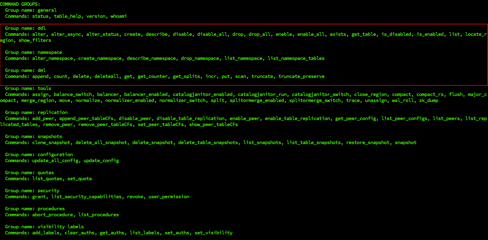

# 1 概念

[HBase官网](https://hbase.apache.org/)

> [Apache](https://www.apache.org/) HBase™ is the [Hadoop](https://hadoop.apache.org/) database, a distributed, scalable, big data store.
>
> Use Apache HBase™ when you need random, realtime read/write access to your Big Data. This project's goal is the hosting of very large tables -- billions of rows X millions of columns -- atop clusters of commodity hardware. Apache HBase is an open-source, distributed, versioned, non-relational database modeled after Google's [Bigtable: A Distributed Storage System for Structured Data](https://research.google.com/archive/bigtable.html) by Chang et al. Just as Bigtable leverages the distributed data storage provided by the Google File System, Apache HBase provides Bigtable-like capabilities on top of Hadoop and HDFS.

从Google的BigTable开始，一系列的可以进行海量数据存储与访问的数据库被设计出来，更进一步说，NoSQL这一概念被提了出来

NoSQL主要指**非关系的、分布式的、支持海量数据存储的数据库设计模式**。也有许多专家将 NoSQL解读为Not Only SQL，表示NoSQL只是关系数据库的补充，而不是替代方案。其中，HBase是这一类NoSQL系统的杰出代表

## 1.1 数据模型


### NameSpace

命名空间，类似于关系型数据库的DataBase概念，每个命名空间下有多个表。HBase有两个自带的命名空间：`hbase`和`defalut`，`hbase`中存放HBase自带的表，`default`是用户默认使用的命名空间

### Cell

表由行和列组成，表格的单元格（Cell）由行和列的坐标交叉决定，是有版本的。默认情况下，版本号是自动分配的，为HBase插入单元格时的时间戳。单元格中的数据是没有类型的，其内容是字节数组

### Column Family

行中的列被分成列族（column family），同一个列族的所有成员具有相同的前缀。如上图`info:format`和`info:geo`都是列族`info`的成员

一个表的列族必须作为表模式定义的一部分预先给出，而列限定符（ column qualifier，可以看作是单列）无需预先给定，但是新的列族成员（列限定符，也就是单列）可以随后按需加入

物理上，所有的列族成员都一起存放在文件系统中。所以，HBase被描述为一个面向列的存储器，实际上更准确的说法是：**它是一个面向列族的存储器**


### Region

HBase自动把表水平划分成区域（Region），每个区域都由表中行的子集构成

一开始一个表只有一个区域，随着区域开始变大（行数增多想象为高表）等到它超出设定的大小阈值，便会在某行的边界上把表分成两个大小基本相同的新分区

第一次划分之前，所有加载的数据都放在原始区域所在的服务器上，随着表的增大，区域个数也会增加。**区域是在HBase集群上分布数据的最小单位**。使用这种方式，一个因为太大而无法放在单台服务器上的表会被放到服务器集群上，其中每个节点都负责管理表所有区域的一个子集


## 1.2 实现

正如HDFS和YARN是有客户端、从属机（slave）和协调主控机（master）组成，HBase也采用相同的模型，它用一个`master`节点协调管理一个或多个`regionserver`从属机


# 2 部署

HBase依赖于ZooKeeper和Hadoop，安装HBase之前先将ZooKeeper和Hadoop部署并启动

将HBase解压至指定目录

```shell
tar -zxvf hbase-1.3.1-bin.tar.gz -C /opt/module
```

修改配置文件(这边使用$hbase表示hbase主目录)

`$hbase/conf/hbase-env.sh`

```shell
# $JAVA_HOME根据自身情况替换为实际路径
export JAVA_HOME=$JAVA_HOME
export HBASE_MANAGES_ZK=false
```

注释掉如下两行（仅JDK7需要用到）


`$hbase/conf/hbase-site.xml`**根据实际情况修改！**

```xml
<configuration>
  <!-- 对应hdfs namenode内部通信端口 -->
<property>
	<name>hbase.rootdir</name>
	<value>hdfs://hadoop102:8020/HBase</value>
</property>
<property>
	<name>hbase.cluster.distributed</name>
	<value>true</value>
</property>
<!-- 0.98 后的新变动，之前版本没有.port,默认端口为 60000 -->
<property>
	<name>hbase.master.port</name>
	<value>16000</value>
</property>
<property> 
	<name>hbase.zookeeper.quorum</name>
	<value>hadoop102,hadoop103,hadoop104</value>
</property>
  <!-- 指定zk的dataDir 要和zk对应 -->
<property> 
	<name>hbase.zookeeper.property.dataDir</name>
	<value>/opt/module/zookeeper-3.6.3/zkData</value>
</property>
</configuration>
```

`$hbase/conf/regionservers`添加所有需要的hbase节点，准确来说应该是`regionserver`的节点（类似于Hadoop的wookers）

```
hadoop102
hadoop103
hadoop104
```

将Hadoop配置[软件接](https://www.cnblogs.com/kex1n/p/5193826.html)到HBase

> 当 我们需要在不同的目录，用到相同的文件时，我们不需要在每一个需要的目录下都放一个必须相同的文件，我们只要在某个固定的目录，放上该文件，然后在其它的 目录下用ln命令链接（link）它就可以，不必重复的占用磁盘空间。例如：ln -s /bin/less /usr/local/bin/less
> -s 是代号（symbolic）的意思。
> 这里有两点要注意：第一，ln命令会保持每一处链接文件的同步性，也就是说，不论你改动了哪一处，其它的文件都会发生相同的变化；第二，ln的链接又软链接 和硬链接两种，软链接就是ln -s ,它只会在你选定的位置上生成一个文件的镜像，不会占用磁盘空间，硬链接ln ,没有参数-s, 它会在你选定的位置上生成一个和源文件大小相同的文件，无论是软链接还是硬链接，文件都保持同步变化

```shell
# core-site 这边我的Hadoop路径为/opt/module/hadoop-3.1.3
# 我的实际操作位 ln -s /opt/module/hadoop-3.1.3/etc/hadoop/core-site.xml /opt/module/hbase-1.3.1/conf/core-site.xm
# 下同
ln -s $HADOOP_HOME/etc/hadoop/core-site.xml $hbase/conf/core-site.xm
# hdfs-site
# ln -s /opt/module/hadoop-3.1.3/etc/hadoop/hdfs-site.xml /opt/module/hbase-1.3.1/conf/hdfs-site.xml
ln -s $HADOOP_HOME/etc/hadoop/hdfs-site.xml $hbase/conf/hdfs-site.xml


[hadoop@hadoop102 conf]$ ln -s /opt/module/hadoop-3.1.3/etc/hadoop/hdfs-site.xml /opt/module/hbase-1.3.1/conf/hdfs-site.xml
[hadoop@hadoop102 conf]$ ll
总用量 40
lrwxrwxrwx. 1 hadoop hadoop   49 7月  28 09:22 core-site.xm -> /opt/module/hadoop-3.1.3/etc/hadoop/core-site.xml
-rw-r--r--. 1 hadoop hadoop 1811 9月  21 2016 hadoop-metrics2-hbase.properties
-rw-r--r--. 1 hadoop hadoop 4537 11月  7 2016 hbase-env.cmd
-rw-r--r--. 1 hadoop hadoop 7513 7月  28 09:06 hbase-env.sh
-rw-r--r--. 1 hadoop hadoop 2257 9月  21 2016 hbase-policy.xml
-rw-r--r--. 1 hadoop hadoop  934 9月  21 2016 hbase-site.xml
lrwxrwxrwx. 1 hadoop hadoop   49 7月  28 09:22 hdfs-site.xml -> /opt/module/hadoop-3.1.3/etc/hadoop/hdfs-site.xml
-rw-r--r--. 1 hadoop hadoop 4722 4月   5 2017 log4j.properties
-rw-r--r--. 1 hadoop hadoop   30 7月  28 09:15 regionservers
```

**配置完成后分发服务到各节点**

## 2.1 启动

```shell
[hadoop@hadoop102 bin]$ pwd
/opt/module/hbase-1.3.1/bin
[hadoop@hadoop102 bin]$ ll
总用量 184
-rwxr-xr-x. 1 hadoop hadoop  4826 11月  7 2016 draining_servers.rb
-rwxr-xr-x. 1 hadoop hadoop  1652 9月  21 2016 get-active-master.rb
-rwxr-xr-x. 1 hadoop hadoop  5805 11月  7 2016 graceful_stop.sh
-rwxr-xr-x. 1 hadoop hadoop 14999 11月  7 2016 hbase
-rwxr-xr-x. 1 hadoop hadoop  4541 9月  21 2016 hbase-cleanup.sh
-rw-r--r--. 1 hadoop hadoop 13421 11月  7 2016 hbase.cmd
-rwxr-xr-x. 1 hadoop hadoop  1537 9月  21 2016 hbase-common.sh
-rw-r--r--. 1 hadoop hadoop  2363 9月  21 2016 hbase-config.cmd
-rwxr-xr-x. 1 hadoop hadoop  4724 4月   5 2017 hbase-config.sh
-rwxr-xr-x. 1 hadoop hadoop  9450 4月   5 2017 hbase-daemon.sh
-rwxr-xr-x. 1 hadoop hadoop  1605 4月   5 2017 hbase-daemons.sh
-rwxr-xr-x. 1 hadoop hadoop   876 9月  21 2016 hbase-jruby
-rwxr-xr-x. 1 hadoop hadoop  7943 4月   5 2017 hirb.rb
-rwxr-xr-x. 1 hadoop hadoop  1912 4月   5 2017 local-master-backup.sh
-rwxr-xr-x. 1 hadoop hadoop  1858 4月   5 2017 local-regionservers.sh
-rwxr-xr-x. 1 hadoop hadoop  2271 9月  21 2016 master-backup.sh
-rwxr-xr-x. 1 hadoop hadoop 17047 4月   5 2017 region_mover.rb
-rwxr-xr-x. 1 hadoop hadoop  2527 4月   5 2017 regionservers.sh
-rwxr-xr-x. 1 hadoop hadoop  4700 11月  7 2016 region_status.rb
drwxr-xr-x. 2 hadoop hadoop    33 7月  28 09:01 replication
-rwxr-xr-x. 1 hadoop hadoop  5711 4月   5 2017 rolling-restart.sh
-rwxr-xr-x. 1 hadoop hadoop  1693 11月  7 2016 shutdown_regionserver.rb
-rw-r--r--. 1 hadoop hadoop  2262 9月  21 2016 start-hbase.cmd
-rwxr-xr-x. 1 hadoop hadoop  1986 4月   5 2017 start-hbase.sh
-rw-r--r--. 1 hadoop hadoop  1752 9月  21 2016 stop-hbase.cmd
-rwxr-xr-x. 1 hadoop hadoop  2236 9月  21 2016 stop-hbase.sh
drwxr-xr-x. 2 hadoop hadoop    38 7月  28 09:01 test
-rwxr-xr-x. 1 hadoop hadoop  1537 11月  7 2016 thread-pool.rb
-rwxr-xr-x. 1 hadoop hadoop  1870 9月  21 2016 zookeepers.sh
```

Master和RegionServer逐一启动

```shell
hbase-daemon.sh start master

hbase-daemon.sh start regionserver
```

注意各节点的时间是否一致，如果超过默认的30分钟就会异常

`$hbase/conf/hbase-site.xml`可以修改机器允许的时间差（不建议时间差异过大）

```xml
<property>
	<name>hbase.master.maxclockskew</name>
	<value>180000</value>
	<description>Time difference of regionserver from master</description>
</property>
```

一建启/停

```shell
start-hbase.sh

stop-hbase.sh
```

启动成功后即可通过页面来访问：`http://hadoop102:16010/`

# 3 HBase Shell

首先要进入hbase客户端命令行 

```shell
[hadoop@hadoop102 hbase-1.3.1]$ bin/hbase shell
SLF4J: Class path contains multiple SLF4J bindings.
SLF4J: Found binding in [jar:file:/opt/module/hbase-1.3.1/lib/slf4j-log4j12-1.7.5.jar!/org/slf4j/impl/StaticLoggerBinder.class]
SLF4J: Found binding in [jar:file:/opt/module/hadoop-3.1.3/share/hadoop/common/lib/slf4j-log4j12-1.7.25.jar!/org/slf4j/impl/StaticLoggerBinder.class]
SLF4J: See http://www.slf4j.org/codes.html#multiple_bindings for an explanation.
SLF4J: Actual binding is of type [org.slf4j.impl.Log4jLoggerFactory]
HBase Shell; enter 'help<RETURN>' for list of supported commands.
Type "exit<RETURN>" to leave the HBase Shell
Version 1.3.1, r930b9a55528fe45d8edce7af42fef2d35e77677a, Thu Apr  6 19:36:54 PDT 2017

hbase(main):001:0> 
```

使用`help`查看命令



重点关注`ddl、dml、namespace`下的命令

## namespace

```
Group name: namespace
Commands: alter_namespace, create_namespace, describe_namespace, drop_namespace, list_namespace, list_namespace_tables
```

### list_namespace

查看有哪些命名空间，可以有多个命名空间，一个命名空间可以有多个表

```shell
hbase(main):003:0> list_namespace
NAMESPACE                                                                                                                                                                           
default                                                                                                                                                                             
hbase                                                                                                                                                                               
2 row(s) in 0.0260 seconds

hbase(main):004:0> 
```

## create_namespace

```shell
hbase(main):007:0> create_namespace 'ck'
0 row(s) in 0.9150 seconds
```

## ddl

ddl包含关于表结构的操作

```
Group name: ddl
Commands: alter, alter_async, alter_status, create, describe, disable, disable_all, drop, drop_all, enable, enable_all, exists, get_table, is_disabled, is_enabled, list, locate_region, show_filters
```

### list

查看当前数据库有哪些表

```shell
hbase(main):002:0> list
TABLE                                                                                                                                                                               
0 row(s) in 0.1790 seconds

=> []
hbase(main):003:0> 
```

### alter

```shell
# 给表添加一个列族
hbase(main):028:0> alter 'ck:stu',NAME='info'
Updating all regions with the new schema...
1/1 regions updated.
Done.
0 row(s) in 2.1930 seconds
```

### create

创建表和列族

```shell
hbase(main):017:0> create 'ck:stu', 'addr'
0 row(s) in 1.3150 seconds

=> Hbase::Table - ck:stu
```

### describle

查看表结构信息 

```shell
hbase(main):020:0> describe 'ck:stu'
Table ck:stu is ENABLED                                                                                                                                                             
ck:stu                                                                                                                                                                              
COLUMN FAMILIES DESCRIPTION                                                                                                                                                         
{NAME => 'addr', BLOOMFILTER => 'ROW', VERSIONS => '1', IN_MEMORY => 'false', KEEP_DELETED_CELLS => 'FALSE', DATA_BLOCK_ENCODING => 'NONE', TTL => 'FOREVER', COMPRESSION => 'NONE',
 MIN_VERSIONS => '0', BLOCKCACHE => 'true', BLOCKSIZE => '65536', REPLICATION_SCOPE => '0'}                                                                                         
1 row(s) in 0.0270 seconds

hbase(main):021:0> 
```

## dml

dml包含对表数据的操作

```
Group name: dml
Commands: append, count, delete, deleteall, get, get_counter, get_splits, incr, put, scan, truncate, truncate_preserve
```

### put

```shell
hbase(main):059:0>  put 'ck:stu','1001','info:sex','male'
0 row(s) in 0.0850 seconds
```

### get

```shell
# 查看指定行
hbase(main):065:0> get 'ck:stu', '100'
COLUMN                                         CELL                                                                                                                                 
0 row(s) in 0.0250 seconds

# 查看指定列族
hbase(main):066:0> get 'ck:stu', '1001', 'info'
COLUMN                                         CELL                                                                                                                                 
 info:sex                                      timestamp=1627459711626, value=male                                                                                                  
1 row(s) in 0.0160 seconds
```

### scan

```shell
hbase(main):064:0> scan 'ck:stu'
ROW                                            COLUMN+CELL                                                                                                                          
 1001                                          column=info:sex, timestamp=1627459711626, value=male                                                                                 
1 row(s) in 0.0160 seconds
```

