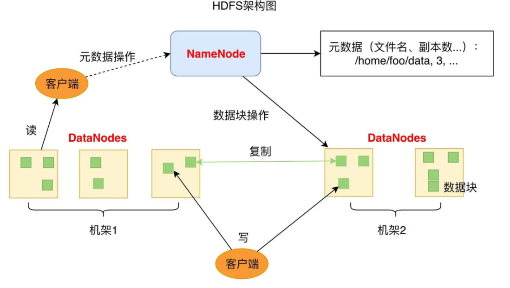
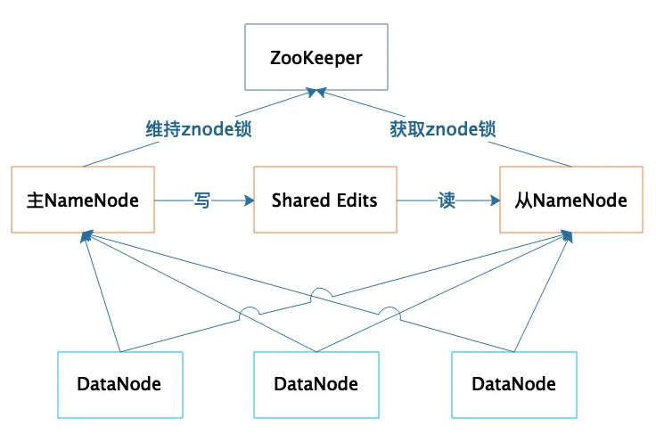
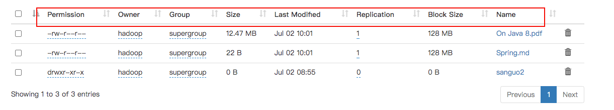
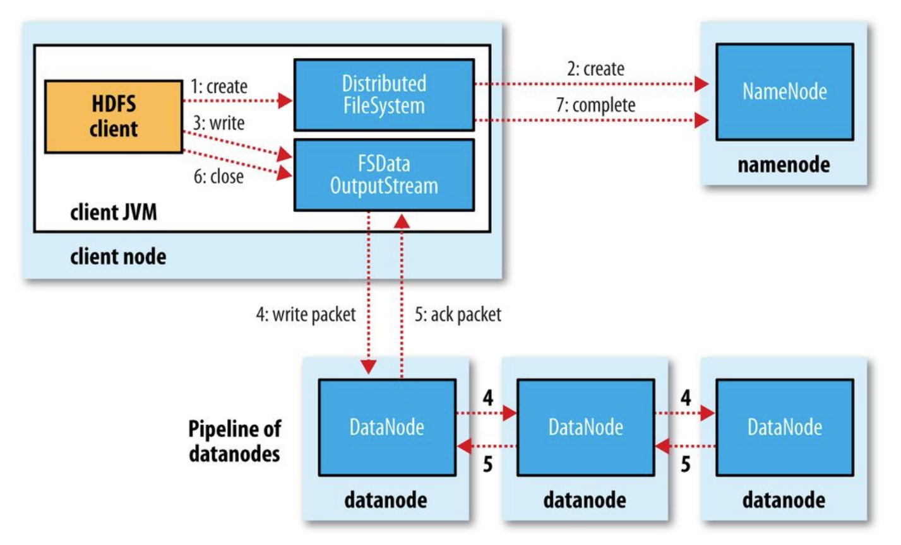

# 1 概述

## 1.1 定义

**HDFS（Hadoop Distributed File System）**是一个分布式文件系统，适用于一次写入多次读取的场景

## 1.2 组成



HDFS的关键组件有NameNode和DataNode

### 1.2.1 NameNode

**NameNode负责整个分布式文件系统的元数据（MetaData）管理，也就是文件路径名、数据块的ID以及存储位置等信息**

HDFS将一个数据块复制为多份（默认3份），并将多份相同数据存储在不同的服务器甚至机架上来保持数据的高可用。当有磁盘损坏或者DataNode服务宕机时，客户端会查找备份数据进行访问

NameNode是整个HDFS的核心，记录着HDFS文件分配表信息，所有的文件路径和数据块存储信息都保存在NameNode，如果NameNode故障，整个HDFS系统集群都无法使用；如果NameNode上记录的数据丢失，整个集群所有DataNode存储的数据也就没用了

因此NameNode高可用容错能力非常重要。NameNode采用主从热备的方式提供高可用服务，如下图



集群部署两台NameNode服务器，一台作为主服务器提供服务，一台作为从服务器进行热备，两台服务器通过ZooKeeper选举，主要是通过争夺znode锁资源，决定谁是主服务器。而DataNode则会向两个NameNode同时发送心跳数据，但是只有主NameNode才能向DataNode返回控制信息

正常运行期间，主从NameNode之间通过一个共享存储系统shared edits来同步文件系统的元数据信息。当主NameNode服务器宕机，从NameNode会通过ZooKeeper升级成为主服务器，并保证HDFS集群的元数据信息，也就是文件分配表信息完整一致

### 1.2.2 DataNode

**DataNode负责文件数据的存储和读写操作，HDFS将文件数据分割成若干数据块（Block），每个DataNode存储一部分数据块，这样文件就分布存储在整个HDFS服务器集群中**

### 1.2.3 Client

- Client在文件上传至HDFS会将文件切分成多个BLock然后进行上传
- 与NameNode交互获取文件位置信息
- 与DataNode交互进行读写
- 通过命令访问或管理HDFS，比如对HDFS的CRUD、NameNode格式化

### 1.2.4 Secondary NameNode

- 辅助NameNode分担其工作量
- 在紧急情况下可辅助恢复部分NameNode

## 1.3 HDFS文件块大小

HDFS默认块大小为128M（Hadoop2.X/3.X，Hadoop1.X为64M）

**HDFS块大小的设置主要取决于磁盘传输速率（100MB/s时考虑128M，200-300MB/s考虑256M）**

若HDFS块设置过小会导致块的增多，从而增加了寻址时间，相反，块设置太大会导致磁盘传输数据的时间增长，处理数据过慢

## 1.4 总结

- 文件数据以数据块的方式进行切分，数据块可以存储在集群任意DataNode服务器上，所以HDFS存储的文件可以非常大，一个文件理论上可以占据整个HDFS服务器集群上的所有磁盘，实现了大容量存储
- HDFS一般的访问模式是通过MapReduce程序在计算时读取，MapReduce对输入数据进行分片读取，通常一个分片就是一个数据块，每个数据块分配一个计算进程，这样就可以同时启动很多进程对一个HDFS文件的多个数据块进行并发访问，从而实现数据的高速访问
- DataNode存储的数据块会进行复制，使每个数据块在集群里有多个备份，保证了数据的可靠性，并通过一系列的故障容错手段实现HDFS系统中主要组件的高可用，进而保证数据和整个系统的高可用

# 2 HDFS的基本操作

## 2.1 基本语法

```shell
hadoop fs ...
hdfs dfs ...
# 两个命令完全相同
```

## 2.2 常用命令

###  -help

查看命令参数

```shell
 hadoop fs -help rm
 
 -rm [-f] [-r|-R] [-skipTrash] [-safely] <src> ... :
  Delete all files that match the specified file pattern. Equivalent to the Unix
  command "rm <src>"
                                                                                 
  -f          If the file does not exist, do not display a diagnostic message or 
              modify the exit status to reflect an error.                        
  -[rR]       Recursively deletes directories.                                   
  -skipTrash  option bypasses trash, if enabled, and immediately deletes <src>.  
  -safely     option requires safety confirmation, if enabled, requires          
              confirmation before deleting large directory with more than        
              <hadoop.shell.delete.limit.num.files> files. Delay is expected when
              walking over large directory recursively to count the number of    
              files to be deleted before the confirmation.  
```

###  -mkdir

创建文件夹

```shell
 hadoop fs -mkdir /sanguo
```

###  -moveFromLocal

将本地文件剪切到HDFS

```shell
# create file and input
vim shuguo.txt
input: shuguo

hadoop fs -moveFromLocal ./shuguo.txt /sanguo
```

###  -copyFromLocal/-put

将本地文件复制到HDFS

```shell
# create file and input
vim weiguo.txt
input: weiguo

hadoop fs -copyFromLocal/-put ./weiguo.txt /sanguo
```

### -appendToFile

追加文件到已有文件末尾 

```shell
 vim liubei.txt
 input: liubei
 
 hadoop fs -appendToFile ./liubei.txt /sanguo/shuguo.txt
```

### -copyToLocal/-get 

从HDFS拷贝到本地

```shell
hadoop fs -copyToLocal /sanguo/shuguo.txt ./

# 可更改名字
hadoop fs -get /sanguo/shuguo.txt ./shuguo2.txt
```

### -ls

显示目录信息

```shell
hadoop fs -ls /sanguo
```

### -cat 

显示文件内容

```shell
 hadoop fs -cat /sanguo/shuguo.txt
```

### -chgrp、-chmod、-chown

修改文件属性

```shell
hadoop fs -chgrp hadoop /sanguo/shuguo.txt

hadoop fs -chmod 666 /sanguo/shuguo.txt

hadoop fs -chown atguigu:atguigu /sanguo/shuguo.txt
```

### -cp

从 HDFS 的一个路径拷贝到 HDFS 的另一个路径

```shell
 hadoop fs -cp /sanguo/shuguo.txt /jinguo
```

### -mv 

在HDFS目录中移动文件

```shell
hadoop fs -mv /sanguo/wuguo.txt /jinguo
hadoop fs -mv /sanguo/weiguo.txt /jinguo
```

### -tail

显示文件末尾1kb的数据

```shell
hadoop fs -tail /jinguo/shuguo.txt
```

### -rm

删除文件或文件夹

```shell
hadoop fs -rm /sanguo/shuguo.txt
```

#### -rm -r

递归删除目录及目录中的内容

```shell
 hadoop fs -rm -r /sanguo
```

### -du 

统计文件大小信息

```shell
hadoop fs -du -s -h /jinguo
27 81 /jinguo

hadoop fs -du -h /jinguo
14 42 /jinguo/shuguo.txt
7 21 /jinguo/weiguo.txt
6 18 /jinguo/wuguo.tx
```

### -setrep

设置HDFS中文件的副本数量

Note：副本超出当前机器时，假设只有三台机器，那么只能有三个副本，后续增加机器后会再创建副本。**即节点数足够时才能使设置的副本数量满足需求**

```shell
hadoop fs -setrep 10 /jinguo/shuguo.txt
```

# 3 HDFS的API操作

首先确保本地以后jdk和hadoop（和服务器版本一直）环境

## 3.1 依赖及日志

```xml
<dependencies>
<dependency>
<groupId>org.apache.hadoop</groupId>
<artifactId>hadoop-client</artifactId>
<version>3.1.3</version>
</dependency>
<dependency>
<groupId>junit</groupId>
<artifactId>junit</artifactId>
<version>4.12</version>
</dependency>
<dependency>
<groupId>org.slf4j</groupId>
<artifactId>slf4j-log4j12</artifactId>
<version>1.7.30</version>
</dependency>
</dependencies>
```

在resources目录下新建log4j.properties

```properties
log4j.rootLogger=INFO, stdout 
log4j.appender.stdout=org.apache.log4j.ConsoleAppender 
log4j.appender.stdout.layout=org.apache.log4j.PatternLayout 
log4j.appender.stdout.layout.ConversionPattern=%d %p [%c] - %m%n 
log4j.appender.logfile=org.apache.log4j.FileAppender 
log4j.appender.logfile.File=target/spring.log 
log4j.appender.logfile.layout=org.apache.log4j.PatternLayout 
log4j.appender.logfile.layout.ConversionPattern=%d %p [%c] - %m%n
```

## 3.2 测试代码

```java
package cn.huakai;

import org.apache.hadoop.conf.Configuration;
import org.apache.hadoop.fs.FileSystem;
import org.apache.hadoop.fs.Path;
import org.junit.After;
import org.junit.Before;
import org.junit.Test;

import java.io.IOException;
import java.net.URI;
import java.net.URISyntaxException;
import java.util.jar.Pack200;

/**
 * @author: huakaimay
 * @since: 2021-07-01
 */
public class HDFSClient {

    private FileSystem fileSystem;

    @Before
    public void init() throws IOException, URISyntaxException, InterruptedException {
        // get paramters
        URI uri = new URI("hdfs://hadoop102:8020");
        Configuration configuration = new Configuration();
        String user = "hadoop";
        fileSystem = FileSystem.get(uri, configuration, user);
    }

    @After
    public void close() throws IOException {
        fileSystem.close();
    }


    @Test
    public void mdkir() {
        try {
            fileSystem.mkdirs(new Path("/xiyou"));
        } catch (IOException e) {
            e.printStackTrace();
        }
    }

    @Test
    public void upload() {
        try {
            fileSystem.copyFromLocalFile(false, true,
                    new Path("/Users/wentimei/Documents/学习笔记/Spring.md"),
                    new Path("/notes/Spring.md"));
        } catch (IOException e) {
            e.printStackTrace();
        }
    }
}
```

## 3.3 参数优先级

1. 客户端代码参数的设置

```java
Configuration configuration = new Configuration();
configuration.set...
```

2. 客户端ClassPath下的用户自定义配置文件

```xml
<?xml version="1.0" encoding="UTF-8"?>
<?xml-stylesheet type="text/xsl" href="configuration.xsl"?>

<configuration>
    <property>
        <name>dfs.replication</name>
        <value>1</value>
    </property>
</configuration>
```

3. 服务器自定义配置文件
4. 服务器默认配置

## 3.4 相关API

### delete

### rename

### copyToLocalFile

### listFiles

文件信息，包括权限，所有者，组等信息



### listStatus

是否Directory

# 4 HDFS的读写流程

## 4.1 文件写入



1. **客户端通过*DistributedFileSystem*调用*create()*来新建文件**
2. ***DistributedFileSystem*对*namenode*建立一个*[RPC](https://www.zhihu.com/question/25536695)*调用并在文件系统的命名空间新建一个空（没有数据块）的文件。namenode执行各项检查确保文件不存在以及客户端是否有相应的权限。若校验通过，*namenode*会对新文件进行记录，否则，文件创建失败并向客户端抛出*IOException*。随后，*DistributedFileSystem*向客户端返回*FSDataOutputStream*对象用于开始写入数据，*FSDataOutputStream*封装的*DFSOutputStream*对象负责处理*datanodes*和*namenode*之间的通信**
3. **当客户端写入数据时，*DFSOutputStream*将其分割成数据包并将其写入被称为*‘data queue’*的内部队列。*DataStreamer*会处理数据队列，它会选出一组适合存储数据副本的一组*datanodes*并要求*namenode* 分配新的数据块。这一组*datanodes*构成了一个管道(*piepline*)**
4. ***DataStreamer*将数据包以流的形式传输到管道中第一个*datanode*，该*datanode*存储数据包并将它发送给第二个*datanode*，以此类推直到最后一个**
5. **同时*DFSOutputStream*内部维护着一个称为*’ack queue‘*(确认队列)的数据包队列来等待datanode的回复。收到管道中所有的*datanode*的回复后，该数据包会从确认队列中删除**
6. **客户端完成数据写入后对数据流调用*close()*方法**

> 在数据写入期间，任何datanode发生故障时执行以下操作：
>
> 首先关闭管道，ack queue中的所有的packets都添加到data queue的最前端，这样可以保证故障节点的下游不会丢失任何数据包。为存储在另一个正常datanode的当前数据块指定一个新的标识，并传递给namenode以便故障datanode在恢复后可以删除存储的部分数据块。从管道中删除故障datanode，基于两个正常的datanode构建新的管道。剩下的数据块会被写入到管道中正常的datanode中