# Hadoop组成

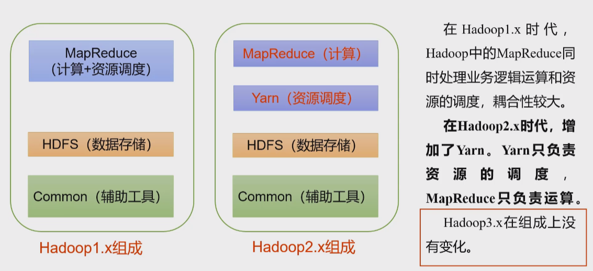

# Hadoop环境搭建

操作系统：CentOs7

我们先搭建一个空的系统随后克隆出多个镜像即可，克隆出的镜像需要修改ip地址和主机名

```shell
sudo vim /etc/hostname
```

## 查看网络情况

```shell
ifconfig
```

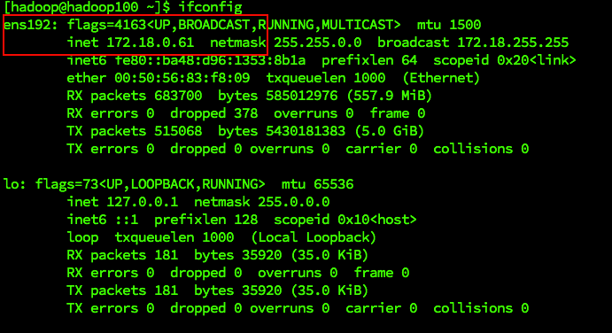

```shell
cat -n /etc/sysconfig/network-scripts/ifcfg-ens192
```

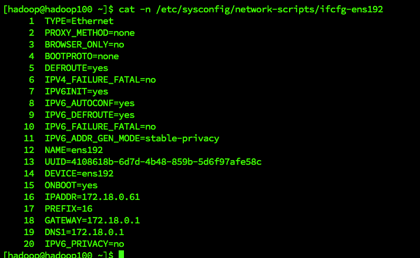

## 添加用户和密码

```shell
adduser hadoop
passwd hadoop

# 切换为普通用户
login -f hadoop
```

## 添加用户权限

我们可以给账户配置root的权限，以后加上sudo即可执行root的权限命令

```shell
vim /etc/sudoers
```

```shell
## Allows people in group wheel to run all commands
%wheel ALL=(ALL) ALL
```

在*%wheel* 这行后面添加

```shell
usernmae ALL=(ALL) NOPASSWD:ALL
```

## 修改文件夹所属主和所属组

```shell
sudo chown username:group path
# exp sudo chown wentimei:wentimei /opt/module
```

## 删除自带的jdk

如果系统是非桌面（最小化系统）不需要执行此步骤，因为没有安装

```shell
# root
su
password
# execute
rpm -qa | grep -i java | xargs -n1 rpm -e --nodeps
# 重启
reboot
```


## 配置主机映射

```shell
sudo vim /etc/hosts

# 将对应的ip和主机名写入hosts文件，后续的镜像ip、主机要与该映射保持一致
10.211.55.21 hadoop
10.211.55.18 hadoop2
10.211.55.23 hadoop3
10.211.55.22 hadoop4
```

## 安装JDK

之后我们要安装的软件只需在一台机上安装即可，其他的机子只要拷贝（scp等命令）即可

### 解压至指定目录

```shell
tar -zxvf jdk-8u212-linux-x64.tar.gz -C /opt/module/
```

### 配置环境变量

查看 `/etc/profile`文件，以往我们都是在该文件下进行配置，可以看到该文件的脚本其实就是在`/etc/profile.d/*.sh` 中循环读取依赖，所以我们可以在`profile.d`中加入自己的`.sh`文件

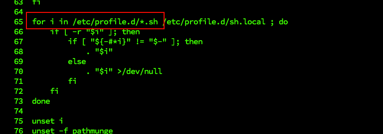

```shell
vi /etc/profile.d/env.sh

#JAVA_HOME
export JAVA_HOME=/opt/module/jdk1.8.0_212
export PATH=$PATH:$JAVA_HOME/bin

#使配置生效
source /etc/profile

java -version
```

## 安装Hadoop

### 解压

```shell
# 将当前文件夹下的指定文件解压至指定目录
tar -zxvf hadoop-3.1.3.tar.gz -C /opt/module/
```

### 配置环境变量

```shell
sudo vim /etc/profile.d/env.sh

#HADOOP_HOME
export HADOOP_HOME=/opt/module/hadoop-3.1.3
export PATH=$PATH:$HADOOP_HOME/bin
export PATH=$PATH:$HADOOP_HOME/sbin
```

### 目录结构

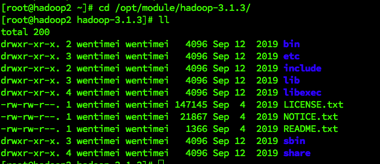

## 文件复制

### xsync脚本

循环复制文件到所有节点的相同目录下

```shell
# 在/home/username/bin下创建脚本文件xsync
cd ~
mkdir bin
cd bin
vim xsync

# 内容如下
#!/bin/bash
#1. 判断参数个数
if [ $# -lt 1 ]
then
echo Not Enough Arguement!
exit;
fi

#2. 遍历集群所有机器
for host in hadoop2 hadoop3 hadoop4
do
echo ==================== $host ====================
#3. 遍历所有目录，挨个发送
for file in $@
do
#4. 判断文件是否存在
if [ -e $file ]
then
#5. 获取父目录
pdir=$(cd -P $(dirname $file); pwd)
#6. 获取当前文件的名称
fname=$(basename $file)
ssh $host "mkdir -p $pdir"
rsync -av $pdir/$fname $host:$pdir
else
echo $file does not exists!
fi
done
done
```

修改xsync脚本的权限

```shell
chmod +x xsync
```

测试

```shell
# 在脚本目录下，将/home/wentimei/bin/ 拷贝到其他主机的相同目录
xsync /home/wentimei/bin/
```

全局调用

```shell
sudo cp /home/wentimei/bin/xsync /bin/
```

**Note: 如果在xsync前使用了sudo则需要加上xsync的全路径名**

```shell
# 在/home/wentimei路径下
sudo ./bin/xsync /home/wentimei/bin/
```

### scp 安全拷贝

基本语法

```shell
# 命令  递归  要拷贝的文件   目标主机和路径，该路径需要确保存在
  scp   -r    /opt/file    10.211.55.3:/opt/file
# 该命令可以从其他主机拉取文件到本地 参数交换即可，也可以将A的文件放置C
```

### rsync

用 *rsync* 做文件的复制要比 *scp* 的速度快，*rsync* 只对差异文件做更新而*scp* 是把所有文件都复制过去。

```shell
# 命令   归档拷贝、显示复制过程  要拷贝的文件   目标主机和路径，该路径需要确保存在
  rsync   -av                    /opt/file    10.211.55.3:/opt/file
```

## ssh免秘钥登录

- 生成公钥和私钥

```shell
cd ~
cd .ssh
ll
# 生成公钥和私钥
ssh-keygen -t rsa
```

- 将公钥拷贝至所有主机（包括自己，自己也要）

```shell
# .ssh目录下
ssh-copy-id hadoop
ssh-copy-id hadoop2
ssh-copy-id hadoop3
ssh-copy-id hadoop4
```

### 免密原理

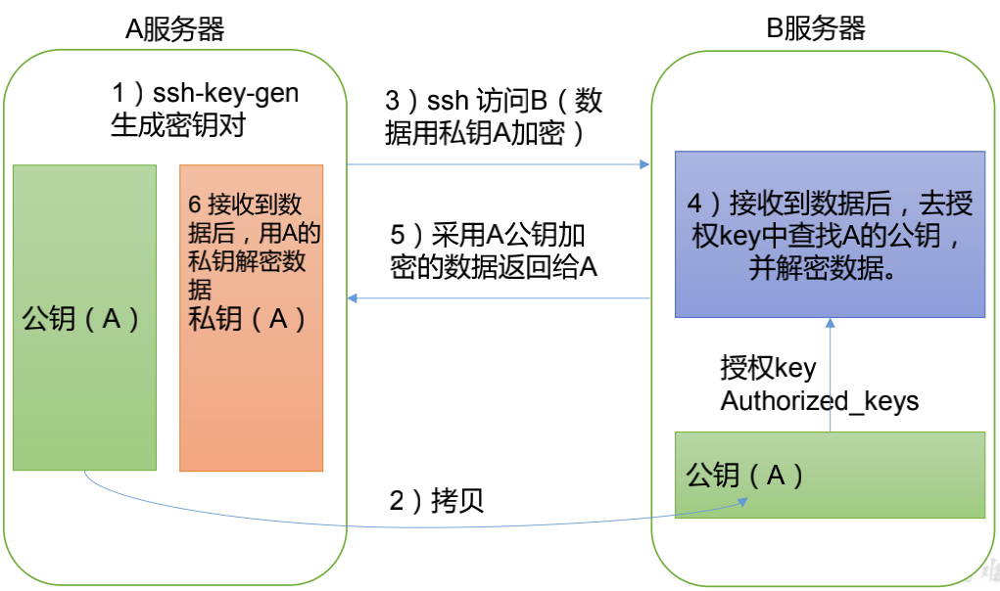

### .ssh目录结构

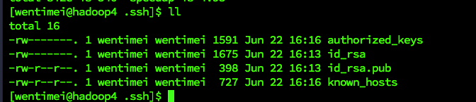

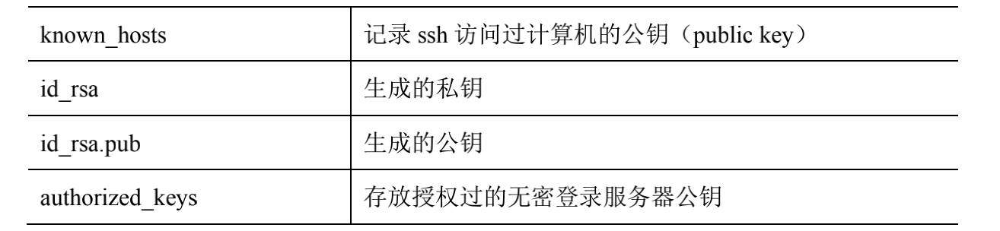

## 集群配置

### 1. 配置规划

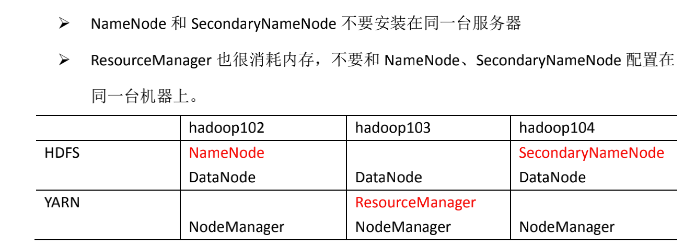

### 2. 配置文件

*Hadoop*有两类配置文件，默认配置文件和自定义配置文件

- 默认配置文件

默认配置文件路径为***$HADOOP_HOME/share/hadoop/xx.jar***，解析jar包获取对于的默认配置文件

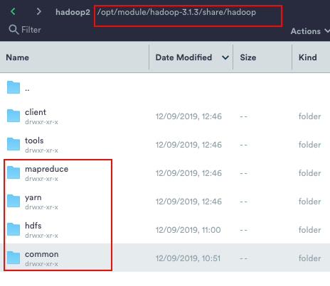

- 自定义配置文件

自定义配置文件存放在***$HADOOP_HOME/etc/hadoop***下包括：

**core-site.xml 、 hdfs-site.xml 、 yarn-site.xml 、 mapred-site.xml**

### 3. 修改自定义配置

#### 3.1 core-site.xml

```shell
# 进入配置文件目录
cd $HADOOP_HOME/etc/hadoop

vim core-site.xml
```

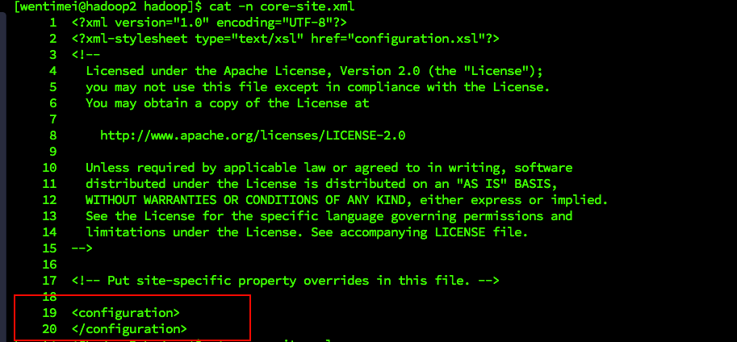

文件内容如下，将*property*放入*configuration*中即可

```xml
<?xml version="1.0" encoding="UTF-8"?>
<?xml-stylesheet type="text/xsl" href="configuration.xsl"?>
<configuration>
<!-- 指定 NameNode 的地址 -->
<property>
<name>fs.defaultFS</name>
<value>hdfs://hadoop102:8020</value>
</property>
<!-- 指定 hadoop 数据的存储目录 -->
<property>
<name>hadoop.tmp.dir</name>
<value>/opt/module/hadoop-3.1.3/data</value>
</property>
<!-- 配置 HDFS 网页登录使用的静态用户为 hadoop -->
<property>
<name>hadoop.http.staticuser.user</name>
<value>hadoop</value>
</property>
</configuration>
```

#### 3.2 hdfs-site.xml

```shell
vim hdfs-site.xml
```

文件内容如下：

```xml
<?xml version="1.0" encoding="UTF-8"?>
<?xml-stylesheet type="text/xsl" href="configuration.xsl"?>
<configuration>
<!-- nn web 端访问地址-->
<property>
<name>dfs.namenode.http-address</name>
<value>hadoop102:9870</value>
</property>
<!-- 2nn web 端访问地址-->
<property>
<name>dfs.namenode.secondary.http-address</name>
<value>hadoop104:9868</value>
</property>
</configuration>
```

#### 3.3 yarn-site.xml

```shell
vim yarn-site.xml
```

文件内容如下：

```xml
<?xml version="1.0" encoding="UTF-8"?>
<?xml-stylesheet type="text/xsl" href="configuration.xsl"?>

<configuration>
<!-- 指定 MR 走 shuffle -->
<property>
<name>yarn.nodemanager.aux-services</name>
<value>mapreduce_shuffle</value>
</property>
<!-- 指定 ResourceManager 的地址-->
<property>
<name>yarn.resourcemanager.hostname</name>
<value>hadoop103</value>
</property>
<!-- 环境变量的继承 该配置只针对3.1.3，高版本不需要配置-->
<property>
<name>yarn.nodemanager.env-whitelist</name>
<value>JAVA_HOME,HADOOP_COMMON_HOME,HADOOP_HDFS_HOME,HADOOP_CO
NF_DIR,CLASSPATH_PREPEND_DISTCACHE,HADOOP_YARN_HOME,HADOOP_MAP
RED_HOME</value>
</property>
</configuration>
```

#### 3.4 mapred-site.xml

```shell
vim mapred-site.xml
```

文件内容如下：

```xml
<?xml version="1.0" encoding="UTF-8"?>
<?xml-stylesheet type="text/xsl" href="configuration.xsl"?>

<configuration>
<!-- 指定 MapReduce 程序运行在 Yarn 上 -->
<property>
<name>mapreduce.framework.name</name>
<value>yarn</value>
</property>
  
<property>
  <name>yarn.app.mapreduce.am.env</name>
  <value>HADOOP_MAPRED_HOME=/opt/module/hadoop-3.1.3</value>
</property>
<property>
  <name>mapreduce.map.env</name>
  <value>HADOOP_MAPRED_HOME=/opt/module/hadoop-3.1.3</value>
</property>
<property>
  <name>mapreduce.reduce.env</name>
  <value>HADOOP_MAPRED_HOME=/opt/module/hadoop-3.1.3</value>
</property>
  
</configuration>
```

### 4. 配置分发

将所有机器的配置都改为一致

```shell
xsync /opt/module/hadoop-3.1.3/etc/hadoop/
```

## 启动

### 1. 配置workers并分发

```shell
vim /opt/module/hadoop-3.1.3/etc/hadoop/workers

# 将内容改为所有的主机名，注意该文件不能含有空格
hadoop2
hadoop3
hadoop4

xsync /opt/module/hadoop-3.1.3/etc/hadoop/workers
```

### 2. 第一次启动初始化 （仅第一次）

```shell
# hadoop目录下
hdfs namenode -format
```

格式化 NameNode，会产生新的集群 id，导致 NameNode 和 DataNode 的集群 id 不一致，集群找
不到已往数据。如果集群在运行过程中报错，需要重新格式化 NameNode 的话，一定要**先停止 namenode 和 datanode 进程**，并且要删除所有机器的 data 和 logs 目录，然后再进行格式
化

启动namenode会在data目录下生成name目录，name目录下有版本号和后面生成的data目录版本相对应，格式化之后namenode版本会产生变化不能和原来的data版本对应，所以需要删除data和logs目录

### 3. 启动HDFS

```shell
# hadoop目录下，在配置了NameNode节点启动
sbin/start-dfs.sh
```

访问地址：ip:9870 比如：10.211.55.18:9870

启动后应该和[配置规划](###1. 配置规划)的配置一致，下同

### 4. 启动yarn

```shell
# hadoop目录下，在配置了ResourceManager的节点启动
sbin/start-dfs.sh
```

访问地址：ip:8088比如：10.211.55.23:8088

### 5. 测试

```shell
# 注意：这里是在hdfs的路径上新建input文件夹
hadoop fs -mkdir /input

# 上传文件到hdfs的/input目录下
hadoop fs -put $HADOOP_HOME/wcinput/word.txt /input

# 这边路径同上，执行过程可在yarn页面上查看
hadoop jar share/hadoop/mapreduce/hadoop-mapreduce-examples-3.1.3.jar wordcount /input /output
```

## 配置历史服务器

### 配置mapred-site.xml

```shell
# $HADOOP_HOME/etc/hadoop
vim mapred-site.xml

# 添加如下配置
<!-- 历史服务器端地址 -->
<property>
<name>mapreduce.jobhistory.address</name>
<value>hadoop2:10020</value>
</property>
<!-- 历史服务器 web 端地址 -->
<property>
<name>mapreduce.jobhistory.webapp.address</name>
<value>hadoop2:19888</value>
</property>
```

### 分发

```shell
# $HADOOP_HOME/etc/hadoop
xsync mapred-site.xml
```

### 启动（Hadoop102）

```shell
 mapred --daemon start historyserver
 
 # 如果yarn已经启动，需要重新启动一下
```

## 开启日志聚集

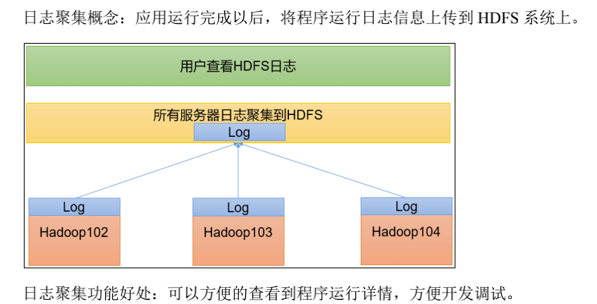

注意，**开启日志聚集功能需要重启yarn和历史服务器**

### 1. 配置yarn-site.xml

```shell
# $HADOOP_HOME/etc/hadoop/目录下
vim yarn-site.xml

# 添加如下配置
<!-- 开启日志聚集功能 -->
<property>
<name>yarn.log-aggregation-enable</name>
<value>true</value>
</property>
<!-- 设置日志聚集服务器地址 -->
<property> 
<name>yarn.log.server.url</name> 
<value>http://hadoop102:19888/jobhistory/logs</value>
</property>
<!-- 设置日志保留时间为 7 天 -->
<property>
<name>yarn.log-aggregation.retain-seconds</name>
<value>604800</value>
</property>
```

### 2. 分发

```shell
xsync $HADOOP_HOME/etc/hadoop/yarn-site.xml
```

### 3. 关闭服务后再次启动

```shell
# 关闭yarn (hadoop103)
sbin/stop-yarn.sh
# 关闭历史服务(hadoop102)
mapred --daemon stop historyserver
# 启动yarn (hadoop103)
sbin/start-yarn.sh
# 启动历史服务 （hadoop102）
mapred --daemon start historyserver
```

## 集群启停命令及脚本

### 1. 集群启停

##### 整体启/停 HDFS 和 YARN

```shell
start-dfs.sh/stop-dfs.sh

start-yarn.sh/stop-yarn.sh
```

### 2. 各组件单一启停

##### 分别启动/停止 HDFS 组件 和 YARN组件

```shell
hdfs --daemon start/stop namenode/datanode/secondarynamenode

yarn --daemon start/stop resourcemanager/nodemanager

# 历史服务启停
mapred --daemon start/stop historyserver
```

### 3. 集群启停脚本

```shell
cd ~
cd bin
vim cluster.sh

#!/bin/bash
if [ $# -lt 1 ]
then
echo "No Args Input..."
exit ;
fi
case $1 in
"start")
echo " =================== 启动 hadoop 集群 ==================="
echo " --------------- 启动 hdfs ---------------"
ssh hadoop102 "/opt/module/hadoop-3.1.3/sbin/start-dfs.sh"
echo " --------------- 启动 yarn ---------------"
ssh hadoop103 "/opt/module/hadoop-3.1.3/sbin/start-yarn.sh"
echo " --------------- 启动 historyserver ---------------"
ssh hadoop102 "/opt/module/hadoop-3.1.3/bin/mapred --daemon start 
historyserver"
;;
"stop")
echo " =================== 关闭 hadoop 集群 ==================="
echo " --------------- 关闭 historyserver ---------------"
ssh hadoop102 "/opt/module/hadoop-3.1.3/bin/mapred --daemon stop 
historyserver"
echo " --------------- 关闭 yarn ---------------"
ssh hadoop103 "/opt/module/hadoop-3.1.3/sbin/stop-yarn.sh"
echo " --------------- 关闭 hdfs ---------------"
ssh hadoop102 "/opt/module/hadoop-3.1.3/sbin/stop-dfs.sh"
;;
*)
echo "Input Args Error..."
;;
esac
```

##### 3.1 权限

```shell
chmod +x cluster.sh
```

### 4. 查看所有机器jps脚本并设置权限

```shell
cd ~
cd bin
vim jpsall

# input
#!/bin/bash
for host in hadoop102 hadoop103 hadoop104
do
echo =============== $host ===============
ssh $host jps 
done

chmod +x jpsall
```

### 5. 分发脚本给所有机器

```shell
xsync /home/hadoop/bin/
```

# 常用端口号

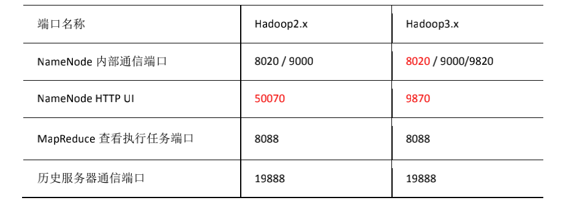

# 集群时间同步

**如果服务器可以连接外网则不需要进行此操作**，因为服务器会定时和公网时间校准