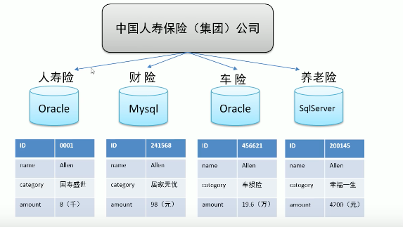
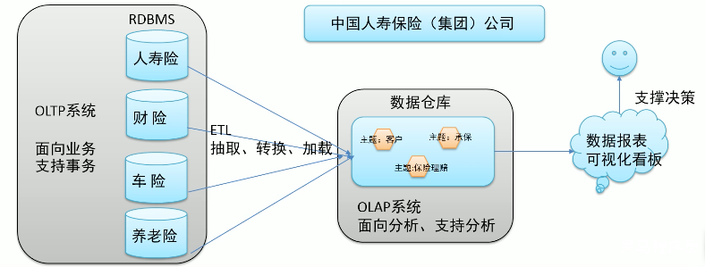

# 1. 数据仓库

## 1.1 基本概念

数据仓库（Data Warehouse）是一种分析数据库，用于存储和处理数据，以便对数据进行**分析**。数据仓库的两个主要功能：存储分析数据和处理分析数据（建立数仓就是为了分析数据且和OLTP解耦）

数仓本身不生产数据，也不需要消费任何数据

[数据库与数据仓库的本质区别是什么](https://www.zhihu.com/question/20623931)

数据仓库：数据仓库系统的主要应用主要是OLAP（On-Line Analytical Processing），支持复杂的**分析**操作，侧重决策支持，并且提供直观易懂的查询结果

[数据库 OLAP、OLTP的介绍和比较](https://www.jianshu.com/p/b1d7ca178691)

关系型数据库（RDBMS）是OLTP的典型应用，比如Oracle、MySQL、SQL Server等

> OLTP，也叫联机事务处理（Online Transaction Processing），表示事务性非常高的系统，一般都是高可用的在线系统，以小的事务以及小的查询为主，评估其系统的时候，一般看其每秒执行的Transaction以及Execute SQL的数量。在这样的系统中，单个数据库每秒处理的Transaction往往超过几百个，或者是几千个，Select 语句的执行量每秒几千甚至几万个。典型的OLTP系统有电子商务系统、银行、证券等，如美国eBay的业务数据库，就是很典型的OLTP数据库。
>
> OLTP比较常用的设计与优化方式为Cache技术与B-tree索引技术，Cache决定了很多语句不需要从磁盘子系统获得数据，所以，Web cache与Oracle data buffer对OLTP系统是很重要的。另外，在索引使用方面，语句越简单越好，这样执行计划也稳定，而且一定要使用绑定变量，减少语句解析，尽量减少表关联，尽量减少分布式事务，基本不使用分区技术、MV技术、并行技术及位图索引。因为并发量很高，批量更新时要分批快速提交，以避免阻塞的发生。
>
> OLTP 系统是一个数据块变化非常频繁，SQL 语句提交非常频繁的系统。 对于数据块来说，应尽可能让数据块保存在内存当中，对于SQL来说，尽可能使用变量绑定技术来达到SQL 重用，减少物理I/O 和重复的SQL 解析，从而极大的改善数据库的性能。

OLTP环境开展分析可行吗？可以，但是没有必要

OLTP系统的核心是面向业务，支持业务，支持事务。所有的操作可以分为读、写，一般来说读的压力明显大于写的压力，使用OLTP开展各种分析，需要考虑如下问题：

- 数据分析需要对数据进行读取操作，读的压力会增大
- OLTP仅存储数周或数月的数据
- 数据分散在不同系统不同表中

## 1.2 数仓分层

数据分层，每个企业根据自己的业务需求可以分成不同的层次，但是最基础的分层思想，理论上数据分为三个层：**数据运营层、数据仓库层、数据服务层**。基于这个基础分层之上，再提交信息的层次，来满足不同的业务需求

[数仓分层的意义价值及如何设计数据分层](https://blog.csdn.net/helloxiaozhe/article/details/108642862)

更多关于数仓的知识应该通过看书或者其他教学学习

[数据仓库原理&实战](https://www.bilibili.com/video/BV1qv411y7Wv?from=search&seid=5234062453980963874)

[数仓项目实战](https://www.bilibili.com/video/BV1rL411E7uz?from=search&seid=5234062453980963874)

