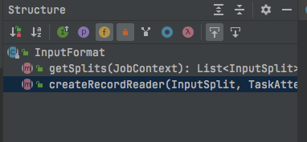
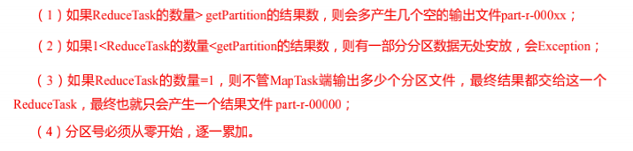

# 1 概述

MapReduce是一种可用于数据处理的编程模型，Hadoop可以运行各种语言版本的MapReduce程序。**MapReduce既是一个编程模型，又是一个计算框架**。也就是说，开发人员必须基于MapReduce编程模型进行编程开发，然后将程序通过MapReduce计算框架分发到Hadoop集群中运行。

> 其编程模型只包含Map和Reduce两个过程，map的主要输入是一对<Key, Value>值，经过map计算后输出一对<Key, Value>值；然后将相同Key合并，形成<Key, Value集合>；再将这个<Key, Value集合>输入reduce，经过计算输出零个或多个<Key, Value>对。

# 2 序列化

序列化是指将结构化对象转化为字节流以便在网络上传输或写到磁盘进行永久存储的过程。反序列化是指将字节流转回结构化对象的逆过程

**序列化用于分布式数据处理的两大领域：进程间通行和永久存储**

在Hadoop中，系统中多个节点上进程间的通信是通过RPC（远程过程调用）实现的。RPC协议将消息序列化成二进制流后发送到远程节点，远程节点接着将二进制流反序列化为原始消息。通常情况下RPC有如下序列化格式

- 紧凑：充分利用网络带宽，进而高效使用存储空间
- 快速：尽量减少序列化和反序列化的性能开销
- 可扩展：可透明的读取老格式的数据
- 支持互操作：可以支持不同语言读/写永久存储的数据

这些属性对持久存储格式十分重要

## 2.1 Wirtable


Hadoop使用的是自己的序列化格式Writable，它紧凑、速度快但不太容易用Java以外的语言进行扩展或使用

> 不使用Java Serialization是因为它太复杂了，Hadoop需要一个至精至简的机制，用于精确控制对象的读和写，这个机制是Hadoop的核心
>
> Java Serialization不满足前面的序列化格式标准：快速、紧凑、可扩展、支持互操作
>
> 不用RMI（远程方法调用）也是出于类似的考虑。高效、高性能的进程间通信是Hadoop的关键

## 2.2 自定义对象实现序列化接口

Hadoop提供的序列化类是有限的，但我们需要自定义对象时就需要实现序列化接口进行传输（原因上面已经说过[序列化](#2 序列化)）

自定义对象实现序列化接口时需要遵循如下步骤

- 实现Writable接口
- 反序列化是必须提供空参构造（反射）
- 重写序列化及反序列化方法

```java
@Override
public void write(DataOutput out) throws IOException {
  // 根据属性类型来决定写什么
  out.writeLong(upFlow);
	out.writeLong(downFlow);
	out.writeLong(sumFlow);
}

@Override
public void readFields(DataInput in) throws IOException {
	upFlow = in.readLong();
	downFlow = in.readLong();
	sumFlow = in.readLong();
}
```

- **反序列化的顺序和序列化写入顺序要一致**
- 重写toString方法用来格式化输出文件

```java
@Override
public String toString() {
    return upFlow + "\t" + downFlow + "\t" + sumFlow;
}
```

- 如果需要将自定义对象放在key中传输，则还需要实现 Comparable 接口，因为MapReduce中的 Shuffle过程要求对key必须能排序（考虑WritableComparable接口）

# 3 应用开发

MapReduce编程遵循一个特定的流程。首先写一个map函数和reduce函数，最好使用单元测试来确保函数的运行符合预期。然后写一个驱动程序来运行作业，看这个驱动程序是否可以正确运行

## 3.1 开发步骤

### Mapper


### Reducer


### Driver

相当于YARN集群的客户端，用于提交我们整个程序到YARN集群，提交的是封装了MapReduce程序相关运行参数的job对象

## 3.2 WordCount案列

如果写成内部类的形式注意一定要用static修饰

```java
package cn.huakai;

import org.apache.hadoop.conf.Configuration;
import org.apache.hadoop.fs.Path;
import org.apache.hadoop.io.LongWritable;
import org.apache.hadoop.io.Text;
import org.apache.hadoop.mapreduce.Job;
import org.apache.hadoop.mapreduce.Mapper;
import org.apache.hadoop.mapreduce.Reducer;
import org.apache.hadoop.mapreduce.lib.input.FileInputFormat;
import org.apache.hadoop.mapreduce.lib.output.FileOutputFormat;

import java.io.IOException;

/**
 * @author: huakaimay
 * @since: 2021-07-06
 */
public class WordCountDriver {

    public static void main(String[] args) throws IOException, InterruptedException, ClassNotFoundException {
        
        // 获取job实例
        Job job = Job.getInstance();

        // 关联Driver
        job.setJarByClass(WordCountDriver.class);

        // 关联Mapper和Reducer
        job.setMapperClass(WordCountMapper.class);
        job.setReducerClass(WordCountReducer.class);

        // 设置Map的输出kv
        job.setMapOutputKeyClass(Text.class);
        job.setMapOutputValueClass(LongWritable.class);

        // 设置最终输出kv
        job.setOutputKeyClass(Text.class);
        job.setOutputValueClass(LongWritable.class);

        // 输入和输出路径
        FileInputFormat.setInputPaths(job, new Path(args[0]));
        FileOutputFormat.setOutputPath(job, new Path(args[1]));

        // 提交job
        boolean result = job.waitForCompletion(true);
        System.exit(result ? 0 : 1);

    }

    /**
     * 文本输入类型key为偏移量，value为字符串
     */
    public static class WordCountMapper extends Mapper<LongWritable, Text, Text, LongWritable> {
        private Text text = new Text();
        private LongWritable longWritable = new LongWritable(1);

        @Override
        protected void map(LongWritable key, Text value, Context context) throws IOException, InterruptedException {
            // 读取文本时的key
            String inKey = value.toString();
            // 每行可能含有空格
            String[] keyArr = inKey.split(" ");
            for (String word : keyArr) {
                text.set(word);
                context.write(text, longWritable);
            }
        }
    }

    public static class WordCountReducer extends Reducer<Text, LongWritable, Text, LongWritable> {
        private LongWritable longWritable = new LongWritable();

        @Override
        protected void reduce(Text key, Iterable<LongWritable> values, Context context) throws IOException, InterruptedException {

            long sum = 0;
            for (LongWritable value : values) {
                sum += value.get();
            }
            longWritable.set(sum);

            context.write(key, longWritable);
        }
    }


}

```

### 打包

maven打包（带有依赖）插件

```xml
 <build>
        <plugins>
            <plugin>
                <artifactId>maven-compiler-plugin</artifactId>
                <version>3.6.1</version>
                <configuration>
                    <source>1.8</source>
                    <target>1.8</target>
                </configuration>
            </plugin>
            <plugin>
                <artifactId>maven-assembly-plugin</artifactId>
                <configuration>
                    <descriptorRefs>
                        <descriptorRef>jar-with-dependencies</descriptorRef>
                    </descriptorRefs>
                </configuration>
                <executions>
                    <execution>
                        <id>make-assembly</id>
                        <phase>package</phase>
                        <goals>
                            <goal>single</goal>
                        </goals>
                    </execution>
                </executions>
            </plugin>
        </plugins>
    </build>
```

### 集群测试

将jar包放置指定目录（/opt/modules/hadoop）下

```shell
# 全限定类名
hadoop jar xxx.jar xxx.WordCountDriver /input /output
```

## 3.3 序列化案例 

需求：统计每个手机号的上行流量、下行流量及总流量（可能含有重复手机号）

格式如下

```
1	13736230513	192.196.100.1	www.atguigu.com	2481	24681	200
2	13846544121	192.196.100.2			264	0	200
3 	13956435636	192.196.100.3			132	1512	200
4 	13966251146	192.168.100.1			240	0	404
5 	18271575951	192.168.100.2	www.atguigu.com	1527	2106	200
6 	84188413	192.168.100.3	www.atguigu.com	4116	1432	200
7 	13590439668	192.168.100.4			1116	954	200
8 	15910133277	192.168.100.5	www.hao123.com	3156	2936	200
9 	13729199489	192.168.100.6			240	0	200
10 	13630577991	192.168.100.7	www.shouhu.com	6960	690	200
11 	15043685818	192.168.100.8	www.baidu.com	3659	3538	200
12 	15959002129	192.168.100.9	www.atguigu.com	1938	180	500
13 	13560439638	192.168.100.10			918	4938	200
14 	13470253144	192.168.100.11			180	180	200
15 	13682846555	192.168.100.12	www.qq.com	1938	2910	200
16 	13992314666	192.168.100.13	www.gaga.com	3008	3720	200
17 	13509468723	192.168.100.14	www.qinghua.com	7335	110349	404
18 	18390173782	192.168.100.15	www.sogou.com	9531	2412	200
19 	13975057813	192.168.100.16	www.baidu.com	11058	48243	200
20 	13768778790	192.168.100.17			120	120	200
21 	13568436656	192.168.100.18	www.alibaba.com	2481	24681	200
22 	13568436656	192.168.100.19			1116	954	200
```


期望输出如下 


### 实体类

```java
package cn.huakai.writable;

import org.apache.hadoop.io.Writable;

import java.io.DataInput;
import java.io.DataOutput;
import java.io.IOException;

/**
 * 流量传输对象
 *
 * @author: huakaimay
 * @since: 2021-07-07
 */
public class FlowDTO implements Writable {

    /**
     * 上行流量
     */
    private Long upFlow;

    /**
     * 下行流量
     */
    private Long downFlow;

    /**
     * 总流量
     */
    private Long sumFlow;

    public Long getUpFlow() {
        return upFlow;
    }

    public void setUpFlow(Long upFlow) {
        this.upFlow = upFlow;
    }

    public Long getDownFlow() {
        return downFlow;
    }

    public void setDownFlow(Long downFlow) {
        this.downFlow = downFlow;
    }

    public Long getSumFlow() {
        return sumFlow;
    }

    public void setSumFlow(Long sumFlow) {
        this.sumFlow = sumFlow;
    }

    public void setSumFlow() {
        this.sumFlow = this.upFlow + this.downFlow;
    }

    @Override
    public void write(DataOutput out) throws IOException {
        out.writeLong(upFlow);
        out.writeLong(downFlow);
        out.writeLong(sumFlow);
    }

    @Override
    public void readFields(DataInput in) throws IOException {
        upFlow = in.readLong();
        downFlow = in.readLong();
        sumFlow = in.readLong();
    }

    @Override
    public String toString() {
        return upFlow + "\t" + downFlow + "\t" + sumFlow;
    }
}
```

### Driver

注意运行时要将mrunit从pom依赖中删除

```java
package cn.huakai.writable;

import org.apache.hadoop.fs.Path;
import org.apache.hadoop.io.LongWritable;
import org.apache.hadoop.io.Text;
import org.apache.hadoop.mapreduce.Job;
import org.apache.hadoop.mapreduce.Mapper;
import org.apache.hadoop.mapreduce.Reducer;
import org.apache.hadoop.mapreduce.lib.input.FileInputFormat;
import org.apache.hadoop.mapreduce.lib.output.FileOutputFormat;
import org.apache.hadoop.mrunit.mapreduce.MapDriver;
import org.junit.Test;

import java.io.IOException;

/**
 * @author: huakaimay
 * @since: 2021-07-07
 */
public class FlowDriver {

    public static void main(String[] args) throws IOException, InterruptedException, ClassNotFoundException {
        Job job = Job.getInstance();

        // jar
        job.setJarByClass(FlowDriver.class);

        // mapper and reducer
        job.setMapperClass(FlowMapper.class);
        job.setReducerClass(FlowReducer.class);

        // map output key & value
        job.setMapOutputValueClass(Text.class);
        job.setMapOutputValueClass(FlowDTO.class);

        // output key & value
        job.setOutputKeyClass(Text.class);
        job.setOutputValueClass(FlowDTO.class);

        // fileinput & output
        FileInputFormat.setInputPaths(job, new Path("/Users/wentimei/Downloads/phone_data.txt"));
        FileOutputFormat.setOutputPath(job, new Path("/Users/wentimei/Downloads/output"));

        // submit
        System.exit(job.waitForCompletion(true) ? 0 : 1);

    }

    public static class FlowMapper extends Mapper<LongWritable, Text, Text, FlowDTO> {
        private FlowDTO flowDTO = new FlowDTO();
        private Text outKey = new Text();

        // 1   13736230513    192.196.100.1  www.atguigu.com    2481   24681  200
        @Override
        protected void map(LongWritable key, Text value, Context context) throws IOException, InterruptedException {
            String[] split = value.toString().split("\t");
            String phone = split[1];
            // 因为前面的数据不全，切割后数据不一致，而后面数据完整，从后切割即可保证数据正确
            String upFlow = split[split.length - 3];
            String downFlow = split[split.length - 2];
            flowDTO.setUpFlow(Long.valueOf(upFlow));
            flowDTO.setDownFlow(Long.parseLong(downFlow));
            flowDTO.setSumFlow();
            outKey.set(phone);
            context.write(outKey, flowDTO);
        }
        @Test
        public void recoder() throws IOException {
            Text text = new Text("2\t13846544121\t192.196.100.2\t\t\t264\t0\t200");
            FlowDTO flowDTO = new FlowDTO();
            flowDTO.setUpFlow(264l);
            flowDTO.setDownFlow(0l);
            flowDTO.setSumFlow();
            new MapDriver<LongWritable, Text, Text, FlowDTO>()
                    .withMapper(new FlowMapper())
                    .withInput(new LongWritable(0), text)
                    .withOutput(new Text("13846544121"), flowDTO)
                    .runTest();
        }
    }

    public static class FlowReducer extends Reducer<Text, FlowDTO, Text, FlowDTO> {
        private FlowDTO flowDTO = new FlowDTO();
        @Override
        protected void reduce(Text key, Iterable<FlowDTO> values, Context context) throws IOException, InterruptedException {

            Long totalUp = 0l;
            Long totalDown = 0l;
            for (FlowDTO value : values) {
                totalUp += value.getUpFlow();
                totalDown += value.getDownFlow();
            }
            flowDTO.setUpFlow(totalUp);
            flowDTO.setDownFlow(totalDown);
            flowDTO.setSumFlow();

            context.write(key,flowDTO);
        }
    }
}
```

# 4 MapReduce工作机制

## 4.1 InputFormat




Map-Reduce依赖于job的InputFormat用于：

- 校验job的input-specification
- 将输入文件切割为分片（InputSplits），每个Mapper都有一个对应的分片

意思是有几个分片就有几个MapTask

- 提供RecordReader实现，从分片中收集数据提供给Mapper


RecordReader将数据分解为key/value的形式给Mapper

### FileInputFormat

#### getSplits

```java
/** 
 * Generate the list of files and make them into FileSplits.
 * @param job the job context
 * @throws IOException
 */
public List<InputSplit> getSplits(JobContext job) throws IOException {
  StopWatch sw = new StopWatch().start();
  long minSize = Math.max(getFormatMinSplitSize(), getMinSplitSize(job));
  long maxSize = getMaxSplitSize(job);

  // generate splits
  List<InputSplit> splits = new ArrayList<InputSplit>();
  List<FileStatus> files = listStatus(job);

  boolean ignoreDirs = !getInputDirRecursive(job)
    && job.getConfiguration().getBoolean(INPUT_DIR_NONRECURSIVE_IGNORE_SUBDIRS, false);
  // 遍历文件
  for (FileStatus file: files) {
    if (ignoreDirs && file.isDirectory()) {
      continue;
    }
    Path path = file.getPath();
    // 单个文件大小
    long length = file.getLen();
    if (length != 0) {
      BlockLocation[] blkLocations;
      if (file instanceof LocatedFileStatus) {
        blkLocations = ((LocatedFileStatus) file).getBlockLocations();
      } else {
        FileSystem fs = path.getFileSystem(job.getConfiguration());
        blkLocations = fs.getFileBlockLocations(file, 0, length);
      }
      if (isSplitable(job, path)) {
        long blockSize = file.getBlockSize();
        /*
        默认情况下切片大小 = blockSize，blockSize不可更改
        splitSize可以通过设置minSize和maxSize来调整大小
        protected long computeSplitSize(long blockSize, long minSize,
                                  long maxSize) {
   	 				return Math.max(minSize, Math.min(maxSize, blockSize));
  			}
  			minSize默认为1
  			设置maxSize小于blockSize时可以将splitSize调小
  			设置minSize大于blockSize时可以将splitSize调大
        */
        long splitSize = computeSplitSize(blockSize, minSize, maxSize);

        long bytesRemaining = length;
        /*
        SPLIT_SLOP为1.1
        当前文件剩余大小（第一次是总大小注意while）/splitSize > 1.1
        也就是说文件大小剩余超过110%时才进行切割
        exp: 8.01 / 4 > 1.1
       	不满足条件所以有4M和4.01M两个文件
        */
        while (((double) bytesRemaining)/splitSize > SPLIT_SLOP) {
          int blkIndex = getBlockIndex(blkLocations, length-bytesRemaining);
          splits.add(makeSplit(path, length-bytesRemaining, splitSize,
                      blkLocations[blkIndex].getHosts(),
                      blkLocations[blkIndex].getCachedHosts()));
          bytesRemaining -= splitSize;
        }

        if (bytesRemaining != 0) {
          int blkIndex = getBlockIndex(blkLocations, length-bytesRemaining);
          splits.add(makeSplit(path, length-bytesRemaining, bytesRemaining,
                     blkLocations[blkIndex].getHosts(),
                     blkLocations[blkIndex].getCachedHosts()));
        }
      } else { // not splitable
        if (LOG.isDebugEnabled()) {
          // Log only if the file is big enough to be splitted
          if (length > Math.min(file.getBlockSize(), minSize)) {
            LOG.debug("File is not splittable so no parallelization "
                + "is possible: " + file.getPath());
          }
        }
        splits.add(makeSplit(path, 0, length, blkLocations[0].getHosts(),
                    blkLocations[0].getCachedHosts()));
      }
    } else { 
      //Create empty hosts array for zero length files
      splits.add(makeSplit(path, 0, length, new String[0]));
    }
  }
  // Save the number of input files for metrics/loadgen
  job.getConfiguration().setLong(NUM_INPUT_FILES, files.size());
  sw.stop();
  if (LOG.isDebugEnabled()) {
    LOG.debug("Total # of splits generated by getSplits: " + splits.size()
        + ", TimeTaken: " + sw.now(TimeUnit.MILLISECONDS));
  }
  return splits;
}
```

#### TextInputFormat


文件以行的方式被读取（换行或者回车表示行尾），key表示行的位置（偏移量）value是行的内容（文本行）

**这是框架默认的切片机制，不管文件多小都会是一个单独的切片，当有当量小文件时会产生大量的切片也就是会有大量的MapTask导致处理效率低下**

### CombineFileInputFormat

#### CombineTextInputFormat


CombineTextInputFormat用于处理小文件过多的场景，它将多个小文件从逻辑上规划到一个切片中，这样多个小文件就可以交给一个MapTask处理

通过`CombineTextInputFormat.setMaxInputSplitSize(job, 4194304); // 4M`可以设置虚拟存储切片的最大值，该值应该根据实际的小文件大小来设置

#### getSplits

生成切片过程包括虚拟存储过程和切片过程


#### 如何更改切片机制

在Driver类中设置即可

`job.setInputFormatClass(xxInputFormat.class)`

## 4.2 Shuffle

MapReduce确保每个reducer的输入都是按Key排序的。系统执行排序，将map输出作为输入传给reducer的过程称为shuffle

### 4.2.1 map端


每个map任务都有一个环形内存缓冲区用于存储任务输出。默认情况下，缓冲区的大小为100MB，一旦缓冲区内容达到阈值（默认为0.8或80%），一个后台线程便开始把内容溢出(spill)到磁盘。在溢出到磁盘过程中，map输出继续写到缓冲区，一旦缓冲区被填满，map将会被阻塞直到写磁盘过程完成

在写磁盘之前，线程首先会根据要传送的数据的reducer，把数据划分成相应的分区。在每个分区中，后台线程按Key进行内存中排序，如果有一个combiner函数，它就在排序后的输出上运行。combiner函数使得map函数结果更紧凑，因此减少写到磁盘的数据和传递给reducer的数据

每次内存缓冲区达到溢出阈值就会新建一个溢出文件，因此在map任务写完其最后一个输出记录之后，会有几个溢出文件。在任务完成前，溢出文件将被合并成一个已分区且以排序的输出文件。默认最多一次合并10个，如果至少存在3个溢出文件，则combiner就会在输出文件写道磁盘之前再次运行（combiner可以在输入上反复运行，不会影响最终结果）如果少于3个溢出文件，由于map输出规模少，combiner调用带来的开销是不划算的，因此不会为map输出再次运行combiner

在map输出写到磁盘的过程中对它进行压缩可以使写磁盘的速度更快，节约磁盘空间并且可以减少传给reducer的数据量

### 4.2.2 reduce端

## 4.3 分区

### 4.3.1 需求


### 4.3.2 实现

#### 分区类

在[Driver](###Driver)的基础上添加分区类实现Partitioner<K,V>，泛型是Mapper的输入k和v

```java
package cn.huakai.v4_4_1;

import org.apache.hadoop.io.Text;
import org.apache.hadoop.mapreduce.Partitioner;

/**
 * @author: huakaimay
 * @since: 2021-07-08
 */
public class ProvincePartitioner extends Partitioner<Text, FlowDTO> {

    @Override
    public int getPartition(Text text, FlowDTO flowDTO, int numPartitions) {
        // 手机号前3位
        String prePhone = text.toString().substring(0, 3);

        return PartitinerEnum.getPartitionerByPre(prePhone);

    }
}

```

#### 枚举类

用于处理分区类型的枚举类

```java
package cn.huakai.v4_4_1;

/**
 * @author: huakaimay
 * @since: 2021-07-08
 */
public enum PartitinerEnum {

    /**
     * 分区0
     */
    P0(0, "136"),
    /**
     * 分区1
     */
    P1(1, "137"),
    P2(2, "138"),
    P3(3, "139"),
    P4(4, "other");

    private int partitioner;

    /**
     * 前缀
     */
    private String pre;

    private String desc;

    public int getPartitioner() {
        return partitioner;
    }

    public void setPartitioner(int partitioner) {
        this.partitioner = partitioner;
    }

    public String getPre() {
        return pre;
    }

    public void setPre(String pre) {
        this.pre = pre;
    }

    public String getDesc() {
        return desc;
    }

    public void setDesc(String desc) {
        this.desc = desc;
    }

    PartitinerEnum() {
    }

    PartitinerEnum(int partitioner) {
        this.partitioner = partitioner;
    }


    PartitinerEnum(int partitioner, String pre) {
        this.partitioner = partitioner;
        this.pre = pre;
    }

    public static int getPartitionerByPre(String pre) {
        PartitinerEnum[] values = PartitinerEnum.values();
        for (PartitinerEnum value : values) {
            if (pre.equals(value.pre))
                return value.partitioner;
        }

        return P4.getPartitioner();
    }
}

```

#### Driver

添加关于分区的设置

```java
job.setPartitionerClass(ProvincePartitioner.class);
job.setNumReduceTasks(5);
```

```java
package cn.huakai.v4_4_1;

import org.apache.hadoop.fs.Path;
import org.apache.hadoop.io.LongWritable;
import org.apache.hadoop.io.Text;
import org.apache.hadoop.mapreduce.Job;
import org.apache.hadoop.mapreduce.Mapper;
import org.apache.hadoop.mapreduce.Reducer;
import org.apache.hadoop.mapreduce.lib.input.FileInputFormat;
import org.apache.hadoop.mapreduce.lib.output.FileOutputFormat;

import java.io.IOException;

/**
 * @author: huakaimay
 * @since: 2021-07-07
 */
public class FlowDriver {

    public static void main(String[] args) throws IOException, InterruptedException, ClassNotFoundException {
        Job job = Job.getInstance();

        // jar
        job.setJarByClass(FlowDriver.class);

        // mapper and reducer
        job.setMapperClass(FlowMapper.class);
        job.setReducerClass(FlowReducer.class);

        // map output key & value
        job.setMapOutputValueClass(Text.class);
        job.setMapOutputValueClass(FlowDTO.class);

        // output key & value
        job.setOutputKeyClass(Text.class);
        job.setOutputValueClass(FlowDTO.class);
        
        // partitioner
        job.setPartitionerClass(ProvincePartitioner.class);
        job.setNumReduceTasks(5);

        // fileinput & output
        FileInputFormat.setInputPaths(job, new Path("/Users/wentimei/Downloads/phone_data.txt"));
        FileOutputFormat.setOutputPath(job, new Path("/Users/wentimei/Downloads/output"));

        // submit
        System.exit(job.waitForCompletion(true) ? 0 : 1);

    }

    public static class FlowMapper extends Mapper<LongWritable, Text, Text, FlowDTO> {
        private FlowDTO flowDTO = new FlowDTO();
        private Text outKey = new Text();

        // 1	13736230513	192.196.100.1	www.atguigu.com	2481	24681	200
        @Override
        protected void map(LongWritable key, Text value, Context context) throws IOException, InterruptedException {
            String[] split = value.toString().split("\t");
            String phone = split[1];
            // 因为前面的数据不全，切割后数据不一致，而后面数据完整，从后切割即可保证数据正确
            String upFlow = split[split.length - 3];
            String downFlow = split[split.length - 2];
            flowDTO.setUpFlow(Long.valueOf(upFlow));
            flowDTO.setDownFlow(Long.parseLong(downFlow));
            flowDTO.setSumFlow();
            outKey.set(phone);
            context.write(outKey, flowDTO);
        }
    }

    public static class FlowReducer extends Reducer<Text, FlowDTO, Text, FlowDTO> {
        private FlowDTO flowDTO = new FlowDTO();
        @Override
        protected void reduce(Text key, Iterable<FlowDTO> values, Context context) throws IOException, InterruptedException {

            Long totalUp = 0l;
            Long totalDown = 0l;
            for (FlowDTO value : values) {
                totalUp += value.getUpFlow();
                totalDown += value.getDownFlow();
            }
            flowDTO.setUpFlow(totalUp);
            flowDTO.setDownFlow(totalDown);
            flowDTO.setSumFlow();

            context.write(key,flowDTO);
        }
    }
}
```

### 4.3.3 总结



## 4.4 排序

> 参考《Hadoop权威指南》9.2排序（P252）

排序是MapReduce的核心技术


**Mapper的输出key必须经过排序！**

### 部分排序

MapReduce根据输入记录的Key对数据集排序，保证输出的每个文件内部有序

案列：


在全排序的基础上加上分区类并在驱动类中设置即可

```java
package cn.huakai.v_4_5.sort2;

import cn.huakai.v4_4_1.PartitinerEnum;
import org.apache.hadoop.io.Text;
import org.apache.hadoop.mapreduce.Partitioner;

/**
 * @author: huakaimay
 * @since: 2021-07-09
 */
public class ProvincePartitioner extends Partitioner<FlowDTO, Text> {

    @Override
    public int getPartition(FlowDTO flowDTO, Text text, int numPartitions) {
        String pre = text.toString().substring(0, 3);
        return PartitinerEnum.getPartitionerByPre(pre);
    }
}
```

```java
// partitioner
job.setPartitionerClass(ProvincePartitioner.class);
job.setNumReduceTasks(5);
```

### 全排序

最简单的方法是使用一个分区（job.setNumReduceTasks(1)），该方法在处理大型文件时效率极低，因为一台机器必须处理所有的输出文件，从而完全丧失了MapReduce所提供的并行架构的优势

案列描述：如果Mapper输出的key是实体类就需要让实体类实现序列化和排序

```java
package cn.huakai.v_4_5.sort1;

import org.apache.hadoop.conf.Configuration;
import org.apache.hadoop.fs.Path;
import org.apache.hadoop.io.LongWritable;
import org.apache.hadoop.io.Text;
import org.apache.hadoop.mapreduce.Job;
import org.apache.hadoop.mapreduce.Mapper;
import org.apache.hadoop.mapreduce.Reducer;
import org.apache.hadoop.mapreduce.lib.input.FileInputFormat;
import org.apache.hadoop.mapreduce.lib.output.FileOutputFormat;

import java.io.IOException;

/**
 * @author: huakaimay
 * @since: 2021-07-07
 */
public class FlowDriver {

    public static void main(String[] args) throws IOException, InterruptedException, ClassNotFoundException {
        Configuration configuration = new Configuration();
        Job job = Job.getInstance(configuration);

        // jar
        job.setJarByClass(FlowDriver.class);

        // mapper and reducer
        job.setMapperClass(FlowMapper.class);
        job.setReducerClass(FlowReducer.class);

        // map output key & value
        job.setMapOutputValueClass(FlowDTO.class);
        job.setMapOutputValueClass(Text.class);

        // output key & value
        job.setOutputKeyClass(FlowDTO.class);
        job.setOutputValueClass(Text.class);

        // fileinput & output
        FileInputFormat.setInputPaths(job, new Path("/Users/wentimei/Downloads/phone_data.txt"));
        FileOutputFormat.setOutputPath(job, new Path("/Users/wentimei/Downloads/output"));

        // submit
        System.exit(job.waitForCompletion(true) ? 0 : 1);

    }

    public static class FlowMapper extends Mapper<LongWritable, Text, FlowDTO, Text> {
        private FlowDTO flowDTO = new FlowDTO();
        private Text outKey = new Text();

        // 1	13736230513	192.196.100.1	www.atguigu.com	2481	24681	200
        @Override
        protected void map(LongWritable key, Text value, Context context) throws IOException, InterruptedException {
            String[] split = value.toString().split("\t");
            flowDTO.setUpFlow(Long.parseLong(split[split.length - 3]));
            flowDTO.setDownFlow(Long.parseLong(split[split.length - 2]));
            flowDTO.setSumFlow();

            outKey.set(split[1]);

            context.write(flowDTO, outKey);
        }
    }

    public static class FlowReducer extends Reducer<FlowDTO, Text, Text, FlowDTO> {

        @Override
        protected void reduce(FlowDTO key, Iterable<Text> values, Context context) throws IOException, InterruptedException {
            for (Text value : values) {
                context.write(value, key);
            }
        }
    }
}
```

```java
package cn.huakai.v_4_5.sort1;

import org.apache.hadoop.io.WritableComparable;

import java.io.DataInput;
import java.io.DataOutput;
import java.io.IOException;

/**
 * 流量传输对象
 *
 * @author: huakaimay
 * @since: 2021-07-07
 */
public class FlowDTO implements WritableComparable<FlowDTO> {

    /**
     * 上行流量
     */
    private Long upFlow;

    /**
     * 下行流量
     */
    private Long downFlow;

    /**
     * 总流量
     */
    private Long sumFlow;

    public Long getUpFlow() {
        return upFlow;
    }

    public void setUpFlow(Long upFlow) {
        this.upFlow = upFlow;
    }

    public Long getDownFlow() {
        return downFlow;
    }

    public void setDownFlow(Long downFlow) {
        this.downFlow = downFlow;
    }

    public Long getSumFlow() {
        return sumFlow;
    }

    public void setSumFlow(Long sumFlow) {
        this.sumFlow = sumFlow;
    }

    public void setSumFlow() {
        this.sumFlow = this.upFlow + this.downFlow;
    }

    @Override
    public void write(DataOutput out) throws IOException {
        out.writeLong(upFlow);
        out.writeLong(downFlow);
        out.writeLong(sumFlow);
    }

    @Override
    public void readFields(DataInput in) throws IOException {
        upFlow = in.readLong();
        downFlow = in.readLong();
        sumFlow = in.readLong();
    }

    @Override
    public String toString() {
        return upFlow + "\t" + downFlow + "\t" + sumFlow;
    }

    @Override
    public int compareTo(FlowDTO o) {
        if (this.sumFlow > o.sumFlow)
            return -1;
        else if (this.sumFlow < o.sumFlow)
            return 1;
        else
            return 0;
    }
}

```

### 辅助排序

在Reduce端对key进行分组。应用于：在接收的key为bean对象时，想让一个或几个字段相同（全部
字段比较不相同）的key进入到同一个reduce方法时，可以采用分组排序

## 4.5 combiner

Hadoop允许用户针对map任务的输出指定一个combiner（向mapper和reducer一样定义），combiner函数的输出作为reduce函数的输入。combiner是一种优化方案，Hadoop无法确定要对一个指定的map任务输出记录调用多少次combiner。也就是说无论调用多少次combiner，reducer的输出结果都是一样的

combiner可以对每个MapTask的输出进行局部汇总，减少网络网络传输量使得reduce执行效率更高 

案列：统计单词次数，可以使用combiner提前计算每个单词的总量以减少reduce的计算

combiner和reducer一样继承Reducer<K, V>，然后在驱动类设置combiner即可

`job.setCombinerClass(xxCombiner.class)`

若combiner和reducer的功能完全一样则可以在驱动类设置combiner，指定reducer类即可

`job.setCombinerClass(xxReducer.class)`


```java
package cn.huakai.v4_6;

import cn.huakai.WordCountDriver;
import org.apache.hadoop.fs.Path;
import org.apache.hadoop.io.LongWritable;
import org.apache.hadoop.io.Text;
import org.apache.hadoop.mapreduce.Job;
import org.apache.hadoop.mapreduce.Mapper;
import org.apache.hadoop.mapreduce.Reducer;
import org.apache.hadoop.mapreduce.lib.input.FileInputFormat;
import org.apache.hadoop.mapreduce.lib.output.FileOutputFormat;

import java.io.IOException;
import java.util.Arrays;

/**
 * @author: huakaimay
 * @since: 2021-07-09
 */
public class WordContDriver {

    public static void main(String[] args) throws IOException, InterruptedException, ClassNotFoundException {

        Job job = Job.getInstance();
        job.setJarByClass(WordContDriver.class);

        job.setMapperClass(WrodCountMapper.class);
        job.setReducerClass(WrodCountReducer.class);

        job.setMapOutputKeyClass(Text.class);
        job.setMapOutputValueClass(LongWritable.class);

        job.setOutputKeyClass(Text.class);
        job.setOutputValueClass(LongWritable.class);
        job.setCombinerClass(WordCombiner.class);

        FileInputFormat.setInputPaths(job, new Path("/Users/wentimei/Downloads/hello.txt"));
        FileOutputFormat.setOutputPath(job, new Path("/Users/wentimei/Downloads/combinerOutput"));


        System.exit(job.waitForCompletion(true) ? 0 : 1);

    }

    public static class WrodCountMapper extends Mapper<LongWritable, Text, Text, LongWritable> {
        private Text outKey = new Text();
        private LongWritable times = new LongWritable(1);

        @Override
        protected void map(LongWritable key, Text value, Context context) throws IOException, InterruptedException {
            Arrays.stream(value.toString().split(" "))
                    .forEach(line -> {
                        outKey.set(line);
                        try {
                            context.write(outKey, times);
                        } catch (IOException e) {
                            e.printStackTrace();
                        } catch (InterruptedException e) {
                            e.printStackTrace();
                        }
                    });


        }
    }

    public static class WrodCountReducer extends Reducer<Text, LongWritable, Text, LongWritable> {
        private LongWritable outValue = new LongWritable();
        @Override
        protected void reduce(Text key, Iterable<LongWritable> values, Context context) throws IOException, InterruptedException {
            long sum = 0;
            for (LongWritable value : values) {
                sum += value.get();
            }
            outValue.set(sum);

            context.write(key, outValue);
        }
    }

    public static class WordCombiner extends Reducer<Text, LongWritable, Text, LongWritable> {
        private LongWritable outValue = new LongWritable();
        @Override
        protected void reduce(Text key, Iterable<LongWritable> values, Context context) throws IOException, InterruptedException {
            long sum = 0;
            for (LongWritable value : values) {
                sum += value.get();
            }
            outValue.set(sum);

            context.write(key, outValue);
        }
    }
}

```

案列都没有分析清楚就写代码了，要先分析清楚案列，怎么解决，会有什么问题出现！

## 4.6 OutputFormat

对应InputFormat，Hadoop都有相应的输出格式


Map-Reduce依赖OutputFormat用于：

1. 校验任务的ouput-sepecification。比如校验输出路径是否已经存在
2. 提供RecordWriter用于写出任务的输出文件，输出文件存储在FileSystem


RecordWriter把输出键值对写到输出文件中

RecordWriter实现把任务输出写到FileSystem

### 4.6.1 TextOutputFormat

TextOutputFormat是默认的输出格式，它把每条记录写为文本。每个键值对由制表符进行分割，可以通过设定`mapreduce.output.textoutputformat.separator`属性改变默认的分割符

和TextoutputFormat对于的输入格式是KeyValueTextInputFormat

### 4.6.2 自定义OutputFormat

自定义输出类型时需要继承FileOutputFormat并改写getRecordWriter方法，返回一个具体的RecordWriter类（自定义），重写自定义Writer的相关方法

#### 案例

过滤输入文件将包含特定字符的文字放到一个目录，其他的放到另一个目录

```
http://www.baidu.com
http://www.google.com
http://cn.bing.com
http://www.atguigu.com
http://www.sohu.com
http://www.sina.com
http://www.sin2a.com
http://www.sin2desa.com
http://www.sindsafa.com
```

#### 实现

尽管设置了自定义的输出格式也需要指定FileOutputFormat，用来指定成功后的文件输出位置

```java
package cn.huakai.v4_6_2;

import org.apache.hadoop.conf.Configuration;
import org.apache.hadoop.fs.FSDataOutputStream;
import org.apache.hadoop.fs.FileSystem;
import org.apache.hadoop.fs.Path;
import org.apache.hadoop.io.IOUtils;
import org.apache.hadoop.io.LongWritable;
import org.apache.hadoop.io.NullWritable;
import org.apache.hadoop.io.Text;
import org.apache.hadoop.mapreduce.*;
import org.apache.hadoop.mapreduce.lib.input.FileInputFormat;
import org.apache.hadoop.mapreduce.lib.output.FileOutputFormat;

import java.io.IOException;

/**
 * @author: huakaimay
 * @since: 2021-07-14
 */
public class OutputDriver {

    public static void main(String[] args) throws IOException, InterruptedException, ClassNotFoundException {

        Job job = Job.getInstance();

        job.setJarByClass(OutputDriver.class);

        job.setMapperClass(JobMapper.class);
        job.setReducerClass(JobReducer.class);

        job.setMapOutputKeyClass(Text.class);
        job.setMapOutputValueClass(NullWritable.class);

        job.setOutputKeyClass(Text.class);
        job.setOutputValueClass(NullWritable.class);

        FileInputFormat.setInputPaths(job, new Path("/Volumes/梅花开/大数据/尚硅谷大数据技术之Hadoop3.x/资料/11_input/inputoutputformat/log.txt"));
        FileOutputFormat.setOutputPath(job, new Path("/Users/wentimei/Downloads/outputformat"));

        job.setOutputFormatClass(LogOutputFormat.class);

        job.submit();
    }


    /**
     * mapper不需要处理
     */
    public static class JobMapper extends Mapper<LongWritable, Text, Text, NullWritable> {
        @Override
        protected void map(LongWritable key, Text value, Context context) throws IOException, InterruptedException {
            context.write(value, NullWritable.get());
        }
    }

    public static class JobReducer extends Reducer<Text, NullWritable, Text, NullWritable> {
        @Override
        protected void reduce(Text key, Iterable<NullWritable> values, Context context) throws IOException, InterruptedException {
            for (NullWritable value : values) {
                context.write(key, value);
            }
        }
    }


    /**
     * 自定义输出格式
     */
    public static class LogOutputFormat extends FileOutputFormat<Text, NullWritable> {

        @Override
        public RecordWriter<Text, NullWritable> getRecordWriter(TaskAttemptContext job) throws IOException, InterruptedException {
            return new LogRecordWriter(job);
        }

    }


    /**
     * 自定义RecordWriter
     * 将不同文件的流分别定义下来
     */
    public static class LogRecordWriter extends RecordWriter<Text, NullWritable> {

        private FSDataOutputStream spec;
        private FSDataOutputStream other;

        public LogRecordWriter() {
        }

        public LogRecordWriter(TaskAttemptContext job) {
            try {
                FileSystem fs = FileSystem.get(job.getConfiguration());
                spec = fs.create(new Path("/Users/wentimei/Downloads/v462/spec"));
                other = fs.create(new Path("/Users/wentimei/Downloads/v462/others"));
            } catch (IOException e) {
                e.printStackTrace();
            }
        }

        @Override
        public void write(Text key, NullWritable value) throws IOException, InterruptedException {
            String line = key.toString();
            if (line.contains("atguigu")) {
                spec.writeBytes(line + "\r\n");
            } else {
                other.writeBytes(line + "\r\n");
            }
        }

        @Override
        public void close(TaskAttemptContext context) throws IOException, InterruptedException {
            IOUtils.closeStream(spec);
            IOUtils.closeStream(other);
        }
    }


}
```

## 4.7 join

**MapReduce能够执行大型数据集间的join操作，join操作如果是由mapper执行，则称为map端连接，如果由reducer执行，则称为reduce端连接**

**采用map端连接还是reduce端连接则取决于数据的组织方式**

### reduce端连接

**reduce端连接的效率往往比map端要低且极易产生数据倾斜**

#### 案例


将商品信息表中数据根据商品pid合并到订单数据表中

最终输出如下，经过pid排序


#### 实现

注意点：

1. reduce时的实体类不能直接赋值，因为这边被处理过了。意思就是只会保留一个下来，所以需要将实体类拷贝出来（BeanUtils.copyProperties(desc, orig)）
2. 传输实体类时虽然不用作为key来排序，但是还是需要实现序列化用于传输，否则会空指针
3. 实体类用不到的属性要给默认值，不然传输过程中会空指针
4. **当使用实体类作为key写时(context.write(bean, NullWritable.get()))，实体类没有复制的属性不会被写出**

```java
package cn.huakai.v4_7.reduce;

import org.apache.commons.beanutils.BeanUtils;
import org.apache.hadoop.fs.Path;
import org.apache.hadoop.io.LongWritable;
import org.apache.hadoop.io.NullWritable;
import org.apache.hadoop.io.Text;
import org.apache.hadoop.mapreduce.Job;
import org.apache.hadoop.mapreduce.Mapper;
import org.apache.hadoop.mapreduce.Reducer;
import org.apache.hadoop.mapreduce.lib.input.FileInputFormat;
import org.apache.hadoop.mapreduce.lib.input.FileSplit;
import org.apache.hadoop.mapreduce.lib.output.FileOutputFormat;

import java.io.IOException;
import java.lang.reflect.InvocationTargetException;
import java.util.ArrayList;

/**
 * @author: huakaimay
 * @since: 2021-07-14
 */
public class ReduceJoinDriver {

    public static void main(String[] args) throws IOException, InterruptedException, ClassNotFoundException {
        Job job = Job.getInstance();

        job.setJarByClass(ReduceJoinDriver.class);

        job.setMapperClass(ReduceJoinMapper.class);
        job.setReducerClass(ReduceJoinReducer.class);

        job.setMapOutputKeyClass(Text.class);
        job.setMapOutputValueClass(TableBean.class);

        job.setOutputKeyClass(TableBean.class);
        job.setOutputValueClass(NullWritable.class);


        FileInputFormat.setInputPaths(job, new Path("/Volumes/梅花开/大数据/尚硅谷大数据技术之Hadoop3.x/资料/11_input/inputtable"));
        FileOutputFormat.setOutputPath(job, new Path("/Users/wentimei/Downloads/v47"));

        System.exit(job.waitForCompletion(true) ? 0 : 1);
    }

    /**
     * outputkey & value :
     * pid & bean
     */
    public static class ReduceJoinMapper extends Mapper<LongWritable, Text, Text, TableBean> {
        private String originFileName;
        private Text outKey = new Text();

        /**
         * 初始化：
         * 通过split获取文件名
         */
        @Override
        protected void setup(Context context) throws IOException, InterruptedException {
            FileSplit fileSplit = (FileSplit) context.getInputSplit();
            // exp: abc.txt
            originFileName = fileSplit.getPath().getName();
        }

        @Override
        protected void map(LongWritable key, Text value, Context context) throws IOException, InterruptedException {
            String line = value.toString();
            String[] split = line.split("\t");

            TableBean tableBean = new TableBean();
            if (originFileName.contains("order")) {
                outKey.set(split[1]);

                tableBean.setId(split[0]);
                tableBean.setPid(split[1]);
                tableBean.setAmout(Long.parseLong(split[2]));
                tableBean.setFileName("order");
                tableBean.setPname("");
            } else {
                outKey.set(split[0]);

                tableBean.setId("");
                tableBean.setAmout(0l);
                tableBean.setPname(split[1]);
                tableBean.setPid(split[0]);
                tableBean.setFileName("pd");
            }

            context.write(outKey, tableBean);
        }
    }

    /**
     * outputkey:
     * bean
     */
    public static class ReduceJoinReducer extends Reducer<Text, TableBean, TableBean, NullWritable> {
        @Override
        protected void reduce(Text key, Iterable<TableBean> values, Context context) throws IOException, InterruptedException {

            ArrayList<TableBean> order = new ArrayList<>();
            TableBean pd = new TableBean();

            for (TableBean value : values) {
                if ("order".equals(value.getFileName())) {
                    // order表 应该是集合
                    TableBean temp = new TableBean();
                    copyProperties(temp, value);
                    order.add(temp);
                } else {
                    // pd表 应该是bean
                    copyProperties(pd, value);
                }
            }

            for (TableBean tableBean : order) {
                tableBean.setPname(pd.getPname());
                context.write(tableBean, NullWritable.get());
            }

        }
    }

    private static void copyProperties(Object desc, Object orig) {
        try {
            BeanUtils.copyProperties(desc, orig);
        } catch (IllegalAccessException e) {
            e.printStackTrace();
        } catch (InvocationTargetException e) {
            e.printStackTrace();
        }
    }

}
```

### map端连接

可以在map端提前缓存多张表，提前处理业务逻辑，这样可以增加map端业务，减少reduce端数据的压力

**map端join的逻辑不需要reduce阶段`job.setNumReduceTasks(0)`**

#### DistributedCache

**缓存方案：**

1. 在mapper的初始化阶段（setup()）将文件读取到缓存中
2. 在Driver驱动类中加载缓存

```java
//缓存普通文件到 Task 运行节点。
job.addCacheFile(new URI("file:///e:/cache/pd.txt"));
//如果是集群运行,需要设置 HDFS 路径
job.addCacheFile(new URI("hdfs://hadoop102:8020/cache/pd.txt"));
```

#### 案例

案列和reduce端一致，这次我们交给map处理

```java
package cn.huakai.v4_7.map;

import cn.huakai.v4_7.TableBean;
import org.apache.hadoop.fs.FSDataInputStream;
import org.apache.hadoop.fs.FSDataOutputStream;
import org.apache.hadoop.fs.FileSystem;
import org.apache.hadoop.fs.Path;
import org.apache.hadoop.io.IOUtils;
import org.apache.hadoop.io.LongWritable;
import org.apache.hadoop.io.NullWritable;
import org.apache.hadoop.io.Text;
import org.apache.hadoop.mapreduce.Job;
import org.apache.hadoop.mapreduce.Mapper;
import org.apache.hadoop.mapreduce.lib.input.FileInputFormat;
import org.apache.hadoop.mapreduce.lib.output.FileOutputFormat;

import java.io.BufferedReader;
import java.io.IOException;
import java.io.InputStreamReader;
import java.net.URI;
import java.net.URISyntaxException;
import java.util.HashMap;

/**
 * map-side join
 *
 * @author: huakaimay
 * @since: 2021-07-15
 */
public class MapJoinDriver {

    public static void main(String[] args) throws IOException, URISyntaxException, InterruptedException, ClassNotFoundException {
        Job job = Job.getInstance();

        job.setJarByClass(MapJoinDriver.class);

        job.setMapperClass(MapJoinMapper.class);

        job.setMapOutputKeyClass(TableBean.class);
        job.setMapOutputValueClass(NullWritable.class);

        job.setOutputKeyClass(TableBean.class);
        job.setOutputValueClass(NullWritable.class);

        FileInputFormat.setInputPaths(job,new Path("/Volumes/梅花开/大数据/尚硅谷大数据技术之Hadoop3.x/资料/11_input/inputtable/order.txt"));
        FileOutputFormat.setOutputPath(job, new Path("/Users/wentimei/Downloads/v47map"));

        job.setNumReduceTasks(0);

        // cache
        job.addCacheFile(new URI("file:///Volumes/梅花开/大数据/尚硅谷大数据技术之Hadoop3.x/资料/11_input/inputtable/pd.txt"));

        System.exit(job.waitForCompletion(true) ? 0 : 1);
    }

    /**
     * map端join不需要reducer
     */
    public static class MapJoinMapper extends Mapper<LongWritable, Text, TableBean, NullWritable> {
        private HashMap<String, String> cacheMap = new HashMap<>();

        @Override
        protected void setup(Context context) throws IOException, InterruptedException {
            URI[] cacheFiles = context.getCacheFiles();
            Path path = new Path(cacheFiles[0]);

            FileSystem fileSystem = FileSystem.get(context.getConfiguration());
            FSDataInputStream fsDataInputStream = fileSystem.open(path);

            BufferedReader reader = new BufferedReader(new
                    InputStreamReader(fsDataInputStream, "UTF-8"));

            // 逐行读取
            String line;
            while ((line = reader.readLine()) != null) {
                String[] split = line.split("\t");
                // pid pname
                cacheMap.put(split[0], split[1]);
            }

            IOUtils.closeStream(reader);
        }

        /**
         * 该value是order表中的每行数据
         * 将数据和缓存文件中的数据进行匹配
         */
        @Override
        protected void map(LongWritable key, Text value, Context context) throws IOException, InterruptedException {
            TableBean tableBean = new TableBean();
            String[] split = value.toString().split("\t");

            // id pid amount
            String pid = split[1];
            String pname = cacheMap.get(pid);
            tableBean.setId(split[0]);
            tableBean.setAmout(Long.parseLong(split[2]));
            tableBean.setPname(pname);
            // expect: id pname amount
            context.write(tableBean, NullWritable.get());
        }
    }
}
```

## 4.8 ETL数据清洗

ETL（Extract-Transform-Load）用来描述将数据从源端经过抽取、转换、加载至目的端的过程

在运行核心业务MapReduce程序之前，往往要先对数据进行清洗，清理掉不符合用户要求的数据。**清理的过程往往只需要运行Mapper程序，不需要运行Reduce程序**

```java
import java.io.IOException;

import org.apache.hadoop.io.LongWritable;
import org.apache.hadoop.io.NullWritable;
import org.apache.hadoop.io.Text;
import org.apache.hadoop.mapreduce.Mapper;

public class WebLogMapper extends Mapper<LongWritable, Text, Text,
        NullWritable> {
    @Override
    protected void map(LongWritable key, Text value, Context context)
            throws IOException, InterruptedException {

        String line = value.toString();
        boolean result = parseLog(line, context);

        if (!result) {
            return;
        }

        context.write(value, NullWritable.get());
    }

    private boolean parseLog(String line, Context context) {
        String[] fields = line.split(" ");
        if (fields.length > 11) {
            return true;
        } else {
            return false;
        }
    }
}
```

### 常用正则表达式

https://www.cnblogs.com/clarke157/p/6430311.html

#### 校验数字的表达式

1 数字：^[0-9]*$

2 n位的数字：^\d{n}$

3 至少n位的数字：^\d{n,}$

4 m-n位的数字：^\d{m,n}$

5 零和非零开头的数字：^(0|[1-9][0-9]*)$

6 非零开头的最多带两位小数的数字：^([1-9][0-9]*)+(.[0-9]{1,2})?$

7 带1-2位小数的正数或负数：^(\-)?\d+(\.\d{1,2})?$

8 正数、负数、和小数：^(\-|\+)?\d+(\.\d+)?$

9 有两位小数的正实数：^[0-9]+(.[0-9]{2})?$

10 有1~3位小数的正实数：^[0-9]+(.[0-9]{1,3})?$

11 非零的正整数：`^[1-9]\d*$ 或 ^([1-9][0-9]*){1,3}$ 或 ^\+?[1-9][0-9]*$`

12 非零的负整数：^\-[1-9][]0-9"*$ 或 ^-[1-9]\d*$

13 非负整数：`^\d+$ 或 ^[1-9]\d*|0$`

14 非正整数：`^-[1-9]\d*|0$ 或 ^((-\d+)|(0+))$`

15 非负浮点数：`^\d+(\.\d+)?$ 或 ^[1-9]\d*\.\d*|0\.\d*[1-9]\d*|0?\.0+|0$`

16 非正浮点数：`^((-\d+(\.\d+)?)|(0+(\.0+)?))$ 或 ^(-([1-9]\d*\.\d*|0\.\d*[1-9]\d*))|0?\.0+|0$`

17 正浮点数：^[1-9]\d*\.\d*|0\.\d*[1-9]\d*$ 或 ^(([0-9]+\.[0-9]*[1-9][0-9]*)|([0-9]*[1-9][0-9]*\.[0-9]+)|([0-9]*[1-9][0-9]*))$

18 负浮点数：^-([1-9]\d*\.\d*|0\.\d*[1-9]\d*)$ 或 ^(-(([0-9]+\.[0-9]*[1-9][0-9]*)|([0-9]*[1-9][0-9]*\.[0-9]+)|([0-9]*[1-9][0-9]*)))$

19 浮点数：`^(-?\d+)(\.\d+)?$ 或 ^-?([1-9]\d*\.\d*|0\.\d*[1-9]\d*|0?\.0+|0)$`

#### 校验字符的表达式

1 汉字：^[\u4e00-\u9fa5]{0,}$

2 英文和数字：`^[A-Za-z0-9]+$ 或 ^[A-Za-z0-9]{4,40}$`

3 长度为3-20的所有字符：^.{3,20}$

4 由26个英文字母组成的字符串：^[A-Za-z]+$

5 由26个大写英文字母组成的字符串：^[A-Z]+$

6 由26个小写英文字母组成的字符串：^[a-z]+$

7 由数字和26个英文字母组成的字符串：^[A-Za-z0-9]+$

8 由数字、26个英文字母或者下划线组成的字符串：`^\w+$ 或 ^\w{3,20}$`

9 中文、英文、数字包括下划线：^[\u4E00-\u9FA5A-Za-z0-9_]+$

10 中文、英文、数字但不包括下划线等符号：`^[\u4E00-\u9FA5A-Za-z0-9]+$ 或 ^[\u4E00-\u9FA5A-Za-z0-9]{2,20}$`

11 可以输入含有^%&',;=?$\"等字符`：[^%&',;=?$\x22]+`

12 禁止输入含有~的字符：`[^~\x22]+`

#### 特殊需求表达式

1 Email地址：^\w+([-+.]\w+)*@\w+([-.]\w+)*\.\w+([-.]\w+)*$

2 域名：`[a-zA-Z0-9][-a-zA-Z0-9]{0,62}(/.[a-zA-Z0-9][-a-zA-Z0-9]{0,62})+/.?`

3 InternetURL：[a-zA-z]+://[^\s]* 或 ^http://([\w-]+\.)+[\w-]+(/[\w-./?%&=]*)?$

4 手机号码：^(13[0-9]|14[5|7]|15[0|1|2|3|5|6|7|8|9]|18[0|1|2|3|5|6|7|8|9])\d{8}$

5 电话号码("XXX-XXXXXXX"、"XXXX-XXXXXXXX"、"XXX-XXXXXXX"、"XXX-XXXXXXXX"、"XXXXXXX"和"XXXXXXXX)：^(\(\d{3,4}-)|\d{3.4}-)?\d{7,8}$

6 国内电话号码(0511-4405222、021-87888822)：\d{3}-\d{8}|\d{4}-\d{7}

7 身份证号(15位、18位数字)：^\d{15}|\d{18}$

8 短身份证号码(数字、字母x结尾)：`^([0-9]){7,18}(x|X)?$ 或 ^\d{8,18}|[0-9x]{8,18}|[0-9X]{8,18}?​`$

9 帐号是否合法(字母开头，允许5-16字节，允许字母数字下划线)：`^[a-zA-Z][a-zA-Z0-9_]{4,15}$`

10 密码(以字母开头，长度在6~18之间，只能包含字母、数字和下划线)：^[a-zA-Z]\w{5,17}$

11 强密码(必须包含大小写字母和数字的组合，不能使用特殊字符，长度在8-10之间)：^(?=.*\d)(?=.*[a-z])(?=.*[A-Z]).{8,10}$

12 日期格式：^\d{4}-\d{1,2}-\d{1,2}

13 一年的12个月(01～09和1～12)：^(0?[1-9]|1[0-2])$

14 一个月的31天(01～09和1～31)：^((0?[1-9])|((1|2)[0-9])|30|31)$

15 钱的输入格式：

16 1.有四种钱的表示形式我们可以接受:"10000.00" 和 "10,000.00", 和没有 "分" 的 "10000" 和 "10,000"：`^[1-9][0-9]*$`

17 2.这表示任意一个不以0开头的数字,但是,这也意味着一个字符"0"不通过,所以我们采用下面的形式：`^(0|[1-9][0-9]*)$`

18 3.一个0或者一个不以0开头的数字.我们还可以允许开头有一个负号：`^(0|-?[1-9][0-9]*)$`

19 4.这表示一个0或者一个可能为负的开头不为0的数字.让用户以0开头好了.把负号的也去掉,因为钱总不能是负的吧.下面我们要加的是说明可能的小数部分：^[0-9]+(.[0-9]+)?$

20 5.必须说明的是,小数点后面至少应该有1位数,所以"10."是不通过的,但是 "10" 和 "10.2" 是通过的：^[0-9]+(.[0-9]{2})?$

21 6.这样我们规定小数点后面必须有两位,如果你认为太苛刻了,可以这样：^[0-9]+(.[0-9]{1,2})?$

22 7.这样就允许用户只写一位小数.下面我们该考虑数字中的逗号了,我们可以这样：^[0-9]{1,3}(,[0-9]{3})*(.[0-9]{1,2})?$

23 8.1到3个数字,后面跟着任意个 逗号+3个数字,逗号成为可选,而不是必须：^([0-9]+|[0-9]{1,3}(,[0-9]{3})*)(.[0-9]{1,2})?$

24 备注：这就是最终结果了,别忘了"+"可以用"*"替代如果你觉得空字符串也可以接受的话(奇怪,为什么?)最后,别忘了在用函数时去掉去掉那个反斜杠,一般的错误都在这里

25 xml文件：`^([a-zA-Z]+-?)+[a-zA-Z0-9]+\\.[x|X][m|M][l|L]$`

26 中文字符的正则表达式：[\u4e00-\u9fa5]

27 双字节字符：[^\x00-\xff] (包括汉字在内，可以用来计算字符串的长度(一个双字节字符长度计2，ASCII字符计1))

28 空白行的正则表达式：\n\s*\r (可以用来删除空白行)

29 HTML标记的正则表达式：<(\S*?)[^>]*>.*?</\1>|<.*? /> (网上流传的版本太糟糕，上面这个也仅仅能部分，对于复杂的嵌套标记依旧无能为力)

30 首尾空白字符的正则表达式：`^\s*|\s*$或(^\s*)|(\s*$) (可以用来删除行首行尾的空白字符(包括空格、制表符、换页符等等)，非常有用的表达式)`

31 腾讯QQ号：`[1-9][0-9]{4,} (腾讯QQ号从10000开始)`

32 中国邮政编码：[1-9]\d{5}(?!\d) (中国邮政编码为6位数字)

33 IP地址：\d+\.\d+\.\d+\.\d+ (提取IP地址时有用)

34 IP地址：((?:(?:25[0-5]|2[0-4]\\d|[01]?\\d?\\d)\\.){3}(?:25[0-5]|2[0-4]\\d|[01]?\\d?\\d))

