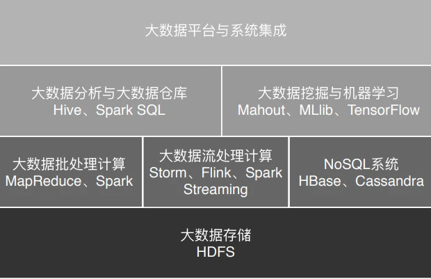

# 说明

本笔记参考极客时间以及尚硅谷大数据

# Hadoop概述

## 存储

大数据主要解决海量数据的采集、存储和分析计算问题。如果我们要对数据进行分析计算，首先要解决的其实是海量数据的存储问题。

海量数据存储需要解决几个核心问题：

1. **数据存储容量问题**：如何存储海量数据？
2. **数据读写熟读问题**：一般磁盘连续读写速度为几时MB，对于大规模数据来讲就太慢了
3. **数据可靠性的问题**：磁盘是计算机设备中最易损坏的硬件，如果磁盘损坏，数据怎么办？

## RAID

大数据出现之前对应的解决方案就是RAID（独立磁盘冗余阵列）技术

该技术是将多块普通磁盘组成一个阵列，共同对外提供服务。主要是为了改善磁盘的存储容量、读写速度，增强磁盘的可用性和容错能力。在RAID之前，要使用大容量、高可用、高速访问的存储系统需要专门的存储设备，这类设备价格要比RAID的几块普通磁盘贵几十倍

### 解决方案

来看看RAID是如何解决关于存储的三个关键问题的

1. 数据存储容量的问题：RAID使用了N块磁盘构成一个存储阵列，数据被存储在多个磁盘上，空间得以扩大

2. 数据读写速度的问题：RAID根据可以使用的磁盘数量，将待写入的数据分成多片，并发同时向多块磁盘进行写入，显然写入的速度可以得到明显提高；同理，读取速度也可以得到明显提高
3. 数据可靠性的问题：当某块磁盘损坏的时候，可以通过其他磁盘上的数据和校验数据将丢失磁盘上的数据还原

在计算机领域，实现更强的计算能力和更大规模的数据存储有两种思路，一种是升级计算机，一种是用分布式系统。前一种也被称作“垂直伸缩”（scaling up），通过升级CPU、内存、磁盘等将一台计算机变得更强大；后一种是“水平伸缩”（scaling out），添加更多的计算机到系统中，从而实现更强大的计算能力

在计算机发展的早期，我们获得更强大计算能力的手段主要依靠**垂直伸缩**。垂直伸缩的方式成本巨大，所以互联网公司走向了一条新的道路：**水平伸缩**，在一个系统中不断添加计算机，以满足不断增长的用户和数据对计算资源的需求。这就是最近十几年引导技术潮流的分布式与大数据技术

RAID可以看作是一种垂直伸缩，一台计算机集成更多的磁盘实现数据更大规模、更安全可靠的存储以及更快的访问速度。而HDFS则是水平伸缩，通过添加更多的服务器实现数据更大、更快、更安全存储与访问

RAID技术只是在单台服务器的多块磁盘上组成阵列，大数据需要更大规模的存储空间和更快的访问速度。将RAID思想原理应用到分布式服务器集群上，就形成了Hadoop分布式文件系统HDFS的架构思想

## 官网

[Hadoop](http://hadoop.apache.org/)

该图的所有这些框架、平台以及相关的算法共同构成了大数据的技术体系

# Hadoop入门

主要内容包括Hadoop的组成和集群搭建（CentOs7）

[Hadoop组成](./Hadoop组成及环境搭建.md)

# HDFS

[HDFS](./HDFS)