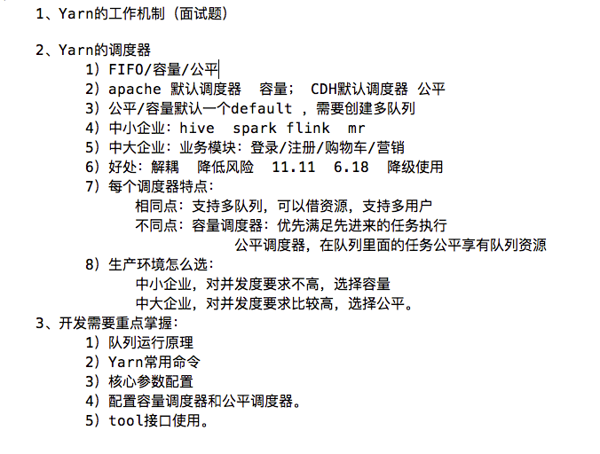

# 1 关于Yarn

​	Apache YARN（Yet Another Resource Negotiator）是Hadoop的集群资源管理系统，负责为运算程序提供服务器运算资源，相当于一个分布式的操作系统平台，而MapReduce等运算程序则相当于运行于操作系统之上的应用程序

# 2 运行机制

​	Yarn通过两类长期运行的守护进程提供自己的核心服务：管理集群上资源使用的资源管理器（resource manager）、运行在集群中所有节点上且能够启动和监控容器（container）的节点管理器（node manager）。容器用于执行特定应用程序的进程，每个容器都有资源限制（内存、CPU等）。一个容器可以是一个Unix进程，也可以是一个Linux cgroup，取决于Yarn的配置


​	资源管理器又包括两个重要组件：**调度器**和**应用程序管理器**

**调度器**其实就是一个资源分配算法，根据应用程序（Client）提交的资源申请和当前服务器集群的资源状况进行资源分配。Yarn内置了几种资源调度算法，包括Fair Scheduler、Capacity Scheduler等

Yarn进行资源分配的单位是容器（Container），每个容器包含了一定量的内存、CPU等计算资源，默认配置下，每个容器包含一个CPU核心。容器由NodeManager进程启动和管理，NodeManger进程会监控本节点上容器的运行状况并向ResourceManger进程汇报

**应用程序管理器**负责应用程序的提交、监控应用程序运行状态等。应用程序启动后需要在集群中运行一个ApplicationMaster，ApplicationMaster也需要运行在容器里面。每个应用程序启动后都会先启动自己的ApplicationMaster，由ApplicationMaster根据应用程序的资源需求进一步向ResourceManager进程申请容器资源，得到容器以后就会分发自己的应用程序代码到容器上启动，进而开始分布式计算

## 2.1 工作流程

1. 我们向Yarn提交应用程序，包括MapReduce ApplicationMaster、MapReduce程序，以及MapReduce Application启动命令
2. ResourceManager进程和NodeManager进程通行，根据集群资源，为用户程序分配第一个容器，并将MapReduce ApplicationMater分发到这个容器上面，并在容器里面启动MapReduce ApplicationMaster
3. MapReduce ApplicationMaster启动后立即向ResourceManager进程注册，并为自己的应用程序申请容器资源
4. MapReduce ApplicationMaster申请到需要的容器之后，立即和相应的NodeManager进程通信，将用户MapReduce程序分发到NodeManager进程所在服务器，并在容器中运行，运行的就是Map或者Reduce任务
5. Map或者Reduce任务在运行期间和MapReduce ApplicationMaster通行，汇报自己的运行状态，如果运行结束，MapReduce ApplicationMaster向ResouceManager进程注销并释放所有的容器资源

# 3 调度

​	理想情况下，Yarn应用发出的资源请求应该立刻给予满足。然而现实中资源是有限的，在一个繁忙的集群上，一个应用经常需要等待才能得到所需的资源。Yarn调度器的工作就是根据既定策略为应用分配资源。调度通常是一个难题，并且没有一个所谓”最好“的策略

​	Yarn中有三种调度器可用：FIFO调度器（FIFO Scheduler），容量调度器（Capacity Scheduler）和公平调度器（Fair Scheduler）

具体设置详见：yarn-default.xml 文件（修改时修改yarn-site.xml文件）

```xml
<property>
<description>The class to use as the resource scheduler.</description>
<name>yarn.resourcemanager.scheduler.class</name>
<value>org.apache.hadoop.yarn.server.resourcemanager.scheduler.capacity.CapacityScheduler</value>
</property>
```

## 3.1 FIFO

​	FIFO调度器将应用放置在**一个**队列中（不支持多队列），按照提交的顺序（先进先出）运行应用。首先为队列中第一个应用的请求分配资源，第一个应用的请求被满足后再依次为队列中下一个应用服务

​	FIFO调度器的优点是简单易懂，不需要任何配置，但是**不适合共享集群**。大的应用会占用集群中的所有资源，所以每个应用必须等待直到轮到自己运行。在一个共享集群中，更适合使用容量调度器或公平调度器。这两种调度器都允许长时间运行的作业能及时完成，同时也允许正在进行较小临时查询的用户能够在合理时间内得到返回结果

## 3.2 Capacity Scheduler 容量调度器

​	容量调度器允许多个组织共享一个Hadoop集群，每个组织可以分配到全部集群资源的一部分。每个组织被分配一个专门的队列（**多队列**），每个队列被配置为可以使用一定的集群资源，**在一个队列内，使用FIFO调度策略对应用进行调度**

​	正常操作时，容量调度器不会通过强行终止来抢占容器（container）。因此，如果一个队列一开始资源够用，随着需求增长，资源开始不够用时，那么这个队列就只能等着其他队列释放容器资源。缓解这种情况的方法是，**为队列设置一个最大容量限制**，这样这个队列就不会过多侵占其他队列的容量了。当然这样做是以牺牲队列弹性为代价的，因此需要在不断尝试和失败中找到一个合理的折中


假设一个队列的层次结构如下

root 

├── prod 

└── dev 

├── eng 

└── science 

一下配置是一个基于上述队列层次的容量调度器配置文件，名为`capacity-scheduler.xml`

```xml
# $HADOOP_HOME/etc/hadoop
<?xml version="1.0"?> 
<configuration> 
<property> 
	<name>yarn.scheduler.capacity.root.queues</name> 
	<value>prod,dev</value> 
</property> 
<property> 
	<name>yarn.scheduler.capacity.root.dev.queues</name> 
	<value>eng,science</value> 
</property> 
<property> 
	<name>yarn.scheduler.capacity.root.prod.capacity</name> 
	<value>40</value> 
</property> 
<property> 
	<name>yarn.scheduler.capacity.root.dev.capacity</name> 
	<value>60</value> 
</property> 
<property> 
	<name>yarn.scheduler.capacity.root.dev.maximum-capacity</name>
  <value>75</value>
</property> 
<property> 
	<name>yarn.scheduler.capacity.root.dev.eng.capacity</name> 
	<value>50</value> 
</property> 
<property> 
	<name>yarn.scheduler.capacity.root.dev.science.capacity</name> 
	<value>50</value> 
</property> 
</configuration>
```

该配置表示：在root队列下定义两个队列，分别占40%和60%的容量。对特定队列进行配置时，通过以下形式`yarn.scheduler.capacity.<queue-path>.<sub-property>`进行设置

## 3.3 Fair Scheduler 公平调度器

​	公平调度器皆在为所有运行的应用公平分配资源。使用公平调度器时，不需要预留一定量的资源，因为调度器所在所有运行的作业之间动态平衡资源。第一个作业启动时，它也是唯一运行的作业，因而获得集群中所有的资源。当第二个作业启动时，它被分配到集群的一半资源，这样每个作业都能公平分享资源

​	从第二作业的启动到获得公平共享资源之间会有时间滞后，因为它必须等待第一个作业使用的容器用完并释放出资源

 

> 公平调度器具体配置详见Hadoop权威指南P90

# 4 常用命令

## 4.1 查看任务

```shell
# 列出所有的Application
yarn application -list

# 根据Application任务状态过滤
yarn application -list -appStates （所有状态：ALL、NEW、
NEW_SAVING、SUBMITTED、ACCEPTED、RUNNING、FINISHED、FAILED、KILLED）
yarn application -list -appStates FINISHED

# kill Application
yarn yarn application -kill <ApplicationId>
```

## 4.2 查看日志

```shell
# 查询Application日志
yarn logs -applicationId <ApplicationId>

# 查询Container日志
yarn logs -applicationId <ApplicationId> -containerId <ContainerId>
```

## 4.3 查看尝试运行的任务

```shell
# 列出所有APplication尝试的列表
yarn applicationattempt -list <ApplicationId>

# 打印ApplicationAttemp状态
yarn applicationattempt -status <ApplicationAttemptId>
```

## 4.4 查看容器

```shell
# 列出所有Container
yarn container -list <ApplicationAttemptId>

# 打印Container状态 只有在任务跑的图中才能看到container的状态
yarn container -status <ContainerId>
```

## 4.5 查看节点状态

```shell
# 列出所有节点
yarn node -list -all
```

## 4.6 更新配置

```shell
# 加载队列配置
yarn rmadmin -refreshQueues
```

## 4.7 查看队列

```shell
# 打印队列消息
yarn queue -status <QueueName>
```

## 4.8 任务超时时间

```shell
# 该时间不能超过队列配置的最大超时时间 yarn.scheduler.capacity.root.hive.maximum-application-lifetime
yarn application -appId appId -updateLifetime Timeout
```

## 4.9 任务优先级

```shell
# 数字越大优先级越高
yarn application -appID <ApplicationID> -updatePriority <intLevel>
```

# 5 核心参数配置

​	如下参数配置是以3台4G，4核CPU，4线程为参考（注意这是单台的配置，如果每台的配置都不同需要单独配置，个别属性除外）

​	修改配置后（`$HADOOP_HOME/etc/hadoop/yarn-site.xml`），重启集群

​	假设处理1G数据量，则`1G / 128m = 8 个 MapTask；1 个 ReduceTask；1 个 mrAppMaster平均每个节点运行 10 个 / 3 台 ≈ 3 个任务（4 3 3）`

```xml
<!-- 选择调度器，默认容量 -->
<property>
	<description>The class to use as the resource scheduler.</description>
	<name>yarn.resourcemanager.scheduler.class</name>
	<value>org.apache.hadoop.yarn.server.resourcemanager.scheduler.capaci
ty.CapacityScheduler</value>
</property>
<!-- ResourceManager 处理调度器请求的线程数量,默认 50；如果提交的任务数大于 50，可以
增加该值，但是不能超过 3 台 * 4 线程 = 12 线程（去除其他应用程序实际不能超过 8） -->
<property>
	<description>Number of threads to handle scheduler interface.</description>
	<name>yarn.resourcemanager.scheduler.client.thread-count</name>
	<value>8</value>
</property>

<!-- 是否让 yarn 自动检测硬件进行配置，默认是 false，如果该节点有很多其他应用程序，建议
手动配置。如果该节点没有其他应用程序，可以采用自动 -->
<property>
	<description>Enable auto-detection of node capabilities such as memory and CPU.				  </description>
	<name>yarn.nodemanager.resource.detect-hardware-capabilities</name>
	<value>false</value>
</property>
<!-- 是否将虚拟核数当作 CPU 核数，默认是 false，采用物理 CPU 核数 -->
<property>
	<description>Flag to determine if logical processors(such as
hyperthreads) should be counted as cores. Only applicable on Linux
when yarn.nodemanager.resource.cpu-vcores is set to -1 and
yarn.nodemanager.resource.detect-hardware-capabilities is true.
	</description>
	<name>yarn.nodemanager.resource.count-logical-processors-as￾cores</name>
	<value>false</value>
</property>
<!-- 虚拟核数和物理核数乘数，默认是 1.0 -->
<property>
	<description>Multiplier to determine how to convert phyiscal cores to
vcores. This value is used if yarn.nodemanager.resource.cpu-vcores
is set to -1(which implies auto-calculate vcores) and
yarn.nodemanager.resource.detect-hardware-capabilities is set to true. 
The number of vcores will be calculated as number of CPUs * multiplier.
	</description>
	<name>yarn.nodemanager.resource.pcores-vcores-multiplier</name>
	<value>1.0</value>
</property>
<!-- NodeManager 使用内存数，默认 8G，修改为 4G 内存 -->
<property>
	<description>Amount of physical memory, in MB, that can be allocated 
for containers. If set to -1 and
yarn.nodemanager.resource.detect-hardware-capabilities is true, it is
automatically calculated(in case of Windows and Linux).
In other cases, the default is 8192MB.
	</description>
	<name>yarn.nodemanager.resource.memory-mb</name>
	<value>4096</value>
</property>
<!-- nodemanager 的 CPU 核数，不按照硬件环境自动设定时默认是 8 个，修改为 4 个 -->
<property>
	<description>Number of vcores that can be allocated
for containers. This is used by the RM scheduler when allocating
resources for containers. This is not used to limit the number of
CPUs used by YARN containers. If it is set to -1 and
yarn.nodemanager.resource.detect-hardware-capabilities is true, it is
automatically determined from the hardware in case of Windows and Linux.
In other cases, number of vcores is 8 by default.
  </description>
	<name>yarn.nodemanager.resource.cpu-vcores</name>
	<value>4</value>
</property>
<!-- 容器最小内存，默认 1G -->
<property>
	<description>The minimum allocation for every container request at the 
RM in MBs. Memory requests lower than this will be set to the value of 
this property. Additionally, a node manager that is configured to have 
less memory than this value will be shut down by the resource manager.
	</description>
	<name>yarn.scheduler.minimum-allocation-mb</name>
	<value>1024</value>
</property>
<!-- 容器最大内存，默认 8G，修改为 2G -->
<property>
	<description>The maximum allocation for every container request at the 
RM in MBs. Memory requests higher than this will throw an
InvalidResourceRequestException.
</description>
	<name>yarn.scheduler.maximum-allocation-mb</name>
	<value>2048</value>
</property>
<!-- 容器最小 CPU 核数，默认 1 个 -->
<property>
	<description>The minimum allocation for every container request at the 
RM in terms of virtual CPU cores. Requests lower than this will be set to 
the value of this property. Additionally, a node manager that is configured 
to have fewer virtual cores than this value will be shut down by the 
resource manager.
	</description>
	<name>yarn.scheduler.minimum-allocation-vcores</name>
	<value>1</value>
</property>
<!-- 容器最大 CPU 核数，默认 4 个，修改为 2 个 -->
<property>
	<description>The maximum allocation for every container request at the 
RM in terms of virtual CPU cores. Requests higher than this will throw an
InvalidResourceRequestException.
  </description>
	<name>yarn.scheduler.maximum-allocation-vcores</name>
	<value>2</value>
</property>
<!-- 虚拟内存检查，默认打开，修改为关闭 CentOS7 和 Java8虚拟内存有问题所以关闭-->
<property>
	<description>Whether virtual memory limits will be enforced for
containers.</description>
	<name>yarn.nodemanager.vmem-check-enabled</name>
	<value>false</value>
</property>
<!-- 虚拟内存和物理内存设置比例,默认 2.1 -->
<property>
	<description>Ratio between virtual memory to physical memory when
setting memory limits for containers. Container allocations are
expressed in terms of physical memory, and virtual memory usage is 
allowed to exceed this allocation by this ratio.
	</description>
	<name>yarn.nodemanager.vmem-pmem-ratio</name>
	<value>2.1</value>
</property>
```

# 6 多队列容量调度器

## 6.1 需求

1. **default 队列占总内存的 40%，最大资源容量占总资源 60%，hive 队列占总内存**

   **的 60%，最大资源容量占总资源 80%**

root 

├── default 

└── hive 

2. **配置队列优先级**

查看[capacity-scheduler.xml](./capacity-scheduler.xml)配置后进行如下修改，配置完队列信息可以使用`yarn rmadmin -refreshQueues`直接刷新

```xml

# 队列 root
#     /   \
# defalut hive
<property>
    <name>yarn.scheduler.capacity.root.queues</name>
    <value>default, hive</value>
    <description>
      The queues at the this level (root is the root queue).
    </description>
</property>

<!-- defalut队列的默认容量-->
  <property>
    <name>yarn.scheduler.capacity.root.default.capacity</name>
    <value>40</value>
    <description>Default queue target capacity.</description>
  </property>

  <property>
    <name>yarn.scheduler.capacity.root.hive.capacity</name>
    <value>60</value>
    <description>Default queue target capacity.</description>
  </property>

<!-- 用户最多可以使用该队列的多少资源 百分比表示-->
  <property>
    <name>yarn.scheduler.capacity.root.default.user-limit-factor</name>
    <value>1</value>
    <description>
      Default queue user limit a percentage from 0.0 to 1.0.
    </description>
  </property>

  <property>
    <name>yarn.scheduler.capacity.root.hive.user-limit-factor</name>
    <value>1</value>
    <description>
      Default queue user limit a percentage from 0.0 to 1.0.
    </description>
  </property>

<!-- default队列的最大资源容量 -->
  <property>
    <name>yarn.scheduler.capacity.root.default.maximum-capacity</name>
    <value>60</value>
    <description>
      The maximum capacity of the default queue. 
    </description>
  </property>

  <property>
    <name>yarn.scheduler.capacity.root.hive.maximum-capacity</name>
    <value>80</value>
    <description>
      The maximum capacity of the default queue. 
    </description>
  </property>

<!-- 启动defalut队列 -->
  <property>
    <name>yarn.scheduler.capacity.root.default.state</name>
    <value>RUNNING</value>
    <description>
      The state of the default queue. State can be one of RUNNING or STOPPED.
    </description>
  </property>

  <property>
    <name>yarn.scheduler.capacity.root.hive.state</name>
    <value>RUNNING</value>
    <description>
      The state of the default queue. State can be one of RUNNING or STOPPED.
    </description>
  </property>

<!-- 哪些用户可以向default队列提交任务 -->
 	<property>
    <name>yarn.scheduler.capacity.root.default.acl_submit_applications</name>
    <value>*</value>
    <description>
      The ACL of who can submit jobs to the default queue.
    </description>
  </property>

	<property>
    <name>yarn.scheduler.capacity.root.hive.acl_submit_applications</name>
    <value>*</value>
    <description>
      The ACL of who can submit jobs to the hive queue.
    </description>
  </property>

<!-- 哪些用户具有default队列的管理权限 -->
  <property>
    <name>yarn.scheduler.capacity.root.default.acl_administer_queue</name>
    <value>*</value>
    <description>
      The ACL of who can administer jobs on the default queue.
    </description>
  </property>

  <property>
    <name>yarn.scheduler.capacity.root.hive.acl_administer_queue</name>
    <value>*</value>
    <description>
      The ACL of who can administer jobs on the hive queue.
    </description>
  </property>

<!-- 哪些用户可以提交具有优先级的任务 -->
  <property>
    <name>yarn.scheduler.capacity.root.default.acl_application_max_priority</name>
    <value>*</value>
    <description>
      The ACL of who can submit applications with configured priority.
      For e.g, [user={name} group={name} max_priority={priority} default_priority={priority}]
    </description>
  </property>

  <property>
    <name>yarn.scheduler.capacity.root.hive.acl_application_max_priority</name>
    <value>*</value>
    <description>
      The ACL of who can submit applications with configured priority.
      For e.g, [user={name} group={name} max_priority={priority} default_priority={priority}]
    </description>
  </property>

	<!-- 
	该队列下面的任务超时时间，如果配置了超时时间则提交到该队列的application能够指定的最大超时时间不能超	 过该值  
	超时时间设置 yarn application -appId appId -updateLifetime Timeout
	-->
<property>
     <name>yarn.scheduler.capacity.root.default.maximum-application-lifetime
     </name>
     <value>-1</value>
     <description>
        Maximum lifetime of an application which is submitted to a queue
        in seconds. Any value less than or equal to zero will be considered as
        disabled.
        This will be a hard time limit for all applications in this
        queue. If positive value is configured then any application submitted
        to this queue will be killed after exceeds the configured lifetime.
        User can also specify lifetime per application basis in
        application submission context. But user lifetime will be
        overridden if it exceeds queue maximum lifetime. It is point-in-time
        configuration.
        Note : Configuring too low value will result in killing application
        sooner. This feature is applicable only for leaf queue.
     </description>
   </property>

<property>
     <name>yarn.scheduler.capacity.root.hive.maximum-application-lifetime
     </name>
     <value>-1</value>
     <description>
        Maximum lifetime of an application which is submitted to a queue
        in seconds. Any value less than or equal to zero will be considered as
        disabled.
        This will be a hard time limit for all applications in this
        queue. If positive value is configured then any application submitted
        to this queue will be killed after exceeds the configured lifetime.
        User can also specify lifetime per application basis in
        application submission context. But user lifetime will be
        overridden if it exceeds queue maximum lifetime. It is point-in-time
        configuration.
        Note : Configuring too low value will result in killing application
        sooner. This feature is applicable only for leaf queue.
     </description>
   </property>

	<!-- 
	如果没有设置该队列下面的任务超时时间则该值会生效表示一直执行下去
	超时时间设置 yarn application -appId appId -updateLifetime Timeout
	-->
<property>
     <name>yarn.scheduler.capacity.root.default.default-application-lifetime
     </name>
     <value>-1</value>
     <description>
        Default lifetime of an application which is submitted to a queue
        in seconds. Any value less than or equal to zero will be considered as
        disabled.
        If the user has not submitted application with lifetime value then this
        value will be taken. It is point-in-time configuration.
        Note : Default lifetime can't exceed maximum lifetime. This feature is
        applicable only for leaf queue.
     </description>
   </property>

<property>
     <name>yarn.scheduler.capacity.root.hive.default-application-lifetime
     </name>
     <value>-1</value>
     <description>
        Default lifetime of an application which is submitted to a queue
        in seconds. Any value less than or equal to zero will be considered as
        disabled.
        If the user has not submitted application with lifetime value then this
        value will be taken. It is point-in-time configuration.
        Note : Default lifetime can't exceed maximum lifetime. This feature is
        applicable only for leaf queue.
     </description>
   </property>
```

## 6.2 指定队列提交

​	不指定提交队列，任务将默认提交到default

1. hadoop jar

```shell
hadoop jar share/hadoop/mapreduce/hadoop-mapreduce-examples-3.1.3.jar wordcount -D    mapreduce.job.queuename=hive /input /output
```

**-D 表示运行时改变参数值**

2. jar包

在配置中指定任务队列

```java
Configuration conf = new Configuration();
conf.set("mapreduce.job.queuename", "hive");
```

## 6.3 任务优先级

​	容量调度器，支持任务优先级的配置，在资源紧张时，优先级高的任务将优先获取资源。默认情况，Yarn将所有任务的优先级限制为0，若想使用任务的优先级功能，须开放该限制。

1. **修改配置文件`yarn-site.xml`**

```xml
<!-- 表示5个级别，数字越大优先级越高 -->
<property>
<name>yarn.cluster.max-application-priority</name>
<value>5</value>
</property>
```

2. **指定优先级**

```shell
hadoop jar /opt/module/hadoop-
3.1.3/share/hadoop/mapreduce/hadoop-mapreduce-examples-3.1.3.jar pi -D
mapreduce.job.priority=5 5 2000000
```

**或者使用[命令](##4.9 任务优先级)**修改正在执行任务的优先级

# 7 多队列公平调度器

1. **修改`yarn-site.xml`**

```xml
<property>
	<name>yarn.resourcemanager.scheduler.class</name>
	<value>org.apache.hadoop.yarn.server.resourcemanager.scheduler.fair.FairS
	cheduler</value>
	<description>配置使用公平调度器</description>
</property>
<property>
	<name>yarn.scheduler.fair.allocation.file</name>
	<value>/opt/module/hadoop-3.1.3/etc/hadoop/fair-scheduler.xml</value>
	<description>指明公平调度器队列分配配置文件</description>
</property>
<property>
	<name>yarn.scheduler.fair.preemption</name>
	<value>false</value>
	<description>禁止队列间资源抢占</description>
</property>
```

2. **配置`fair-scheduler.xml`**

```xml
<?xml version="1.0"?>
<allocations>
  <!-- 
  单个队列中 Application Master 占用资源的最大比例,取值 0-1 ，企业一般配置 0.1 
  -->
  <queueMaxAMShareDefault>0.5</queueMaxAMShareDefault>
  <!-- 单个队列最大资源的默认值 test atguigu default -->
  <queueMaxResourcesDefault>4096mb,4vcores</queueMaxResourcesDefault>
<!-- 增加一个队列 test -->
<queue name="test">
  <!-- 队列最小资源 -->
  <minResources>2048mb,2vcores</minResources>
  <!-- 队列最大资源 -->
  <maxResources>4096mb,4vcores</maxResources>
  <!-- 队列中最多同时运行的应用数，默认 50，根据线程数配置 -->
  <maxRunningApps>4</maxRunningApps>
  <!-- 队列中 Application Master 占用资源的最大比例 -->
  <maxAMShare>0.5</maxAMShare>
  <!-- 该队列资源权重,默认值为 1.0 -->
  <weight>1.0</weight>
  <!-- 队列内部的资源分配策略 -->
  <schedulingPolicy>fair</schedulingPolicy>
</queue>
<!-- 增加一个队列 atguigu -->
<queue name="atguigu" type="parent">
  <!-- 队列最小资源 -->
  <minResources>2048mb,2vcores</minResources>
  <!-- 队列最大资源 -->
  <maxResources>4096mb,4vcores</maxResources>
  <!-- 队列中最多同时运行的应用数，默认 50，根据线程数配置 -->
  <maxRunningApps>4</maxRunningApps>
  <!-- 队列中 Application Master 占用资源的最大比例 -->
  <maxAMShare>0.5</maxAMShare>
  <!-- 该队列资源权重,默认值为 1.0 -->
  <weight>1.0</weight>
  <!-- 队列内部的资源分配策略 --> 
  <schedulingPolicy>fair</schedulingPolicy>
</queue>
<!-- 任务队列分配策略,可配置多层规则,从第一个规则开始匹配,直到匹配成功 -->
<queuePlacementPolicy>
  <!-- 提交任务时指定队列,如未指定提交队列,则继续匹配下一个规则; false 表示：如果指
  定队列不存在,不允许自动创建-->
  <rule name="specified" create="false"/>
  <!-- 提交到 root.group.username 队列,若 root.group 不存在,不允许自动创建；若
  root.group.user 不存在,允许自动创建 -->
  <rule name="nestedUserQueue" create="true">
  <rule name="primaryGroup" create="false"/>
  </rule>
  <!-- 最后一个规则必须为 reject 或者 default。Reject 表示拒绝创建提交失败，
  default 表示把任务提交到 default 队列 -->
  <rule name="reject" />
</queuePlacementPolicy>
</allocations>
```

分发配置并重启yarn

# 8 TOOL

```shell
hadoop jar xx.jar xx.WordCount /input /output1
```

如上命令可以正常运行，当我们需要动态传参时就会有异常发生

```shell
hadoop jar xx.jar xx.WordCount -D mapreduce.job.queuename=root.test /input /output1
```

我们需要实现TOOL接口，实现所有的方法，并通过ToolRunner.run()来运行原来的程序

```java
package cn.huakai.yarn.v8;

import org.apache.hadoop.conf.Configuration;
import org.apache.hadoop.fs.Path;
import org.apache.hadoop.io.LongWritable;
import org.apache.hadoop.io.Text;
import org.apache.hadoop.mapreduce.Job;
import org.apache.hadoop.mapreduce.Mapper;
import org.apache.hadoop.mapreduce.Reducer;
import org.apache.hadoop.mapreduce.lib.input.FileInputFormat;
import org.apache.hadoop.mapreduce.lib.output.FileOutputFormat;
import org.apache.hadoop.util.Tool;

import java.io.IOException;

/**
 * @author: huakaimay
 * @since: 2021-07-20
 */
public class WordCount implements Tool {
    private Configuration conf;


    @Override
    public int run(String[] args) throws Exception {
        Job job = Job.getInstance(conf);
        job.setJarByClass(WordCountDriver.class);

        job.setMapperClass(WrodCountMapper.class);
        job.setReducerClass(WordCountReducer.class);

        job.setMapOutputKeyClass(Text.class);
        job.setMapOutputValueClass(LongWritable.class);

        job.setOutputKeyClass(Text.class);
        job.setOutputValueClass(LongWritable.class);

        FileInputFormat.setInputPaths(job, new Path(args[0]));
        FileOutputFormat.setOutputPath(job, new Path(args[1]));

        return job.waitForCompletion(true) ? 0 : 1;
    }

    @Override
    public void setConf(Configuration conf) {
        this.conf = conf;
    }

    @Override
    public Configuration getConf() {
        return conf;
    }


    public static class WrodCountMapper extends Mapper<LongWritable, Text, Text, LongWritable> {
        private Text outK = new Text();
        private LongWritable longWritable = new LongWritable(1);

        @Override
        protected void map(LongWritable key, Text value, Context context) throws IOException, InterruptedException {
            String line = value.toString();
            String[] split = line.split(" ");

            for (String nKey : split) {
                outK.set(nKey);
                context.write(outK, longWritable);
            }

        }
    }

    public static class WordCountReducer extends Reducer<Text, LongWritable, Text, LongWritable> {
        private LongWritable outV = new LongWritable(0);

        @Override
        protected void reduce(Text key, Iterable<LongWritable> values, Context context) throws IOException, InterruptedException {
            long sum = 0l;
            for (LongWritable value : values) {
                sum += value.get();
            }
            outV.set(sum);
            context.write(key, outV);
        }
    }
}

```

```java
package cn.huakai.yarn.v8;

import org.apache.hadoop.conf.Configuration;
import org.apache.hadoop.util.Tool;
import org.apache.hadoop.util.ToolRunner;

import java.util.Arrays;

public class WordCountDriver {

    private static Tool tool;

    public static void main(String[] args) throws Exception {
        Configuration configuration = new Configuration();


        switch (args[0]) {
            case "wordcount":
                tool = new WordCount();
                break;
            default:
                throw new RuntimeException("no such tool" + args[0]);
        }

        String[] strings = Arrays.copyOfRange(args, 1, args.length);


        ToolRunner.run(configuration, tool, strings);
    }
}
```

# 9 总结

