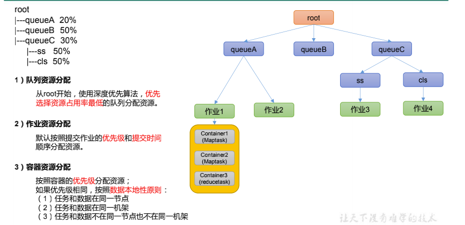

# 1 关于Yarn

​	Apache YARN（Yet Another Resource Negotiator）是Hadoop的集群资源管理系统，负责为运算程序提供服务器运算资源，相当于一个分布式的操作系统平台，而MapReduce等运算程序则相当于运行于操作系统之上的应用程序

# 2 运行机制

​	Yarn通过两类长期运行的守护进程提供自己的核心服务：管理集群上资源使用的资源管理器（resource manager）、运行在集群中所有节点上且能够启动和监控容器（container）的节点管理器（node manager）。容器用于执行特定应用程序的进程，每个容器都有资源限制（内存、CPU等）。一个容器可以是一个Unix进程，也可以是一个Linux cgroup，取决于Yarn的配置


​	资源管理器又包括两个重要组件：**调度器**和**应用程序管理器**

**调度器**其实就是一个资源分配算法，根据应用程序（Client）提交的资源申请和当前服务器集群的资源状况进行资源分配。Yarn内置了几种资源调度算法，包括Fair Scheduler、Capacity Scheduler等

Yarn进行资源分配的单位是容器（Container），每个容器包含了一定量的内存、CPU等计算资源，默认配置下，每个容器包含一个CPU核心。容器由NodeManager进程启动和管理，NodeManger进程会监控本节点上容器的运行状况并向ResourceManger进程汇报

**应用程序管理器**负责应用程序的提交、监控应用程序运行状态等。应用程序启动后需要在集群中运行一个ApplicationMaster，ApplicationMaster也需要运行在容器里面。每个应用程序启动后都会先启动自己的ApplicationMaster，由ApplicationMaster根据应用程序的资源需求进一步向ResourceManager进程申请容器资源，得到容器以后就会分发自己的应用程序代码到容器上启动，进而开始分布式计算

## 2.1 工作流程

1. 我们向Yarn提交应用程序，包括MapReduce ApplicationMaster、MapReduce程序，以及MapReduce Application启动命令
2. ResourceManager进程和NodeManager进程通行，根据集群资源，为用户程序分配第一个容器，并将MapReduce ApplicationMater分发到这个容器上面，并在容器里面启动MapReduce ApplicationMaster
3. MapReduce ApplicationMaster启动后立即向ResourceManager进程注册，并为自己的应用程序申请容器资源
4. MapReduce ApplicationMaster申请到需要的容器之后，立即和相应的NodeManager进程通信，将用户MapReduce程序分发到NodeManager进程所在服务器，并在容器中运行，运行的就是Map或者Reduce任务
5. Map或者Reduce任务在运行期间和MapReduce ApplicationMaster通行，汇报自己的运行状态，如果运行结束，MapReduce ApplicationMaster向ResouceManager进程注销并释放所有的容器资源

# 3 调度

​	理想情况下，Yarn应用发出的资源请求应该立刻给予满足。然而现实中资源是有限的，在一个繁忙的集群上，一个应用经常需要等待才能得到所需的资源。Yarn调度器的工作就是根据既定策略为应用分配资源。调度通常是一个难题，并且没有一个所谓”最好“的策略

​	Yarn中有三种调度器可用：FIFO调度器（FIFO Scheduler），容量调度器（Capacity Scheduler）和公平调度器（Fair Scheduler）

具体设置详见：yarn-default.xml 文件（修改时修改yarn-site.xml文件）

```xml
<property>
<description>The class to use as the resource scheduler.</description>
<name>yarn.resourcemanager.scheduler.class</name>
<value>org.apache.hadoop.yarn.server.resourcemanager.scheduler.capacity.CapacityScheduler</value>
</property>
```

## 3.1 FIFO

​	FIFO调度器将应用放置在**一个**队列中（不支持多队列），按照提交的顺序（先进先出）运行应用。首先为队列中第一个应用的请求分配资源，第一个应用的请求被满足后再依次为队列中下一个应用服务

​	FIFO调度器的优点是简单易懂，不需要任何配置，但是**不适合共享集群**。大的应用会占用集群中的所有资源，所以每个应用必须等待直到轮到自己运行。在一个共享集群中，更适合使用容量调度器或公平调度器。这两种调度器都允许长时间运行的作业能及时完成，同时也允许正在进行较小临时查询的用户能够在合理时间内得到返回结果

## 3.2 Capacity Scheduler 容量调度器

​	容量调度器允许多个组织共享一个Hadoop集群，每个组织可以分配到全部集群资源的一部分。每个组织被分配一个专门的队列（**多队列**），每个队列被配置为可以使用一定的集群资源，**在一个队列内，使用FIFO调度策略对应用进行调度**

​	正常操作时，容量调度器不会通过强行终止来抢占容器（container）。因此，如果一个队列一开始资源够用，随着需求增长，资源开始不够用时，那么这个队列就只能等着其他队列释放容器资源。缓解这种情况的方法是，**为队列设置一个最大容量限制**，这样这个队列就不会过多侵占其他队列的容量了。当然这样做是以牺牲队列弹性为代价的，因此需要在不断尝试和失败中找到一个合理的折中





假设一个队列的层次结构如下

root 

├── prod 

└── dev 

├── eng 

└── science 

一下配置是一个基于上述队列层次的容量调度器配置文件，名为`capacity-scheduler.xml`

```xml
# $HADOOP_HOME/etc/hadoop
<?xml version="1.0"?> 
<configuration> 
<property> 
	<name>yarn.scheduler.capacity.root.queues</name> 
	<value>prod,dev</value> 
</property> 
<property> 
	<name>yarn.scheduler.capacity.root.dev.queues</name> 
	<value>eng,science</value> 
</property> 
<property> 
	<name>yarn.scheduler.capacity.root.prod.capacity</name> 
	<value>40</value> 
</property> 
<property> 
	<name>yarn.scheduler.capacity.root.dev.capacity</name> 
	<value>60</value> 
</property> 
<property> 
	<name>yarn.scheduler.capacity.root.dev.maximum-capacity</name>
  <value>75</value>
</property> 
<property> 
	<name>yarn.scheduler.capacity.root.dev.eng.capacity</name> 
	<value>50</value> 
</property> 
<property> 
	<name>yarn.scheduler.capacity.root.dev.science.capacity</name> 
	<value>50</value> 
</property> 
</configuration>
```

该配置表示：在root队列下定义两个队列，分别占40%和60%的容量。对特定队列进行配置时，通过以下形式`yarn.scheduler.capacity.<queue-path>.<sub-property>`进行设置

## 3.3 Fair Scheduler 公平调度器

​	公平调度器皆在为所有运行的应用公平分配资源。使用公平调度器时，不需要预留一定量的资源，因为调度器所在所有运行的作业之间动态平衡资源。第一个作业启动时，它也是唯一运行的作业，因而获得集群中所有的资源。当第二个作业启动时，它被分配到集群的一半资源，这样每个作业都能公平分享资源

​	从第二作业的启动到获得公平共享资源之间会有时间滞后，因为它必须等待第一个作业使用的容器用完并释放出资源

 

> 公平调度器具体配置详见Hadoop权威指南P90

