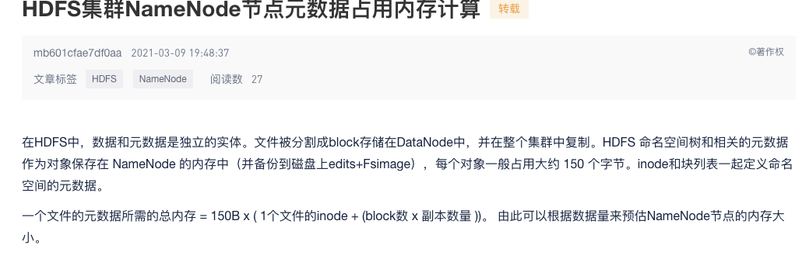
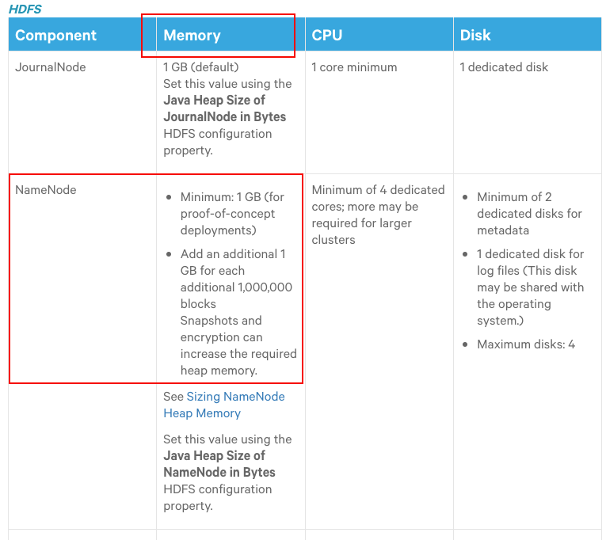
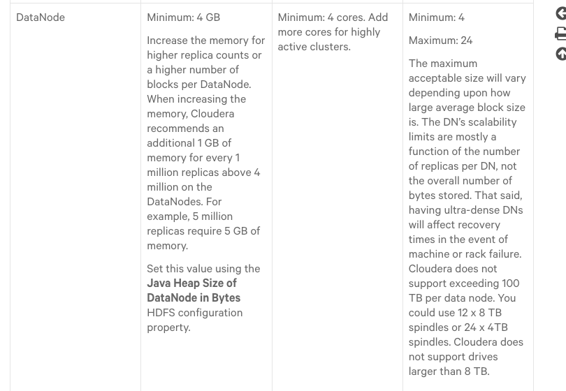
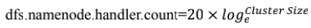
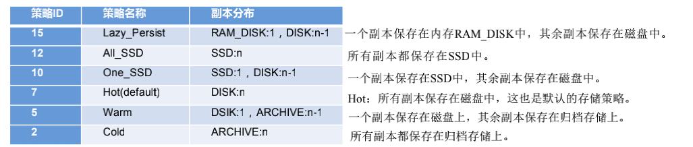
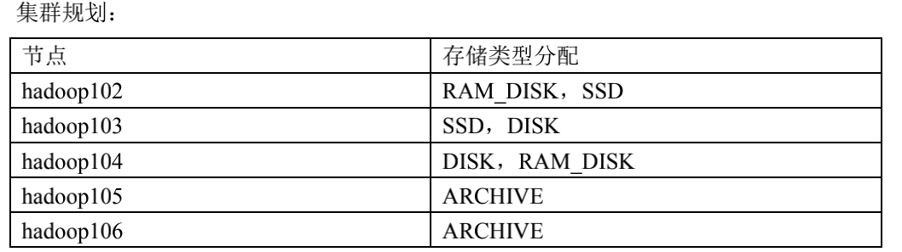
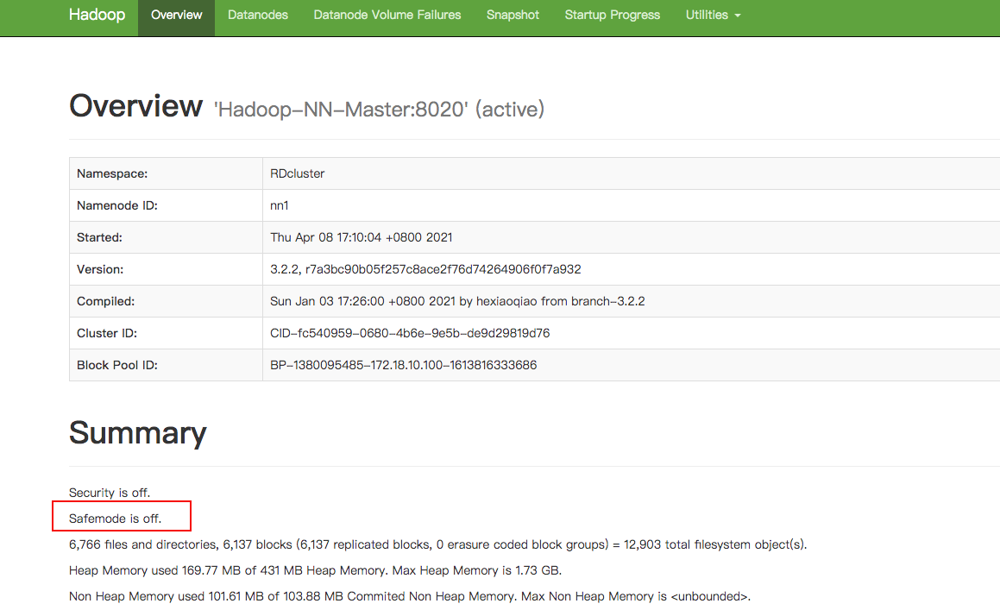
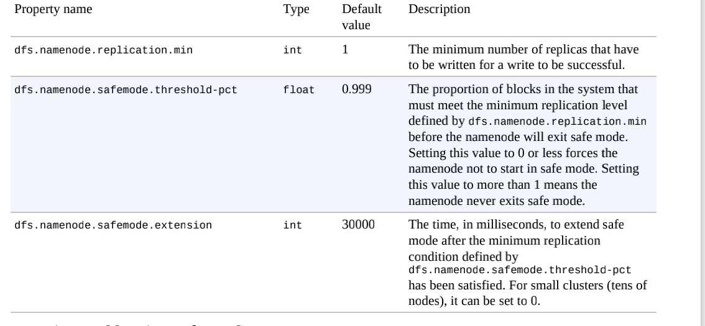

# 1 HDFS核心参数

## 1.1 NameNode内存生产配置

1. NameNode内存计算

>  每个文件块大概占用 150byte，一台服务器 128G 内存为例，能存储多少文件块呢？
>
> 128 * 1024 * 1024 * 1024 / 150Byte ≈ 9.1 亿 

没懂什么意思，文件块为啥是150byte，算出来存储这么多文件块做啥

> 应该是要配置相应的内存容量来满足一定数量文件块的存储，但是这边不知道文件块大小是怎么来的（HDFS文件块大小可以设置，但是一般设置的是128M）
>
> Update: 概念理解错误，128M值的是DataNode中的block而不是这边所指的NameNode中的块

经过查阅[资料](https://blog.51cto.com/u_15103042/2652872)发现：上面所说的文件块指的是NameNode中保存的**block的命名空间树和相关元数据**，这个对象一般大约占用150byte

**我把DataNode中的文件块（block）和这边所说的NameNode的文件块（应该叫元数据更合理一些，叫文件块让我产生了无解，并忘记了这边谈论的是NameNode，基础概念不扎实导致）**



所以，这里的意思是NameNode中存储块（元数据+命名空间树）的块大小约为150byte，配置多少内存就可以计算出可以存储多少个这样的块

2. 配置NameNode内存

在Hadoop2.x中，NameNode内存默认为2000m

在Hadoop3.x中，如果没有为NameNode设置内存，则会根据机器自动缩放

**使用命令查看当前内存情况**

```shell
[hadoop@hadoop102 hadoop]$ jps
21510 NodeManager
21063 NameNode
21688 JobHistoryServer
21226 DataNode
382 Jps

# 查看NameNode和DataNode占用内存情况
[hadoop@hadoop102 hadoop]$ jmap -heap 21063
Heap Configuration:
   MinHeapFreeRatio         = 0
   MaxHeapFreeRatio         = 100
   MaxHeapSize              = 991952896 (946.0MB)
   
[hadoop@hadoop102 hadoop]$ jmap -heap 21226
Heap Configuration:
   MinHeapFreeRatio         = 0
   MaxHeapFreeRatio         = 100
   MaxHeapSize              = 991952896 (946.0MB)
```

发现NameNode和DataNode都是自动分配的内存，想要配置内存，参考[硬件需求](https://docs.cloudera.com/documentation/enterprise/6/release-notes/topics/rg_hardware_requirements.html#concept_fzz_dq4_gbb)进行配置：



NameNode最小内存为1G，每增加一百万个block就多配置1G内存



DataNode最小内存4G，当DtaNode上的副本总数低于四百万时设置内存为4G，高过四百万时每增加一百万增加1G内存

`vim $HADOOP_HOME/etc/hadoop/hadoop-env.sh`

```shell
# 3.x修改对应的值即可，这边是1G
export HDFS_NAMENODE_OPTS="-Dhadoop.security.logger=INFO,RFAS -Xmx1024m"

export HDFS_DATANODE_OPTS="-Dhadoop.security.logger=ERROR,RFAS -Xmx1024m"

# 2.x
HADOOP_NAMENODE_OPTS=-Xmx3072m
```

3. 将配置下发给所有机器

## 1.2 NameNode心跳并发配置

NameNode有一个工作线程池，用来处理不同DataNode的并发心跳以及客户端并发的元数据操作

根据参考公式来计算，比如集群规模为3，则有`20*math.log(3) = 21`

```shell
# 可以通过python来计算
 sudo yum install -y python
 python
 import math
 print int(20 * math.log(3))
 21
```

修改相应的配置`vim $HADOOP_HOME/etc/hadoop/hdfs-site.xml`，该参数默认值为`10`

```shell
<property>
<name>dfs.namenode.handler.count</name>
<value>21</value>
</property>
```

将配置下发给所有机器

## 1.3 回收站

开启回收站功能可以防止误删除，但是回收站有时间限制

启用回收站`vim $HADOOP_HOME/etc/hadoop/core-site.xlm`

```shell
# 时间单位为min
<property>
<name>fs.trash.interval</name>
<value>30</value>
</property>
```

如果值为0表示禁用回收站，还需要设置回收站检测间隔时间，该值必须小于等于上面的值

```shell
# 时间单位为min，检测回收站是否满足删除时间
<property>
<name>fs.trash.checkpoint.interval</name>
<value>15</value>
</property>
```

**配置完成下发给所有机器**

只有通过命令行删除才会进入到回收站，回收站路径为`/user/<userName>/.Trash/...`

```shell
# 开启回收站功能后删除会进入到回收站
hadoop fs -rm -r /input

# 通过移动命令将数据还原
hadoop fs -mv /user/<userNmae>/.Trash/... /input
```

通过网页删除的文件不会到回收站，通过程序删除的文件也不会经过回收站，使用`moveToTrash()`才会进入回收站

```java
Trash trash = new Trash(conf);
trash.moveToTrash(path);
```

# 2 HDFS集群压测

我们需要对生产环境集群进行压测，用以了解HDFS的读写性能

HDFS的读写性能主要受网络和磁盘影响比较大

## 2.1 HDFS写性能测试

1. 向HDFS集群写10个128M的文件，**文件数量根据集群总核数来定， 确保所有的机器都能运行所以一般设置为总核数-1即可**

```shell
hadoop jar /opt/module/hadoop-3.1.3/share/hadoop/mapreduce/hadoop-mapreduce-client-jobclient-3.1.3-tests.jar TestDFSIO -write -nrFiles 10 -fileSize 128MB

# 清理和删除测试数据
hadoop jar /opt/module/hadoop-3.1.3/share/hadoop/mapreduce/hadoop-*test*.jar TestDFSIO -write -clean
```

测试过程中有可能因为虚拟或者物理内存原因报错，可以关闭虚拟内存（不推荐），考虑修改默认内存等值参考资料：https://blog.csdn.net/Abysscarry/article/details/80331311


Throughput: 衡量每个map task的吞吐量

Average IO rate: 衡量每个文件的平均IO速度

IO rate std deviation: 高标准差表示数据散布在一个大的值域中，这可能意味着群集中某个节点存在性能相关的问题，这可能和硬件或软件有关

关于集群压测的问题：https://www.zhihu.com/question/21588815/answer/31027187

> 压测时我们在集群上的某台机器上使用命令测试，所以该机器上的副本不参与测试，假设有3台机，测试10个文件，除去本机副本则有 `(3 - 1) * 10 = 20`个文件

## 2.2 HDFS读性能测试

```shell
hadoop jar /opt/module/hadoop-3.1.3/share/hadoop/mapreduce/hadoop-mapreduce-client-jobclient-3.1.3-tests.jar TestDFSIO -read -nrFiles 10 -fileSize 128MB

# 清理和删除测试数据
hadoop jar /opt/module/hadoop-3.1.3/share/hadoop/mapreduce/hadoop-*test*.jar TestDFSIO -read -clean
```

# 3 HDFS多目录

## 3.1 NameNode多目录

启用该配置最好是第一次开启集群时，因为后续使用该配置需要格式化集群

```shell
# 删除所有机器的data和logs目录
rm -rf data/ logs/

# 格式化集群并启动
bin/hdfs namenode -format
sbin/start-dfs.sh
```

NameNode在本地的目录可以配置成多个，每个目录存放相同内容

`vim $HADOOP_HOME/etc/hadoop/hdfs-site.xml`

```xml
<property>
<name>dfs.namenode.name.dir</name>
<value>file://${hadoop.tmp.dir}/dfs/name1,file://${hadoop.tmp.dir}/dfs/namme2</value>
</property>
```

该配置只是进行了备份并不是高可用，一旦机器挂掉这些备份没有任何作用

**该配置可以不用分发，根据服务器配置自行配置即可**

## 3.2 DataNode多目录

DataNode也可以配置成多个目录且每个目录的数据不一样（具体配置根据服务器硬盘情况来）

`vim $HADOOP_HOME/etc/hadoop/hdfs-site.xml`

```shell
<property>
<name>dfs.datanode.data.dir</name>
<value>file://${hadoop.tmp.dir}/dfs/data1,file://${hadoop.tmp.dir}/dfs/data2</value>
</property>
```

配置完毕需要重新启动，**该配置可以不用分发，根据服务器配置自行配置即可**

```shell
# $HADOOP_HOME/etc/hadoop/sbin

stop-dfs.sh

start-dfs.sh

[hadoop@hadoop102 dfs]$ pwd
/opt/module/hadoop-3.1.3/data/dfs
[hadoop@hadoop102 dfs]$ ll
总用量 0
drwx------. 3 hadoop hadoop 40 7月   2 08:47 data
drwx------. 2 hadoop hadoop  6 7月  22 09:05 data1
drwx------. 2 hadoop hadoop  6 7月  22 09:05 data2
drwxrwxr-x. 3 hadoop hadoop 40 7月   2 08:47 name
```

## 3.3 集群磁盘数据均衡

生产环境当新增磁盘时，新增磁盘没有数据，可以执行磁盘数据均衡命令（Hadoop3.x新特性）

1. 生成均衡计划

`hdfs diskbalancer -plan <hostname>`

hostname: 新增磁盘的那个主机（要进行均衡的主机）

2. 执行均衡计划

`hdfs diskbalancer -execute <hostname>.plan.json`

3. 查看当前均衡任务的执行情况

`hdfs diskbalancer -query <hostname>`

4. 取消均衡任务

`hdfs diskbalancer -cancel <hostname>.plan.json`

# 4 集群扩容及缩容

## 4.1 黑白名单

第一次增加黑白名单需要重启集群，之后的修改只需要刷新节点即可`hdfs dfsadmin -refreshNodes`

将已有主机加入白名单做到尽量防止黑客恶意攻击

1. 在**NameNode**节点`$HADOOP_HOME/etc/hadoop`目录下创建`whitelist`和`blacklist`文件，将受信任的节点写入`whitelist`（最好一次性创建，这样后面不需要重启服务）

```shell
vim whitelist
hadoop102
hadoop103
hadoop104
...

touch blacklist
```

2. `$HADOOP_HOME/etc/hadoop/hdfs-site.xml`添加新增的黑白名单文件

```xml
<!-- 白名单 -->
<property>
<name>dfs.hosts</name>
<value>/opt/module/hadoop-3.1.3/etc/hadoop/whitelist</value>
</property>
<!-- 黑名单 -->
<property>
<name>dfs.hosts.exclude</name>
<value>/opt/module/hadoop-3.1.3/etc/hadoop/blacklist</value>
</property>
```

3. 分发黑白名单并重启即可

## 4.2 新增节点

当我们需要新增节点时需要如下配置：

1. 新节点的主机名和ip地址，以hadoop105为列

```shell
ifconfig

cat /etc/hostname
```

2. Java环境和Hadoop环境

```shell
# 从hadoop102拷贝到hadoop105
scp -r /opt/module/* hadoop105:/opt/module/*
# 环境变量
scp -r /etc/profile.d/my_env.sh hadoop105:/etc/profile.d/my_env.sh

souce /etc/profile

java -version
```

3. 确保新节点没有`$HADOOP_HOME`目录下没有data和logs目录（要看从哪台机拷贝的），有则删除

```shell
rm -rf data/ logs/
```

4. 配置NameNode节点（hadoop102）和ResouceManager(hadoop103)节点到新节点的ssh无秘钥登录，配置之前先确保`/etc/hosts`已有对应关系的映射

```shell
cd ~
cd .ssh
ssh-copy-id hadoop105
```

5. 将新节点添加至[白名单](##4.1 黑白名单)（所有节点）并刷新（非第一次添加的情况下）`hdfs dfsadmin -refreshNodes`
6. 直接启动新节点DataNode即可关联到集群

```shell
hdfs --daemon start datanode
```

## 4.3 数据均衡

https://blog.51cto.com/xiaoxiaozhou/2139236

新增的节点数据量会少于原有节点，或者一些原有导致各个节点数据不均衡，此时可以使用数据均衡命令

使用该命令只需要在一台稍微空闲的节点上运行即可

```shell
# $HADOOP_HOME/sbin 表示各节点磁盘空间利用率相差不超过10，可自行设置
start-balancer.sh -threshold 10

# 停止
stop-balancer.sh -threshold 10
```

## 4.4 关闭节点（黑名单）

通过黑名单的方式让已有节点退役

**退役时如果退役后的节点小于等于副本数量则不能退役成功**

1. `$HADOOP_HOME/etc/hadoop `

```shell
vim blacklist
hadoop105
```

2. 配置`$HADOOP_HOME/etc/hadoop/hdfs-site.xml`(最好是和白名单一起配置，无论有用否)，**并分发**

```xml
<!-- 黑名单 -->
<property>
<name>dfs.hosts.exclude</name>
<value>/opt/module/hadoop-3.1.3/etc/hadoop/blacklist</value>
</property>
```

3. 第一次添加重启集群，否则刷新即可

```shell
# 第一次需要重启
cluster.sh stop
cluster.sh start

# 不是第一次刷新
hdfs dfsadmin -refreshNodes
```

# 5 HDFS存储优化

## 5.1 纠删码

Hadoop3.x引入了纠删码，采用计算的方式降低了原来数据副本占用的空间，相较原先的备份可以节省50%左右的存储空间

**纠删码策略是给具体一个路径设置，该路径下的所有文件都会执行此策略**，默认是RS-6-3-1024k，如果要是用别的策略需要提前开启`hdfs ec -enablePolicy -policy <Policy>`

使用`hdfs es`可以查看纠删码相关命令

```shell
[hadoop@hadoop102 hadoop]$ hdfs ec
Usage: bin/hdfs ec [COMMAND]
          [-listPolicies]
          [-addPolicies -policyFile <file>]
          [-getPolicy -path <path>]
          [-removePolicy -policy <policy>]
          [-setPolicy -path <path> [-policy <policy>] [-replicate]]
          [-unsetPolicy -path <path>]
          [-listCodecs]
          [-enablePolicy -policy <policy>]
          [-disablePolicy -policy <policy>]
          [-help <command-name>]
```

查看当前支持的纠删码策略

```shell
hdfs ec -listPolicies

Erasure Coding Policies:
ErasureCodingPolicy=[Name=RS-10-4-1024k, Schema=[ECSchema=[Codec=rs, 
numDataUnits=10, numParityUnits=4]], CellSize=1048576, Id=5], 
State=DISABLED
ErasureCodingPolicy=[Name=RS-3-2-1024k, Schema=[ECSchema=[Codec=rs, 
numDataUnits=3, numParityUnits=2]], CellSize=1048576, Id=2], 
State=DISABLED
ErasureCodingPolicy=[Name=RS-6-3-1024k, Schema=[ECSchema=[Codec=rs, 
numDataUnits=6, numParityUnits=3]], CellSize=1048576, Id=1], 
State=ENABLED
ErasureCodingPolicy=[Name=RS-LEGACY-6-3-1024k, 
Schema=[ECSchema=[Codec=rs-legacy, numDataUnits=6, numParityUnits=3]], 
CellSize=1048576, Id=3], State=DISABLED
ErasureCodingPolicy=[Name=XOR-2-1-1024k, Schema=[ECSchema=[Codec=xor, 
numDataUnits=2, numParityUnits=1]], CellSize=1048576, Id=4], 
State=DISABLED
```

### 5.1.1 纠删码策略说明

**RS-3-2-1024k**：使用RS编码，每3个数据单元生成2个校验单元，共5个单元。这5个单元中只要有任意3个单元存在就可以通过计算得到原始数据。每个单元大小为 `1024 *1 024 = 1046576`

**RS-10-4-1024k** ：同上，根据数字改变..每10个...2个，共14...

**XOR-2-1-1024k**：同上，只是编码算法使用的是`XOR`（比RS快）

**RS-LEGACY-6-3-1024k**：同上，编码算法为`rs-legacy`

### 5.1.2 案列

将`/input` 目录设置为`RS-3-2-1024k`策略

1. 开启策略支持

```shell
hdfs ec -enablePolicy -policy RS-3-2-1024k
```

2. 设置策略

```shell
# /input需要提前存在 hdfs dfs -mkdir /input
hdfs ec -setPoicy -path /input -policy RS-3-2-1024k
```

3. 上传文件

```shell
hdfs dfs -put <fileName> /input
```

## 5.2 异构存储（冷热数据分离）

异构存储可以将不同的数据存储在不同类型的硬盘中

### 5.2.1 存储类型

RAM_DISK：内存镜像文件系统

SSD：固态硬盘

DISK：普通磁盘，在HDFS中没有主动声明的数据目录存储类型默认都是DISK

ARCHIVE：没有特指哪种类型，一般用于归档

### 5.2.2 存储策略



存储策略从上往下，代表了设备访问速度从快到慢

### 5.2.3 异构存储操作

#### 查看当前所有策略

```shell
hdfs storagepoliciyes -listPolicies
```

#### 给指定路径设置策略

```shell
hdfs storagepolicies -setStoragePolicy -path <path> -policy <policy>
```

#### 获取指定路径的存储策略

```shell
hdfs storagepolicies -getStoragePolicy -path <path>
```

#### 取消策略

```shell
hdfs storagepolicies -unsetStoragePolicy -path <path>
```

#### 查看文件块分布

```shell
# $HADOOP_HOME目录下
bin/hdfs fsck <path> -files -blocks -locations
```

#### 查看集群节点

```shell
hadoop dfsadmin -report
```

### 5.2.4 配置



我们只需要对每台设备进行相关配置即可，步骤为开启策略，设置存储类型，比如Hadoop102

```xml
<property>
	<name>dfs.storage.policy.enabled</name>
	<value>true</value>
</property>
<property>
	<name>dfs.datanode.data.dir</name> 
	<value>[SSD]file:///opt/module/hadoop-3.1.3/<path>/ssd,[RAM_DISK]file:///opt/module/hadoop-3.1.3/<path>/ram_disk</value>
</property>
```

未设置存储策略时默认[存储策略](###5.2.2 存储策略)为HOT

```shell
hdfs storagepolicies -getStoragePolicy -path <path>

hdfs fsck <path> -files -blocks -locations

[DatanodeInfoWithStorage[192.168.10.104:9866,DS-0b133854-7f9e-48df-939b-
5ca6482c5afb,DISK], DatanodeInfoWithStorage[192.168.10.103:9866,DS-ca1bd3b9-d9a5-4101-9f92-3da5f1baa28b,DISK]]
```

未制定目录设置指定存储策略

```shell
 hdfs storagepolicies -setStoragePolicy -path /hdfsdata -policy <storagePolicy>
 
 # 指定策略并不会生效，还需要手动让HDFS根据存储策略自行移动文件块
 hdfs mover <path>
```

**配置完成后需要格式化集群并重启**

# 6 HDFS故障排除

## 6.1 集群安全模式

NameNode启动时，首先将映射文件（*fsimage*）载入内存，并执行编辑日志（*edits*）中的各项编辑操作。一旦在内存中成功建立文件系统元数据的映射，则创建一个新的*fsimage*文件和一个空的编辑日志。在这个过程中，namenode运行在安全模式，意味着namenode的文件系统对于客户端来说是只读的

### 6.1.1 进入和退出安全模式

查看安全模式状态

```shell
hdfs dfsadmin -safemode get
```

HDFS的网页界面也能够显示namenode是否处于安全模式



**满足下列属性时可以退出安全模式：**



1. **最小复本数为1（也称最小复本级别）**
2. **满足最小复本级别的块的比例**
3. **满足最小复本条件之后，namenode处于安全模式的时间（单位毫秒）**

在启动一个刚刚格式化的HDFS集群时，因为系统中还没有任何块，所以namonode不会进入安全模式

用户希望在执行某条命令之前先退出安全模式（**指当前处于安全模式，等安全模式结束后执行某条命令**），**特别是在脚本中**，可以使用`wait`（PS: 有时候我们希望进入只读状态，一旦离开该状态就执行后续操作）

```shell
# 已处于安全模式
hdfs dfsadmin -safemode wait

vim safemode.sh
 
 #!/bin/bash
hdfs dfsadmin -safemode wait
hdfs dfs -put /opt/module/hadoop-3.1.3/README.txt /

chmod 777 safemode.sh
./safemode.sh 

# 一旦离开安全模式，就将执行该脚本
```

管理员可随时进入或离开安全模式

```shell
hdfs dfsadmin -safemode enter

hdfs dfsadmin -safemode leave
```

如果遇到数据块损坏会进入安全模式，这个时候需要修复磁盘或者删除元数据