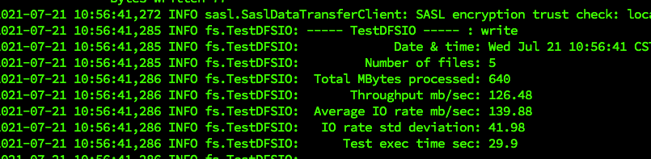

# 1 HDFS核心参数

## 1.1 NameNode内存生产配置

1. NameNode内存计算

>  每个文件块大概占用 150byte，一台服务器 128G 内存为例，能存储多少文件块呢？
>
> 128 * 1024 * 1024 * 1024 / 150Byte ≈ 9.1 亿 

没懂什么意思，文件块为啥是150byte，算出来存储这么多文件块做啥

> 应该是要配置相应的内存容量来满足一定数量文件块的存储，但是这边不知道文件块大小是怎么来的（HDFS文件块大小可以设置，但是一般设置的是128M）
>
> Update: 概念理解错误，128M值的是DataNode中的block而不是这边所指的NameNode中的块

经过查阅[资料](https://blog.51cto.com/u_15103042/2652872)发现：上面所说的文件块指的是NameNode中保存的**block的命名空间树和相关元数据**，这个对象一般大约占用150byte

**我把DataNode中的文件块（block）和这边所说的NameNode的文件块（应该叫元数据更合理一些，叫文件块让我产生了无解，并忘记了这边谈论的是NameNode，基础概念不扎实导致）**


所以，这里的意思是NameNode中存储块（元数据+命名空间树）的块大小约为150byte，配置多少内存就可以计算出可以存储多少个这样的块

2. 配置NameNode内存

在Hadoop2.x中，NameNode内存默认为2000m

在Hadoop3.x中，如果没有为NameNode设置内存，则会根据机器自动缩放

**使用命令查看当前内存情况**

```shell
[hadoop@hadoop102 hadoop]$ jps
21510 NodeManager
21063 NameNode
21688 JobHistoryServer
21226 DataNode
382 Jps

# 查看NameNode和DataNode占用内存情况
[hadoop@hadoop102 hadoop]$ jmap -heap 21063
Heap Configuration:
   MinHeapFreeRatio         = 0
   MaxHeapFreeRatio         = 100
   MaxHeapSize              = 991952896 (946.0MB)
   
[hadoop@hadoop102 hadoop]$ jmap -heap 21226
Heap Configuration:
   MinHeapFreeRatio         = 0
   MaxHeapFreeRatio         = 100
   MaxHeapSize              = 991952896 (946.0MB)
```

发现NameNode和DataNode都是自动分配的内存，想要配置内存，参考[硬件需求](https://docs.cloudera.com/documentation/enterprise/6/release-notes/topics/rg_hardware_requirements.html#concept_fzz_dq4_gbb)进行配置：


NameNode最小内存为1G，每增加一百万个block就多配置1G内存


DataNode最小内存4G，当DtaNode上的副本总数低于四百万时设置内存为4G，高过四百万时每增加一百万增加1G内存

`vim $HADOOP_HOME/etc/hadoop/hadoop-env.sh`

```shell
# 3.x修改对应的值即可，这边是1G
export HDFS_NAMENODE_OPTS="-Dhadoop.security.logger=INFO,RFAS -Xmx1024m"

export HDFS_DATANODE_OPTS="-Dhadoop.security.logger=ERROR,RFAS -Xmx1024m"

# 2.x
HADOOP_NAMENODE_OPTS=-Xmx3072m
```

## 1.2 NameNode心跳并发配置

NameNode有一个工作线程池，用来处理不同DataNode的并发心跳以及客户端并发的元数据操作

根据参考公式来计算，比如集群规模为3，则有`20*math.log(3) = 21`

```shell
# 可以通过python来计算
 sudo yum install -y python
 python
 import math
 print int(20 * math.log(3))
 21
```

修改相应的配置`vim $HADOOP_HOME/etc/hadoop/hdfs-site.xml`，该参数默认值为`10`

```shell
<property>
<name>dfs.namenode.handler.count</name>
<value>21</value>
</property>
```

## 1.3 回收站

开启回收站功能可以防止误删除，但是回收站有时间限制

启用回收站`vim $HADOOP_HOME/etc/hadoop/core-site.xlm`

```shell
# 时间单位为min
<property>
<name>fs.trash.interval</name>
<value>30</value>
</property>
```

如果值为0表示禁用回收站，还需要设置回收站检测间隔时间，该值必须小于等于上面的值

```shell
# 时间单位为min，检测回收站是否满足删除时间
<property>
<name>fs.trash.checkpoint.interval</name>
<value>15</value>
</property>
```

只有通过命令行删除才会进入到回收站，回收站路径为`/user/<userName>/.Trash/...`

```shell
# 开启回收站功能后删除会进入到回收站
hadoop fs -rm -r /input

# 通过移动命令将数据还原
hadoop fs -mv /user/<userNmae>/.Trash/... /input
```

通过网页删除的文件不会到回收站，通过程序删除的文件也不会经过回收站，使用`moveToTrash()`才会进入回收站

```java
Trash trash = new Trash(conf);
trash.moveToTrash(path);
```

# 2 HDFS集群压测

我们需要对生产环境集群进行压测，用以了解HDFS的读写性能

HDFS的读写性能主要受网络和磁盘影响比较大

## 2.1 HDFS写性能测试

1. 向HDFS集群写10个128M的文件，**文件数量根据集群总核数来定， 确保所有的机器都能运行所以一般设置为总核数-1即可**

```shell
hadoop jar /opt/module/hadoop-3.1.3/share/hadoop/mapreduce/hadoop-mapreduce-client-jobclient-3.1.3-tests.jar TestDFSIO -write -nrFiles 10 -fileSize 128MB

# 清理和删除测试数据
hadoop jar /opt/module/hadoop-3.1.3/share/hadoop/mapreduce/hadoop-*test*.jar TestDFSIO -write -clean
```

测试过程中有可能因为虚拟或者物理内存原因报错，可以关闭虚拟内存（不推荐），考虑修改默认内存等值参考资料：https://blog.csdn.net/Abysscarry/article/details/80331311



Throughput: 衡量每个map task的吞吐量

Average IO rate: 衡量每个文件的平均IO速度

IO rate std deviation: 高标准差表示数据散布在一个大的值域中，这可能意味着群集中某个节点存在性能相关的问题，这可能和硬件或软件有关

关于集群压测的问题：https://www.zhihu.com/question/21588815/answer/31027187

> 压测时我们在集群上的某台机器上使用命令测试，所以该机器上的副本不参与测试，假设有3台机，测试10个文件，除去本机副本则有 `(3 - 1) * 10 = 20`个文件

## 2.2 HDFS读性能测试

```shell
hadoop jar /opt/module/hadoop-3.1.3/share/hadoop/mapreduce/hadoop-mapreduce-client-jobclient-3.1.3-tests.jar TestDFSIO -read -nrFiles 10 -fileSize 128MB

# 清理和删除测试数据
hadoop jar /opt/module/hadoop-3.1.3/share/hadoop/mapreduce/hadoop-*test*.jar TestDFSIO -read -clean
```

# 3 HDFS多目录

## 3.1 NameNode多目录

启用开配置最好是第一次开启集群时，因为后续使用该配置需要格式化集群

```shell
# 删除所有机器的data和logs目录
rm -rf data/ logs/

# 格式化集群并启动
bin/hdfs namenode -format
sbin/start-dfs.sh
```

NameNode在本地的目录可以配置成多个，每个目录存放相同内容

`vim $HADOOP_HOME/etc/hadoop/hdfs-site.xml`

```xml
<property>
<name>dfs.namenode.name.dir</name>
<value>file://${hadoop.tmp.dir}/dfs/name1,file://${hadoop.tmp.dir}/dfs/namme2</value>
</property>
```

该配置只是进行了备份并不是高可用，一旦机器挂掉这些备份没有任何作用

## 3.2 DataNode多目录

DataNode也可以配置成多个目录且每个目录的数据不一样

`vim $HADOOP_HOME/etc/hadoop/hdfs-site.xml`

```shell
<property>
<name>dfs.datanode.data.dir</name>
<value>file://${hadoop.tmp.dir}/dfs/data1,file://${hadoop.tmp.
dir}/dfs/data2</value>
</property>
```

## 3.3 集群磁盘数据均衡

生产环境当新增磁盘时，新增磁盘没有数据看可以执行磁盘数据均衡命令（Hadoop3.x新特性）

